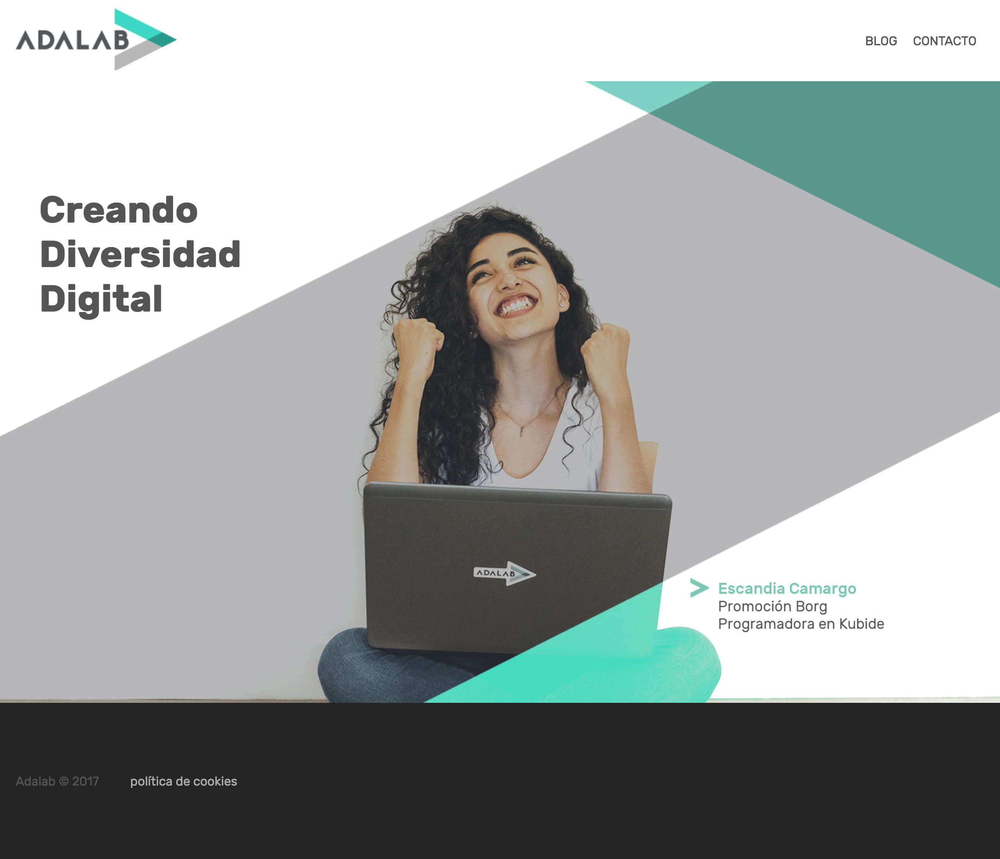
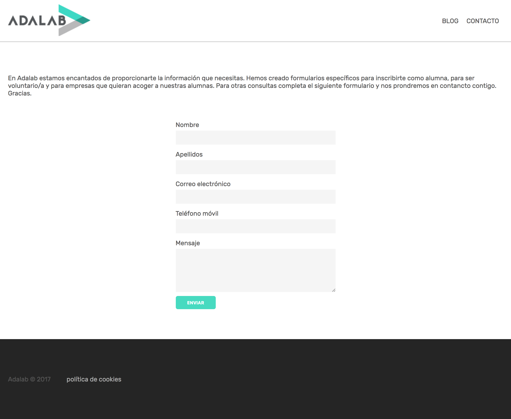
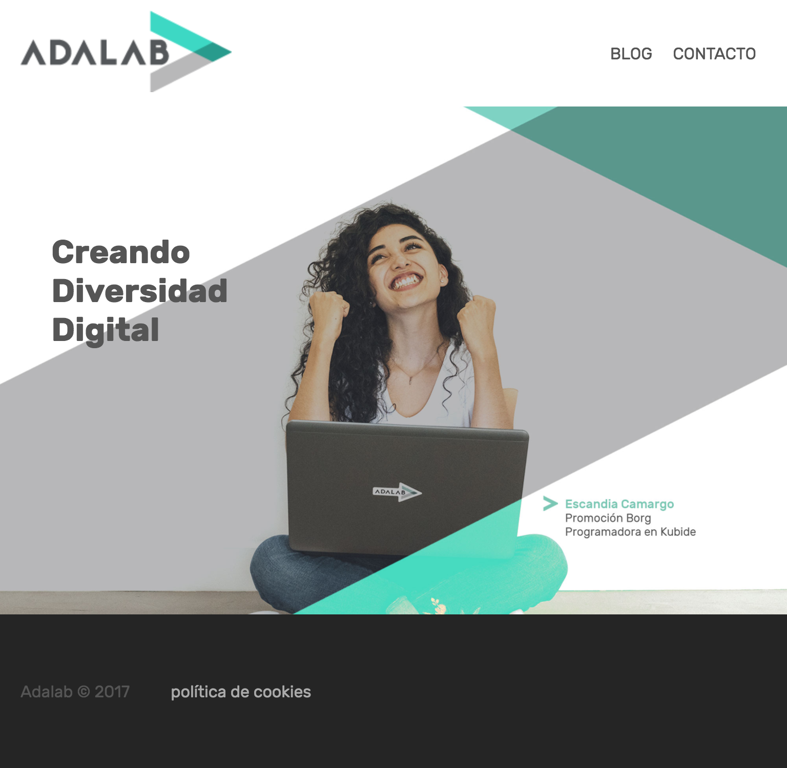
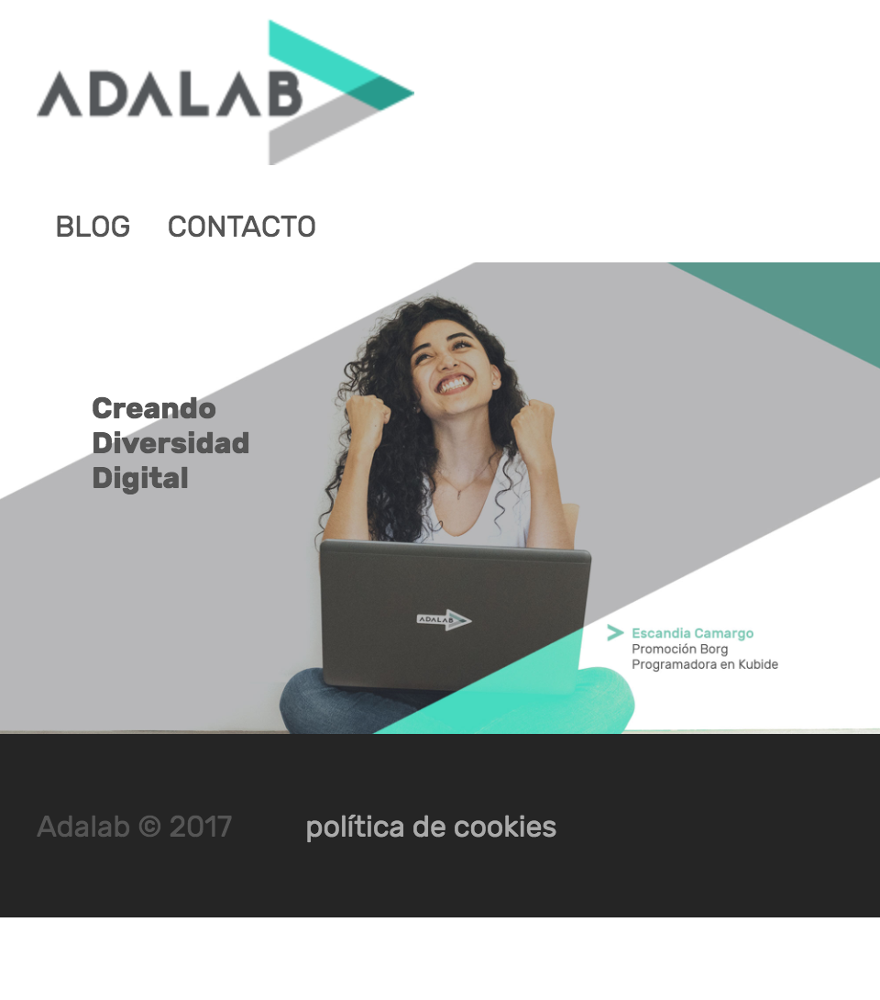

## Ejercicio de evaluación - Sprint 1

En este ejercicio vamos a maquetar una versión simplificada de la Home de la página web de Adalab.

Antes de empezar, tenéis que crear un nuevo repositorio en GitHub desde GitHub Classroom usando [este enlace](https://classroom.github.com/classrooms/22891503-adalab-classroom). Una vez creado, lo clonaremos en nuestro ordenador y en la carpeta creada empezaremos a trabajar en el ejercicio.

La web siplificada que hemos preparado, consta de estos elementos:
1. Una cabecera fija, que te acompaña al hacer scroll
  1. en la cabecera está el logo de Adalab como enlace a la home a la izquierda
  1. también en la cabecera, pero alineado a la derecha, está un menú de opciones en línea. Al pasar el ratón sobre las opciones, éstas cambian de color y aparece una línea debajo
  1. al clickar la opción "contacto" del menú, enlaza a otra página con un formulario
1. Debajo del header hay una sección con una imagen que ocupa todo el ancho de la pantalla
  1. sobre la imagen, hay un texto que dice "Creando Diversidad Digital"
1. El pie de página consta del texto de copyright y enlace a la política de cookies
1. La página del formulario tiene la misma cabecera y pie de página que la Home
  1. Tiene un párrafo explicativo
  1. Tiene un formulario con los campos: nombre, apellidos, correo electrónico, teléfono y mensaje
  1. Tiene un botón para enviar el formulario

La web realizada tiene que ser responsive con estas características:

- por debajo de 900px
  - el texto "Creando Diversidad Digital" se ve más pequeño
  - el pie de página y la imagen central tienen menor altura

- por debajo de 500px
    - el menú de la cabecera se coloca bajo el logo
    - el texto "Creando Diversidad Digital" se ve aún más pequeño
    - el pie de página y la imagen central tienen aún menor altura

También os damos información del diseño para poder maquetar:
- la tipografía usada es Rubik
- la paleta de colores usados son: #555555 #aaaaaa #f5f5f5 #3CDBC0 #252525
- la imagen principal podéis [cogerla de este enlace](http://adalab.es/wp-content/uploads/2017/02/banner_home_v3.jpeg)

Según vayáis trabajando en el ejercicio, id haciendo nuevas versiones (commit) del mismo y subid los cambios a GitHub (push). De esta forma podremos ver cómo vais avanzando. Al final, publicad el resultado usando GitHub Pages.
