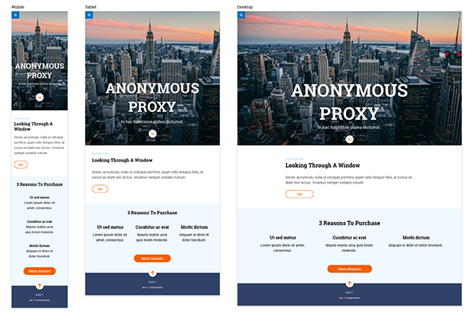

## Ejercicio de evaluación final - Sprint 1

Antes de empezar, tenéis que crear un nuevo repositorio desde GitHub Classroom usando [este enlace](https://classroom.github.com/a/xNW_XfAT). Una vez creado, lo clonamos en nuestro ordenador y en la carpeta creada empezaremos a trabajar en el ejercicio. Esta vez el repositorio incluirá algunos archivos:  
* Base con Gulp
* Imágenes para resolver el Ejercicio

El ejercicio consiste en desarrollar una página web de acuerdo a un diseño dado. Habrá que resolver varios puntos:
- Usar Sass
- Usar CSS Grid
- Resolver interacciones usando transiciones

Vamos de definir los distintos hitos del ejercicio:

### 1. Maquetación

En primer lugar vamos a realizar la maquetación sobre un diseño dado:  

1. El primer módulo (hero) debe ocupar, como mínimo el alto de la ventana del navegador, a ver cómo resolvéis todos los casos intermedios que no hay especificados en el diseño ;)
2. Os vamos a pedir que uséis CSS Grid para el listado de elementos del bloque celeste de "3 Reasons To Purchase"
3. No hay estados `hover` definidos para restarle complejidad pero si véis que sobra tiempo, tomadlo como un bonus
4. Las imágenes e iconos están generados ya al clonar el repositorio por primera vez
5. De igual manera, está incluído el starter kit de Adalab con gulp

### 2. Interacción
En total, tenemos 4 interacciones que resolver:
1. El menú que sale del lateral, como en este [ejemplo](https://marvelapp.com/7b61be1) al hacer hover sobre el botón y desaparece cuando el ratón no está sobre el botón ni el menú
2. Cada opción del menú enlaza a su sección correspondiente
3. El botón del módulo hero enlaza a la sección siguiente
4. El botón del footer sube hasta arriba de la página

***

URL del proyecto: https://zpl.io/awnYgWg

**Zeplin** es una aplicación para poder compartir un diseño con desarrolladores sin necesidad de que usen aplicaciones como Sketch, Illustrator o Photoshop, y con mucha más información que unos pantallazos.

Podéis ver un pequeño [tutorial en Youtube](https://www.youtube.com/watch?time_continue=12&v=tbKZAGthUgQ).

Se puede acceder al diseño directamente desde el navegador para lo que necesitaréis una cuenta de zeplin (que se puede conseguir de forma gratuita desde su página).
***

**¡Al turrón!**
