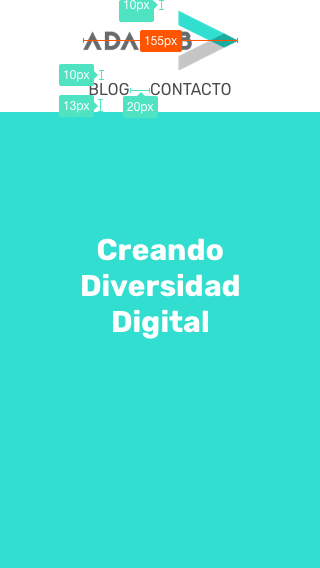
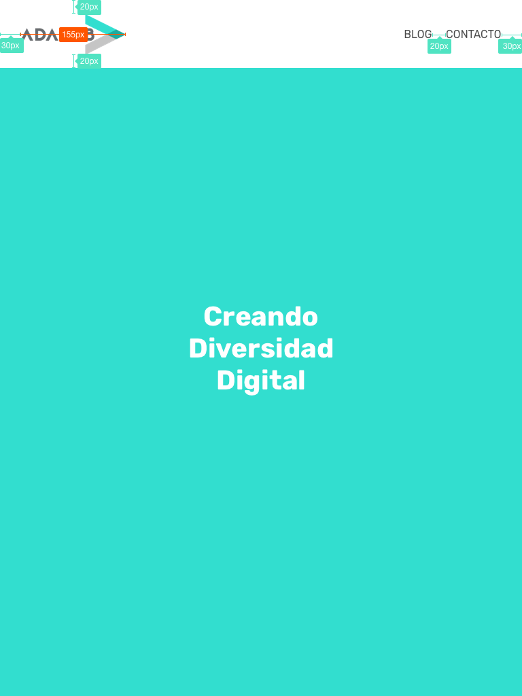

## Ejercicio de evaluación intermedia - Sprint 1

En este ejercicio vamos a maquetar una versión simplificada de la Home de la página web de Adalab.

Antes de empezar, tenéis que crear un nuevo repositorio en GitHub desde GitHub Classroom usando [este enlace](https://classroom.github.com/a/UOiK3sGe). Una vez creado, lo clonaremos en nuestro ordenador y en la carpeta creada empezaremos a trabajar en el ejercicio.

* * *

### Elementos
La web simplificada que hemos preparado, consta de estos elementos:
1. Una **cabecera** fija, que ocupa todo el ancho de la pantalla y que contiene:
  - El logo de Adalab con un enlace a la home.
  - Un menú de opciones en línea.
2. Hay una sección principal que tiene un color de fondo y un título que dice "Creando Diversidad Digital"

### Información de estilo:

También os damos información de estilo:
- La tipografía usada es `Rubik` y el html para añadirlo desde Google Fonts es:
  ```html
  <link href="https://fonts.googleapis.com/css?family=Rubik" rel="stylesheet">
  ```
- La paleta de colores usados son:
  - `#4a4a4a` (Texto del menú)
  - `#3CDBC0` (color de fondo de la página)
  - `#FFFFFFF` (Color de texto de "Creando diversidad digital")
- El logo de adalab podéis [descargarlo de este enlace](https://github.com/Adalab/materiales-front-end-D/blob/master/assets/images/logo_adalab_155x61.png)

La web realizada tiene que ser **responsive**, es decir, debe funcionar correctamente para los siguientes tamaños:

* * *

### Móvil

- Por defecto
    - El logo tiene un tamaño de 155px de ancho.
    - El menú de la cabecera se coloca bajo el logo.
    - El texto de las opciones del menú tiene un tamaño de 16px.
    - El texto del título "Creando Diversidad Digital" tiene un tamaño de 30px.

#### Ejemplo de web para móvil:


* * *

### Tablet y desktop

- A partir de 768px
    - El menú de la cabecera se coloca a la derecha.
    - El texto de las opciones del menú tiene un tamaño de 16px.
    - El texto del título "Creando Diversidad Digital" tiene un tamaño de 40px.

#### Ejemplo de web a partir de tablet:


* * *

Según vayáis trabajando en el ejercicio, id haciendo nuevas versiones (`commit`) del mismo y subid los cambios a GitHub (`push`). De esta forma podremos ver cómo vais avanzando. También publicad el resultado usando GitHub Pages (en las preferencias del proyecto) y poned el enlace a GitHub Pages al lado de la descripción del repo.

**¡A darle caña!**
