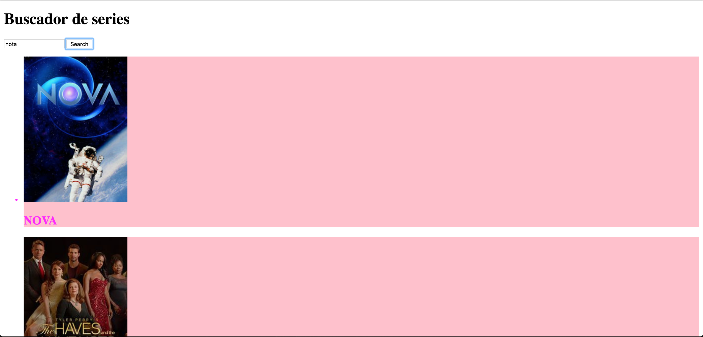
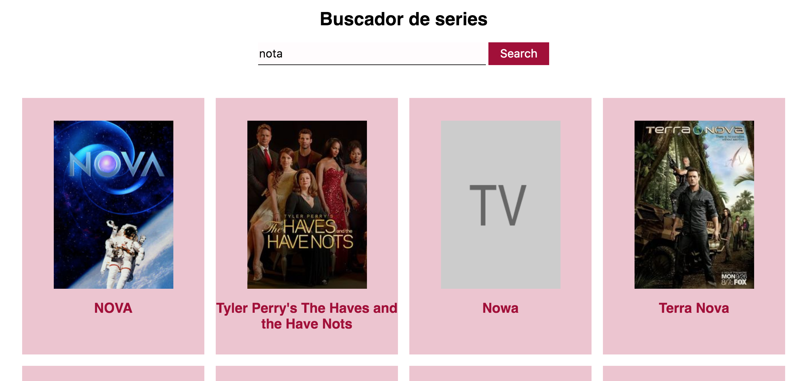

## Ejercicio de evaluación final - Sprint 2

Antes de empezar, tenéis que crear un nuevo repositorio desde GitHub Classroom usando [este enlace](https://classroom.github.com/a/hb6gJ5Hb). Una vez creado, lo clonamos en nuestro ordenador y en la carpeta creada empezaremos a trabajar en el ejercicio.

El ejercicio consiste en desarrollar una aplicación web de búsqueda de series de TV, donde demostraremos los conocimientos de JavaScript adquiridos durante el sprint. 
El ejercicio también tiene una parte de maquetación con HTML y Sass, os recomendamos dedicar esfuerzo a la maquetación una vez terminada la parte de JavaScript, ya que los criterios de evaluación están relacionados con esta última.

Vamos de definir los distintos hitos del ejercicio:

### 1. Maquetación

En primer lugar vamos a realizar una maquetación básica sobre este modelo. No nos centramos en medidas, colores ni tipografía hasta un hito posterior.

La aplicación de búsqueda de series consta de dos partes
1. Un campo de texto y un botón para buscar series por su título
2. Un listado de resultados de búsqueda donde aparece el cartel de la serie y el título

Para realizar la maquetación básica del ejercicio usaremos Sass y la base de gulp del [Adalab Web Starter Kit](https://github.com/Adalab/Adalab-web-starter-kit).

### 2. Búsqueda

Al hacer clic sobre el botón de 'Buscar', nuestra aplicación debe conectarse al [API abierto de TVMaze para búsqueda de series](http://www.tvmaze.com/api#show-search). Os recomendamos echar un vistazo al [JSON que devuelve una petición de búsqueda](http://api.tvmaze.com/search/shows?q=girls) para ver qué datos de los que nos devuelve necesitamos. Para construir la URL de búsqueda necesitaremos recoger el texto que ha introducido el usuario en el campo de búsqueda. Por cada show contenido en el resultado de búsqueda debemos pintar una tarjeta donde mostramos una imagen de la serie y el título. 

Algunas de las series que obtenemos en los resultados no tienen cartel. En ese caso debemos mostrar una imagen de relleno. Podemos crear una imagen de relleno con el servicio de placeholder.com donde en la propia URL indicamos el tamaño, colores, texto: https://via.placeholder.com/210x295/cccccc/666666/?text=TV

### 3. Favoritos

Una vez aparecen los resultados de búsqueda, podremos indicar cuáles son nuestros favoritos. Para ello, al hacer clic sobre un resultado cambia el color de fondo y se pone un borde alrededor de la tarjeta.

### 4. BONUS: Afinar la maquetación

Una vez terminada la parte de interacción, podemos centrarnos en la parte de maquetación para aproximarnos a la propuesta gráfica.

### Entrega

La entrega del ejercicio se realizará en el mismo repositorio que has creado al comienzo del ejercicio. Hemos pautado 12 horas de dedicación al ejercicio, por lo que el límite de entrega es
- turno de mañana: jueves 12 de julio antes de las 15:00
- turno de tarde: jueves 12 de julio antes de las 22:00

### Normas

Este ejercicio está pensado para que se realice de forma individual en clase, pero podrás consultar tus dudas con la profesora y tus compañeras si lo consideras necesario. Es una buena oportunidad para conocer cómo estás progresando, saber qué temas debes reforzar durante las siguientes semanas y cuáles dominas. Te recomendamos que te sientas cómoda con el ejercicio que entregues y no envíes cosas copiadas que no entiendas, puesto que en la revisión del ejercicio con la profesora se te pedirá que expliques las decisiones tomadas para realizar el ejercicio. Este feedback individual con la profesora será de un máximo de 30 minutos, y te propondrá además realizar cambios in situ sobre el ejercicio. Al final, tendrás un feedback sobre aspectos a destacar y a mejorar en tu ejercicio, y sabrás qué objetivos de aprendizaje has superado de los listados a continuación.

### Criterios de evaluación

Vamos a listar los criterios de evaluación de este ejercicio. Si superas más del 80% de los criterios, estás aprendiendo al ritmo que hemos pautado para poder afrontar los conocimientos del siguiente sprint.

#### Control de versiones
- Uso de control de versiones con ramas para nuevas funcionalidades

#### JavaScript básico
- Crear código JavaScript con sintaxis correcta, bien estructurado e indentado
- Usar variables para almacenar información y re-asignar valores
- Usar condicionales para ejecutar acciones distintas en función de una condición
- Saber recorrer listados de datos para procesarlos
- Usar funciones para estructurar el código
- Saber modificar la información del DOM para añadir contenido dinámico
- Saber escuchar eventos del DOM y actuar en consecuencia

#### AJAX y APIs
- Crear peticiones con fetch y promesas
- Gestionar información en formato JSON 

**¡Al turrón!**
