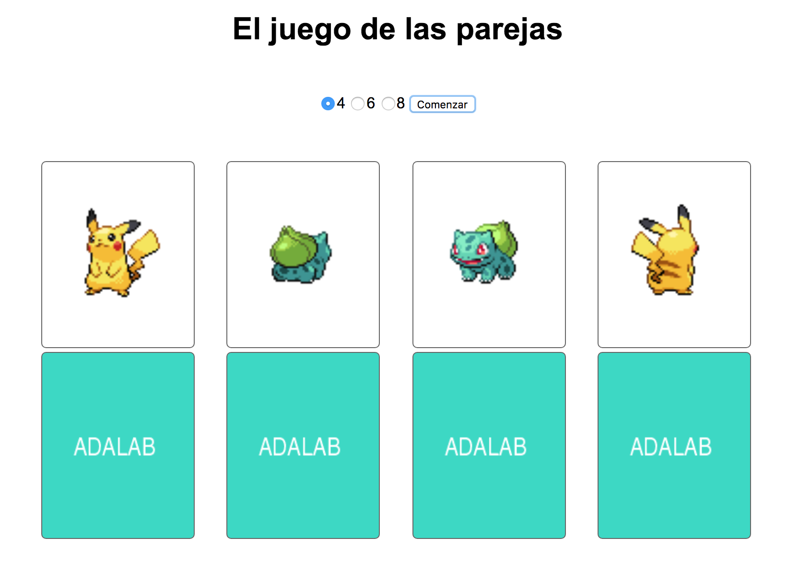
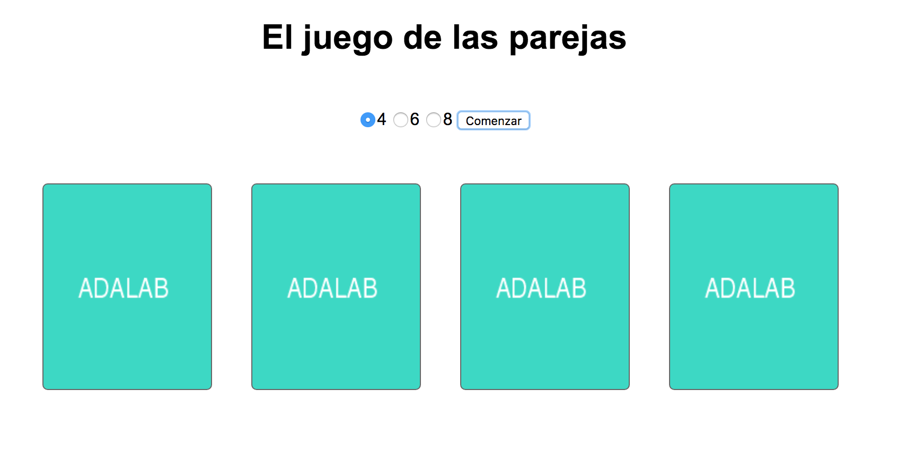
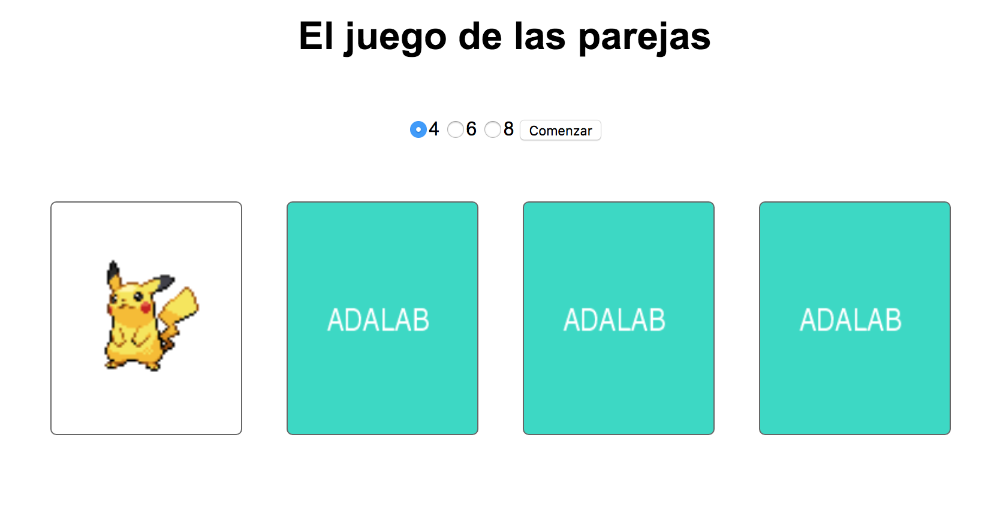

## Ejercicio de evaluación final (bis) - Sprint 2

El ejercicio consiste en desarrollar una aplicación web que simula un juego de buscar las parejas. El objetivo del ejercicio es desarrollar la interfaz del juego, no implementar el juego en sí que quedará como un BONUS.

Vamos de definir los distintos hitos del ejercicio:

### 1. Maquetación

En primer lugar vamos a realizar una maquetación básica del juego.

La aplicación de búsqueda de series consta de dos partes
1. Un formulario para elegir el tamaño de la partida y un botón
2. Un listado de cartas, representadas por 2 imágenes: una de la parte anterior de la carta y otra de la parte posterior. La imagen de la parte anterior la obtendremos de un servidor, y la imagen posterior será fija, por ejemplo, usando https://via.placeholder.com/160x195/30d9c4/ffffff/?text=ADALAB

Para realizar la maquetación básica del ejercicio usaremos Sass y la base de gulp del [Adalab Web Starter Kit](https://github.com/Adalab/Adalab-web-starter-kit).

### 2. Inicio de la partida

Al hacer clic sobre el botón de 'Comenzar', nuestra aplicación debe recoger el valor del tamaño de la partida y conectarse a un API que devuelve un listado de cartas. La URL del API es https://raw.githubusercontent.com/Adalab/cards-data/master/NUMERO.json, donde NUMERO puede tomar el valor de 4, 6 y 8. Por cada carta nos llagará la URL de la imagen a mostrar.

### 3. Interacción

Una vez mostramos el listado de cartas vamos a hacer que el listado sea interactivo. Para eso, lo primero que haremos será ocultar la parte frontal de las cartas mostrando solo la parte de atrás.

Al hacer clic sobre una carta vamos a mostrar su parte frontal y a ocultar su parte trasera. Al volver a hacer clic haremos la operación contraria, y volveremos a ver su parte trasera y ocultar la frontal.

### 4. BONUS: Implementar el juego

Una vez terminada la parte obligatoria, os animamos a intentar implementar el juego de las parejas en una rama del repositorio. Por cada carta, tenemos información en el JSON de cuáles son pareja. Esta parte del ejercicio es bastante compleja, así que no os desesperéis si no conseguís completarla.

### Entrega

La entrega del ejercicio se realizará en un repositorio de GitHub enviado por slack a la profesora. El límite de entrega es el **lunes 30 de julio antes de las 8:00h para el turno de mañana y antes de las 15:00h para el turno de tarde**.

### Normas

Este ejercicio está pensado para que se realice de forma individual,  pero podrás consultar tus dudas con la profesora y tus compañeras si lo consideras necesario. Es una buena oportunidad para conocer cómo estás progresando, saber qué temas debes reforzar durante las siguientes semanas y cuáles dominas. Te recomendamos que te sientas cómoda con el ejercicio que entregues y no envíes cosas copiadas que no entiendas, puesto que en la revisión del ejercicio con la profesora te pedirá que expliques las decisiones tomadas para realizar el ejercicio. Este feedback individual con la profesora será de un máximo de 30 minutos, y te propondrá además realizar cambios in situ sobre el ejercicio. Al final, tendrás un feedback sobre aspectos a destacar y a mejorar en tu ejercicio, y sabrás qué objetivos de aprendizaje has superado de los listados a continuación.

### Criterios de evaluación

Vamos a listar los criterios de evaluación de este ejercicio. Si superas más del 80% de los criterios, estás aprendiendo al ritmo que hemos pautado para poder afrontar los conocimientos del siguiente sprint.

#### Control de versiones
- Uso de control de versiones con ramas para nuevas funcionalidades

#### JavaScript básico
- Crear código JavaScript con sintaxis correcta, bien estructurado e indentado
- Usar variables para almacenar información y re-asignar valores
- Usar condicionales para ejecutar acciones distintas en función de una condición
- Saber recorrer listados de datos para procesarlos
- Usar funciones para estructurar el código
- Saber modificar la información del DOM para añadir contenido dinámico
- Saber escuchar eventos del DOM y actuar en consecuencia

#### AJAX y APIs
- Crear peticiones con fetch y promesas
- Gestionar información en formato JSON 

**¡Al turrón!**
