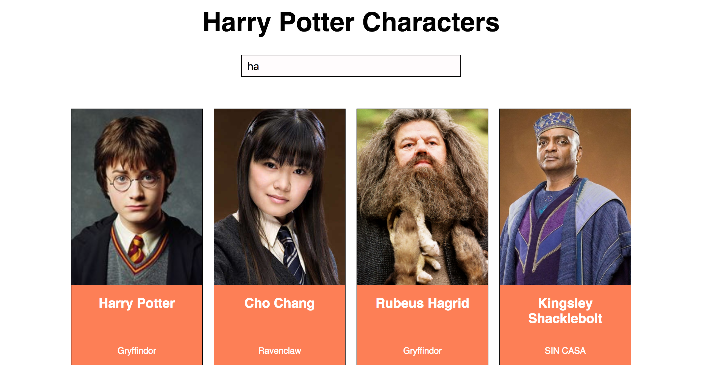
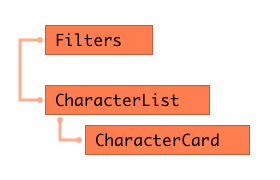

## Ejercicio de evaluación - Sprint 3

Antes de empezar, tenéis que [crear un nuevo repositorio desde GitHub Classroom](https://classroom.github.com/a/c6phaMiz). Una vez creado, lo clonamos en nuestro ordenador y en la carpeta creada empezaremos a trabajar en el ejercicio.

El ejercicio consiste en desarrollar una página web con un listado de personajes de *Harry Potter*, que podemos filtrar por el nombre del personaje. Vamos a usar React para realizarlo.

Vamos de definir los distintas partes del ejercicio:

### 1. Listado de personajes

En primer lugar, vamos a realizar una web con el listado de personajes de Harry Potter. Para eso, vamos a utilizar el servicio de http://hp-api.herokuapp.com/ que nos devuelve información sobre 25 personajes de la saga. Sobre cada uno, vamos a pintar al menos:
- nombre
- foto
- casa

Para esta primera parte del ejercicio es suficiente pintar la información sin maquetar.

### 2. Filtrado de personajes

Ahora que ya tenemos el listado de personajes en pantalla, la segunda parte consiste en poder buscarlos por nombre. Para eso, añadimos un `input` a la interfaz, de forma que al ir escribiendo un nombre queden en la interfaz solo los personajes cuyo nombre contiene las letras escritas. En el pantallazo de arriba, al escribir una 'ha' aparecen personajes cuyo nombre completo contiene esa letra.

> NOTA: en principio no es necesario tener en cuenta si las letras están en mayúscula/minúscula para la búsqueda, pero si queréis añadir esta mejora pues genial

### 3 Componentes del listado de personajes
El listado debe tener los siguientes componentes como mínimo:
- Componente para los filtros
- Componente para el listado
  - Componente para la tarjeta de cada personaje del listado

Como en el ejemplo:

### 4. Detalle de personajes

Vamos a implementar una nueva funcionalidad: al hacer clic sobre la tarjeta de un personaje, su información aparecerá a pantalla completa. Para hacer esto usaremos rutas y React router. En la pantalla de detalle aparecerá además de nombre, foto y casa, el año de nacimiento, el patronus y si está vivo o muerto al final de la saga.

>  Ya que esta API no nos devuelve resultados con un identificador único por objeto tendremos que añadirle uno nosotras ;)  
>  **PISTA**: ¿Quizás podríamos usar el operador spread para conseguirlo? ¿Yay or nay?

### 5. BONUS: Mejoras visuales

Para terminar, podéis realizar algunas mejoras visuales del ejercicio. Por ejemplo:
- mostrar la casa y si un personajes está muerto con un icono
- usar algún sistema de grid para pintar el listado de personajes
- que funcione bien el responsive en dispositivos pequeños

### Entrega

La entrega del ejercicio se realizará en el mismo repositorio que has creado al comienzo del ejercicio. Hemos pautado 12 horas de dedicación al ejercicio, por lo que el límite de entrega es
- turno de mañana: jueves 9 de agosto antes de las 15:00
- turno de tarde: jueves 9 de agosto antes de las 22:00

### Normas

Este ejercicio está pensado para que se realice de forma individual en clase, pero podrás consultar tus dudas con la profesora y tus compañeras si lo consideras necesario. Es una buena oportunidad para conocer cómo estás progresando, saber qué temas debes reforzar durante las siguientes semanas y cuáles dominas. Te recomendamos que te sientas cómoda con el ejercicio que entregues y no envíes cosas copiadas que no entiendas, puesto que en la revisión del ejercicio con la profesora te pedirá que expliques las decisiones tomadas para realizar el ejercicio. Este feedback individual con la profesora será de un máximo de 30 minutos, y te propondrá además realizar cambios in situ sobre el ejercicio. Al final, tendrás un feedback sobre aspectos a destacar y a mejorar en tu ejercicio, y sabrás qué objetivos de aprendizaje has superado de los listados a continuación.

### Criterios de evaluación

Vamos a listar los criterios de evaluación de este ejercicio. Si superas más del 80% de los criterios, estás aprendiendo al ritmo que hemos pautado para poder afrontar el proyecto final.

#### ES6
- Usa correctamente la notación de clases, métodos y atributos
- Usa correctamente los imports / exports
- Usa notación de arrow functions

#### React básico
- Crea una estructura adecuada de componentes, el principal maneja el estado
- Usa el método render y JSX para pintar componentes
- Usa las props para pasar datos a componentes hijos
- Usa el estado para almacenar información de la interfaz
- Usa eventos en React para atender a interacciones del usuario
- Sabe pintar listados de datos
- Usa lifting para pasar info de hijos a padres
- Usa métodos del ciclo de vida como componentDidMount para las peticiones AJAX

#### React router
- Crea rutas navegables dentro de una aplicación

**¡Mucha suerte, muggles!**
