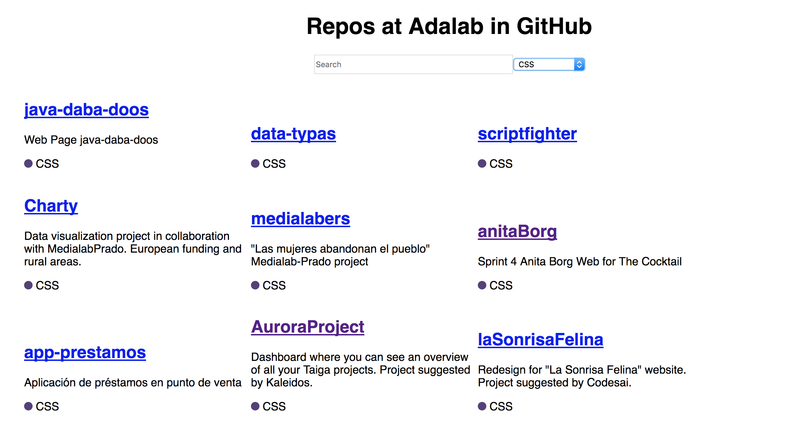

## Ejercicio de evaluación final (bis) - Sprint 3

El ejercicio consiste en desarrollar una página web con un listado de repositorios de git en la organización de *Adalab*. Podremos filtrar el listado por el lenguaje predominante en el código o por su nombre. Vamos a usar React para realizarlo.

Vamos de definir los distintas partes del ejercicio:

### 1. Listado de repos

En primer lugar, vamos a realizar una web con el listado de reposotorios de GitHub en la organización de Adalab. Para eso, vamos a utilizar el API de GitHub que nos devuelve un listado de los repositorios públicos de la organización usando el endpoint en la URL https://api.github.com/orgs/Adalab/repos. De cada repo, vamos a pintar:
- nombre con un enlace a la web del repositorio
- descripción si existe
- lenguaje del repositorio, indicado por un círculo de color para cada tecnología (HTML, CSS y JavaScript)

Debéis usar al menos estos componentes:
- un componente `App` principal de la aplicación
- un componente `RepoList` para el listado de repos
- un componente `Repo` para modelar la tarjeta con la información de un repo
- un componente `Search` para el filtrado

### 2. Filtrado por nombre y lenguaje

Ahora que ya tenemos el listado de repos en pantalla, la segunda parte consiste en poder filtar por lenguaje. Para eso, añadimos un `select` a la interfaz, de forma que al elegir por ejemplo `HTML` podamos ver solo los repos cuyo lenguaje principal es `HTML`.

Añadir al filtrado por lenguaje otro que filtre también por el nombre del repositorio según lo vamos escribiendo. Es decir, se filtrará a la vez por lenguaje y por nombre. El `input` de texto debe incluirse en el componente `Search`.

### 3. Detalle de repo

Vamos a implementar una nueva funcionalidad: al hacer clic sobre la tarjeta de un repo (fuera del enlace), su información aparecerá a pantalla completa. Para hacer esto usaremos rutas y React router. En la pantalla de detalle aparecerá además de nombre, descripción y lenguaje, el número de estrellas (*stargazers*), el número de observadores (*watchers*) y el número de *forks*.

### Entrega

La entrega del ejercicio se realizará en un repositorio de GitHub enviado por slack a la profesora. El límite de entrega es el **miércoles 12 de septiembre antes de las 8:00h para el turno de mañana y antes de las 15:00h para el turno de tarde**.

### Normas

Este ejercicio está pensado para que se realice de forma individual en clase, pero podrás consultar tus dudas con la profesora y tus compañeras si lo consideras necesario. Es una buena oportunidad para conocer cómo estás progresando, saber qué temas debes reforzar durante las siguientes semanas y cuáles dominas. Te recomendamos que te sientas cómoda con el ejercicio que entregues y no envíes cosas copiadas que no entiendas, puesto que en la revisión del ejercicio con la profesora te pedirá que expliques las decisiones tomadas para realizar el ejercicio. Este feedback individual con la profesora será de un máximo de 30 minutos, y te propondrá además realizar cambios in situ sobre el ejercicio. Al final, tendrás un feedback sobre aspectos a destacar y a mejorar en tu ejercicio, y sabrás qué objetivos de aprendizaje has superado de los listados a continuación.

### Criterios de evaluación

Vamos a listar los criterios de evaluación de este ejercicio. Si superas más del 80% de los criterios, estás aprendiendo al ritmo que hemos pautado para poder afrontar la búsqueda de empleo.

#### ES6
- Usa correctamente la notación de clases, métodos y atributos
- Usa correctamente los imports / exports
- Usa notación de arrow functions

#### React básico
- Crea una estructura adecuada de componentes, el principal maneja el estado
- Usa el método render y JSX para pintar componentes
- Usa las props para pasar datos a componentes hijos
- Usa el estado para almacenar información de la interfaz
- Usa eventos en React para atender a interacciones del usuario
- Sabe pintar listados de datos
- Usa lifting para pasar info de hijos a padres
- Usa métodos del ciclo de vida como componentDidMount para las peticiones AJAX

#### React router
- Crea rutas navegables dentro de una aplicación

**¡A por todas!**
