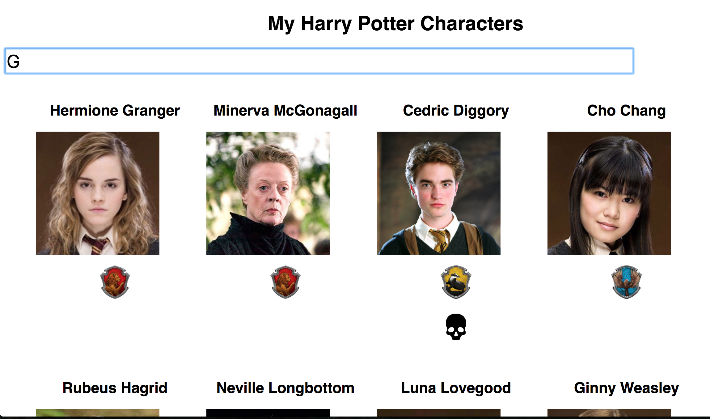

## Ejercicio de evaluación - Sprint 4

Antes de empezar, tenéis que crear un nuevo repositorio desde GitHub Classroom. Para ello tenéis que aceptar usar un enlace distinto para [el grupo de mañana](https://classroom.github.com/a/maU_fuR8) y para [el grupo de tarde](https://classroom.github.com/a/GmS07mvH). Una vez creado, lo clonamos en nuestro ordenador y en la carpeta creada empezaremos a trabajar en el ejercicio.

El deadline para la entrega es el **31 de enero de 2018 a las 21:30** para ambos grupos.

El ejercicio consiste en desarrollar una página web con un listado de personajes de *Harry Potter*, que podemos filtrar por el nombre del personaje. Vamos a usar React para realizarlo.

Vamos de definir los distintas partes del ejercicio:

### 1. Listado de personajes

En primer lugar, vamos a realizar una web con el listado de personajes de Harry Potter. Para eso, vamos a utilizar el servicio de http://hp-api.herokuapp.com/ que nos devuelve bastante información sobre 25 personajes de la saga. Sobre cada uno, vamos a pintar al menos:
- nombre
- foto
- casa
- ¿está vivo?

Para esta primera parte del ejercicio es suficiente si queréis pintar todas la información excepto la foto como un texto.

### 2. Filtrado de personajes

Ahora que ya tenemos el listado de personajes en pantalla, la segunda parte consiste en poder buscarlos por nombre. Para eso, añadimos un `input` a la interfaz, de forma que al ir escribiendo un nombre queden en la interfaz solo los personajes cuyo nombre contiene las letras escritas. En el pantallazo de arriba, al escribir una 'G' aparecen personajes cuyo nombre completo contiene esa letra.

> PISTA: en los ejercicios de clase, estuvimos trabajando algo similar usando el método `includes` de las cadenas

> NOTA: en principio no es necesario tener en cuenta si las letras están en mayúscula/minúscula para la búsqueda, pero si queréis añadir esta mejora pues genial

### 3. BONUS: Mejoras visuales

Para terminar, podéis realizar algunas mejoras visuales del ejercicio. Por ejemplo:
- mostrar la casa y si un personajes está muerto con un icono
- usar algún sistema de grid para pintar los personajes
- que funcione bien el responsive en dispositivos pequeños
- que los textos estén centrados y alineados

**¡Mucha suerte, muggles!**
