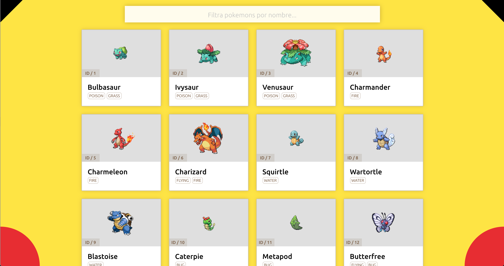

# Prueba técnica 1: Pokedex

## Resumen

En esta prueba vamos a desarrollar un sencillo pokedex, es decir, una app para consultar los distintos tipos de pokemon y algunas características.

## Especificaciones

Se desarrollará una sencilla webapp usando React y el API de pokemon [PokeAPI](https://pokeapi.co/). El servicio tiene limitado el número de peticiones así que usadlo con cuidado. Además, tenéis una copia del servicio también disponible en bajo la URL http://pokeapi.salestock.net/api/v2/

La app debe tener las siguientes características:
- Debe tener un listado de pokemon, donde debe aparecer al menos su foto, nombre, número y tipo (o tipos)
- Deben aparecer los 25 primeros pokemon (para tener la info detallada de cada uno, tendremos que hacer una petición al servidor y recordad que hay un límite)
- Los pokemon deben poder filtrarse por nombre

## Entrega

Tenéis que crear un nuevo repositorio en GitHub desde GitHub Classroom usando [este enlace](https://classroom.github.com/a/4ciAYfBU). Una vez creado, lo clonaremos en nuestro ordenador y en la carpeta creada empezaremos a trabajar en el ejercicio.

## Inspiración

- http://pokedex.org

## Guión exposición
Os proponemos un guión para presentar el ejercicio pero el entrevistador podrá variarlo o redirigirlo en cualquier momento:
- Descripción breve de la API
- Cómo se ha planteado el ejercicio
- Estructura de componentes
- En este caso el html/css no es importante pero si se ha resuelto, contar muy brevemente cómo se han resuelto.
