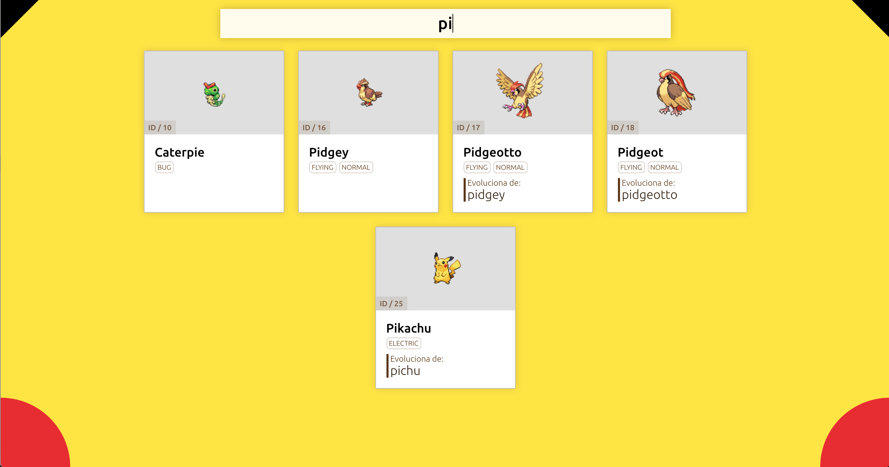

# Prueba técnica 2: Pokedex ampliado

## Resumen

En esta prueba vamos a continuar con el Pokedex que construimos en la prueba anterior para añadir algunas funcionalidades extra.

## Especificaciones

Vamos a serguir explorando el API de pokemon [PokeAPI](https://pokeapi.co/)

La app debe tener las siguientes nuevas características:
- En el listado principal debe aparecer si el pokemon es una evolunción de otro, de cual es
- Usaremos el router de React para que, al clickar sobre la tarjeta de un pokemon, aparezca una pantalla de detalle con más información detallada de ese pokemon. Os proponemos: altura, peso, habilidades, imágenes del pokemon y sus evoluciones
- Usar algún tipo de transición a vuestra elección al mostrar/ocultar el componente de detalle de pokemon

## Entrega

Subid los cambios actualizados en el repositorio de la prueba anterior.

## Inspiración

- http://pokedex.org

## Guión exposición
Os proponemos un guión para presentar el ejercicio pero el entrevistador podrá variarlo o redirigirlo en cualquier momento:
- Descripción breve de la API
- Cómo se ha planteado el ejercicio
- Estructura de componentes y uso del router
- Uso de transiciones
