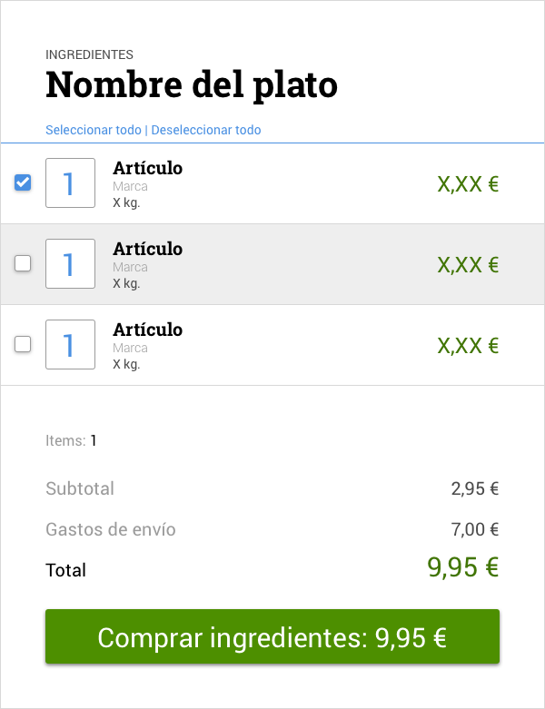

# Prueba técnica 5: Risotto de setas

## Resumen

Nuestro mercado favorito tiene un servicio nuevo en el que cada día podemos pedir un plato y nos permite hacer un pedido con los ingredientes, hoy toca Risotto de setas vegano.

## Especificaciones
Con los datos que nos facilita el mercado, [PENDIENTE](), tenemos que hacer un pequeño frontal con el nombre del plato, y la lista para comprar los ingredientes teniendo en cuenta que:

* podré seleccionar todos los ingredientes, alguno o ninguno
* podré cambiar la cantidad de un artículo
* siempre tendré una lista actualizada de lo que me costaría hacer un pedido (en caso de tener elementos seleccionados)
* El botón de compra siempre marcará dicha cantidad
* El botón de compra debería llevar a la url final de compra, pero eso lo dejaremos para otro día
* No usaremos React en este caso

## Guía gráfica
Esta imagen es una guía para hacernos una idea de cómo debería quedar:

  

## Entrega
Tenéis que crear un nuevo repositorio en GitHub desde GitHub Classroom usando [este enlace](https://classroom.github.com/a/hMbvTgTY). Una vez creado invitaremos a nuestro voluntario, lo clonaremos en nuestro ordenador y en la carpeta creada empezaremos a trabajar en el ejercicio.

## Guión exposición
Os proponemos un guión para presentar el ejercicio pero el entrevistador podrá variarlo o redirigirlo en cualquier momento:
- Revisión de los datos que nos entrega la tienda
- Flujo de programación
- Revisión de los casos de uso
