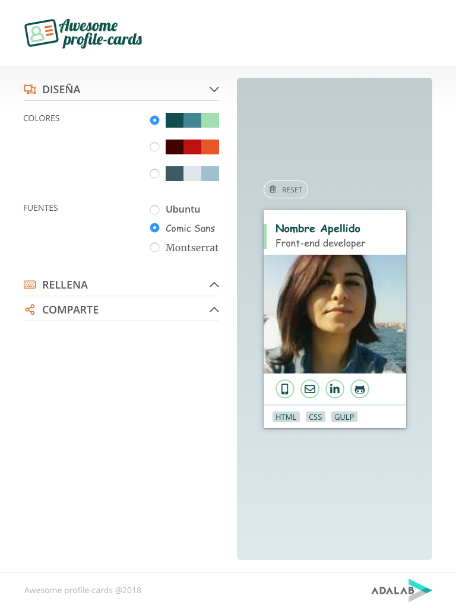

# Proyecto 2: Awesome profile-cards

<!-- TOC START min:2 max:2 link:true update:true -->
- [Resumen (TL;DR)](#resumen-tldr)
- [Objetivos](#objetivos)
- [Caso de uso](#caso-de-uso)
- [Especificaciones](#especificaciones)
- [Diseño](#diseo)
- [Hitos](#hitos)
- [Entrega](#entrega)
- [Recursos](#recursos)

<!-- TOC END -->

## Resumen ([TL;DR](https://spanish.stackexchange.com/questions/15317/hay-alg%C3%BAn-equivalente-en-castellano-al-ingl%C3%A9s-tldr))

En este proyecto vamos a realizar una aplicación web que nos permite crear una tarjeta de visita personalizada. En la página web podemos introducir nuestros datos profesionales y obtener una vista maquetada con esta información. Lo bueno de este proyecto es que será una herramienta de la que os podréis beneficiar. Será una aplicación web interactiva creada por vosotras y que podéis usar para crear vuestras propias tarjetas de visita profesionales.

## Objetivos

1. Aprender los conceptos básicos de programación (variables, estructuras de datos, condicionales, funciones, etc.)
1. Comprender cómo manipular el DOM de una página y responder a eventos del usuario
1. Manejar estructuras de datos complejas, con arrays y objetos
1. Realizar peticiones al servidor y almacenar datos en local
1. Exponer en la sesión final y seguir adquiriendo habilidades de presentación en público

## Caso de uso

Con esta web podréis mostrar que, a parte de maquetar, podéis crear una página web con la que interactuar y sacar algo que vaya más allá de una página que solo muestra información. Esto os permitirá mostrar vuestras habilidades a la hora de trabajar con JavaScript en GitHub, algo que en las empresas se valora bastante a la hora de escoger candidatos para puestos de programador front-end.

## Especificaciones

En el desarrollo de esta aplicación web usaremos las siguientes tecnologías:
- Uso avanzado de formularios HTML
- Maquetación usando CSS avanzado, como flex y grid
- Uso de mediaqueries para que el diseño sea adaptable al dispositivo usando la estrategia mobile first
- Gestión de eventos (al hacer click, pasa x, etc.)
- Acceso a datos en Internet mediante peticiones AJAX
- Almacenamiento en local usando LocalStorage
- Uso de git para el control de versiones del proyecto
- Publicación del resultado en Internet usando GitHub pages

La aplicación funciona siguiendo estos pasos:
1. Permitir al usuario elegir el estilo de la tarjeta, eligiendo paleta de colores y tipografía
2. Permitir al usuario que, mediante la introducción de información en un formulario, este texto se muestre maquetado automáticamente en un cuadro similar a una tarjeta de visita, que será la muestra del resultado final
3. Permitir que el usuario pueda compartir su tarjeta de visita por Twitter

La tarjeta de visita deberá tener los siguientes campos (entre paréntesis el nombre del campo a usar):
- Nombre completo (full_name)
- Profesión (desarrolladora front-end ;)) (job)
- Datos personales
  - Teléfono (phone)
  - Correo electrónico (email)
- RRSS
  - LinkedIn (linkedin)
  - GitHub (github)
- Habilidades: a elegir máximo 3 de un listado (skills)

Respecto a la interacción con la web:
- Los campos deberán tener restricciones para su formato indicado. Campo de teléfono para el móvil, mail para el correo, etc.
- Las modificaciones que hacemos en el formulario (diseño y contenido), aparecen automáticamente en la vista previa de la tarjeta
- Las 3 partes del proceso de creación serán elementos colapsables, que al hacer clic en el título se mostrará/ocultará solo mostrando una sección de al vez
- Las opciones de habilidades las obtenemos al hacer una petición a un [servicio en esta URL](https://raw.githubusercontent.com/Adalab/dorcas-s2-proyecto-data/master/skills.json)
- Se podrán seleccionar varias habilidades (hasta un máximo de 3), pudiendo añadir más con un botón, y borrando las existentes con otro
- Toda la información del formulario debe almacenarse en LocalStorage (alamcenamiento local del navegador), de forma que al recargar la página siga disponible y podamos borrarla con un botón de *Reset*. Para esto, debemos definir una estructura de datos compleja (con arrays y objetos) que es lo que guardaremos en el navegador.
- Para compartir en Twitter usaremos un API (la URL os la daremos más adelante) que os devolverá una web con la tarjeta de visita con la información rellena. Con esta URL y un texto predefinido, debéis pre-rellenar un tweet para facilidad del usuario

## Diseño

El diseño lo podéis inspeccionar en [este proyecto de zeplin](https://app.zeplin.io/project/5b28021febd4990163e9020b/screen/5b280288ae4a31fc6a3ab179). También podéis probar cómo funciona en este [prototipo online](https://sketch.cloud/s/12l0y/all/tablet+/00-app-tablet+/play).

Las fuentes necesarias para crear el diseño son
- Merriweather (google fonts)
- Open sans (google fonts)
- Comic Sans MS (sistema)
- Montserrat (google fonts)
- Ubuntu (google fonts)
- FontAwesome (fontawesome.io)

### Archivos

Podéis descargar los logos necesarios para completar el proyecto:

- [Logo de Adalab](assets/images/logo-adalab.png)
- [Logo de Awesome Profile-cards](https://github.com/Adalab/materiales-front-end-D/blob/master/proyectos/assets/images/logo-awesome-profile-cards.svg)

## Hitos

En esta sección os proponemos una serie de hitos como sugerencia para dividir las fases de este proyecto. Siguiendo los principios de las metodologías ágiles estableceremos pequeños ciclos iterativos de forma que al final de cada uno de estos generemos valor real de cara al usuario.

### Primero. Arranque del proyecto (kickoff)

- 2 sesiones de trabajo.
- Organizar el trabajo a realizar usando Trello, e ir asignando tareas y responsables.
- Crear la infraestructura necesaria: repositorio en GitHub con acceso para todos los miembros del equipo.
- Establecer la estructura del contenido de la web, buscar referencias y esbozar un diseño visual de la web.

### Segundo. Primera versión simple de la web

- 1 semana de trabajo
- Desarrollar una primera versión básica de la web, con la maquetación de la estructura básica (para web y móvil) que incluye el formulario con los colapsables y la vista previa
- Funcionalidad básica: al modificar un campo del formulario, se actualiza la vista previa

> **NOTA**:  
Para considerar terminado este hito y todos los siguientes debéis tener publicada la web en GitHub Pages.

### Tercero. Formulario interactivo
permite
- 1 semana de trabajo
- Formulario interactivo, que al modificar cualquier campo de datos o el diseño se actualice la vista previapermite
- En el campo de habilidades pueden añadirse hasta 3 datos, y se añaden y eliminan de forma dinámica. De momento escribiremos las opciones del campo a manita en el HTML (datos 'harcodeados'), más adelante las sustituiremos por aquellas que nos devuelva el servidor.
### Cuarto. Manejo de datos

- 1 semana de trabajo
- Hacer que el contenido se almacene en LocalStorage del navegador
- Hacer que los datos del combo de habilidades se descarguen desde un servidor
- Añadir la funcionalidad de compartir en Twitter

### Quinto. Presentación final

- 2 sesiones de trabajo
- El último día del sprint presentaréis la versión final de este proyecto. Para ello tendréis que dejarlo publicado y acabado con tiempo, y organizaros para preparar la presentación

## Entrega

El formato de entrega de este proyecto será mediante la subida de este a la plataforma de GitHub. Para subirlo, se creará un repositorio en la organización de Adalab. El nombre del repositorio deberá estar compuesto de las siguientes partes, todo ello separado por guiones:
- Nombre de la promoción en minúsculas
- "s" minúscula seguida del número del sprint
- Nombre del equipo en minúsculas

Por ejemplo, el nombre de la primera promoción de Adalab fue "Ada". Si un grupo realizase un proyecto para el primer sprint y el nombre de ese grupo fuese "Lovelace", el nombre del repositorio debería ser "ada-s1-lovelace".

De manera adicional, se deberá activar "GitHub Pages" en el proyecto para que este pueda ser visualizado como una web, es decir, que en el caso anterior, si alguien introdujese la dirección "adalab.github.io/web-hopper/" en un navegador web, este mostraría la web que se genera con el código del repositorio.

Por último, para acompañar a la entrega del proyecto, el equipo realizará una presentación de 10 minutos mostrando la web y explicando los siguientes puntos:

- Cómo está estructurada la web y el contenido y el por qué de cada cosa
- Cómo se ha diseñado
- La estructura del código y las partes más importantes de este (por encima, sin entrar mucho en detalle)
- Cómo ha sido la organización del equipo, el reparto de tareas y la coordinación a la hora de trabajar todas en el mismo código
- Cuál de las tareas o los puntos ha sido el que más esfuerzo ha requerido
- Cuál de las tareas o partes de la web es la que hace que el equipo esté más orgulloso

Al final de esta presentación habrá un turno breve de preguntas, de manera informal, tanto por parte de otras compañeras como por parte de los profesores.

## Recursos

Para este proyecto hemos preparado un listado de recursos que os pueden servir de ayuda.

### Ejemplo similar
Si en este punto algo no ha quedado del todo claro aquí tenéis un ejemplo similar con un generador de firmas de email para nuestra empresa.
Este es un ejemplo real en el que a través de un formulario actualizamos lo que luego será la firma de email para los empleados de esta empresa.

Está subido a GitHub y utiliza GitHub Pages para tenerlo online.

- [Generador de firmas de email](https://chucheria.github.io/EmailSignatureGenerator/index.html)
