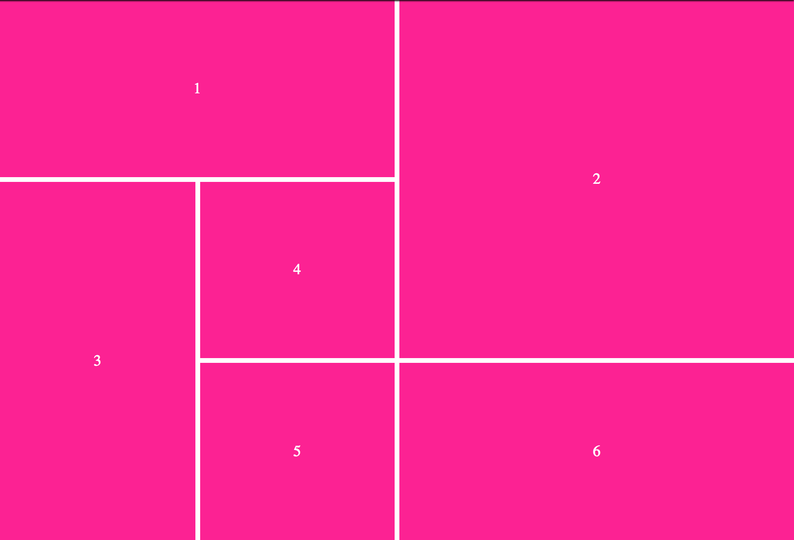
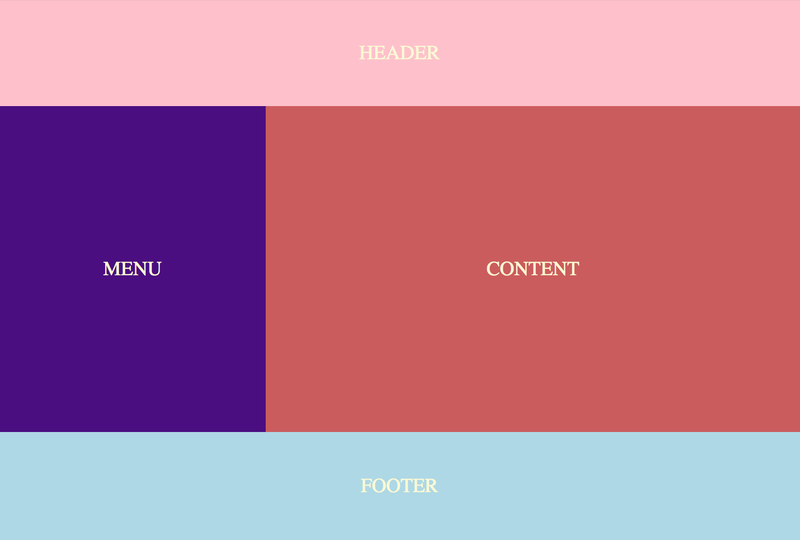
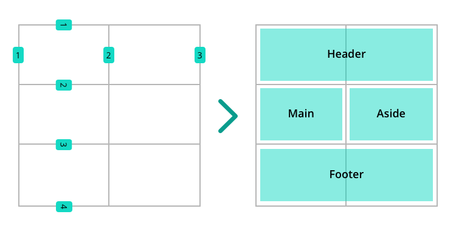
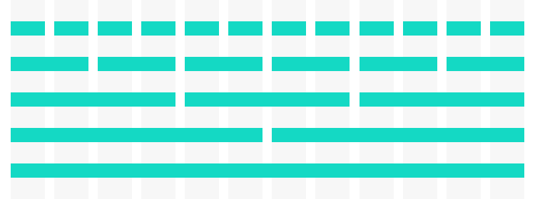
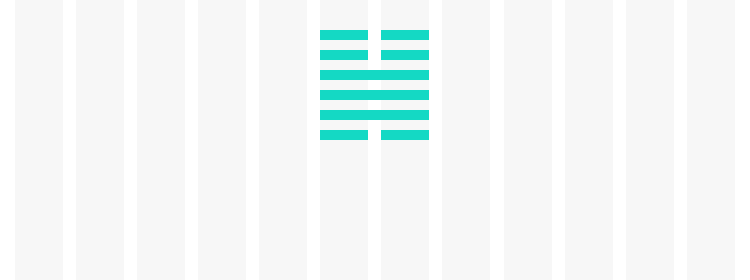
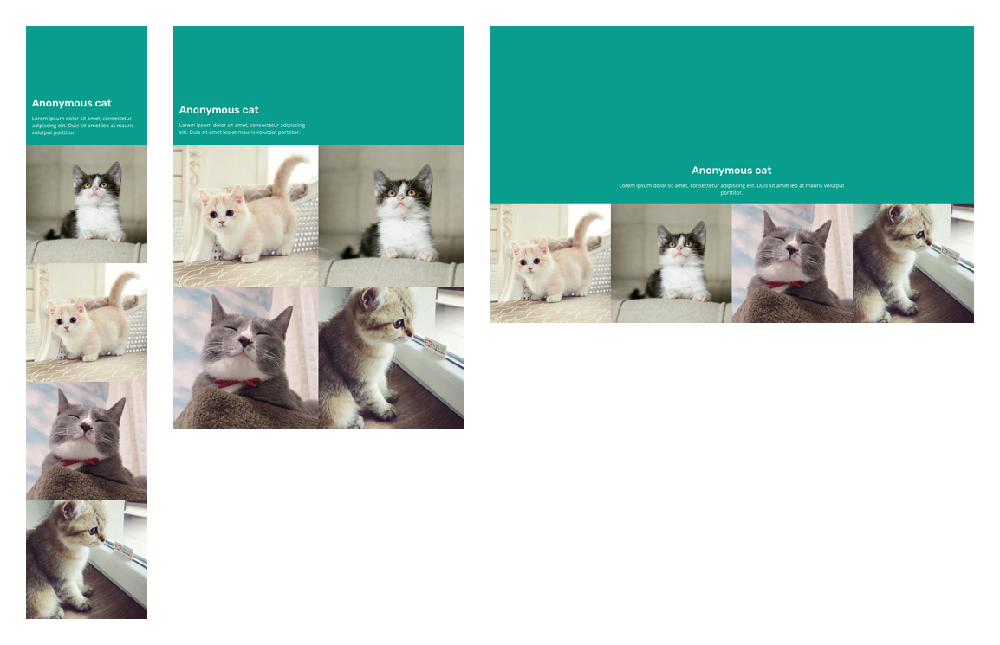

# Sistema de grid

<!-- TOC START min:2 max:2 link:true update:true -->
- [Introducción](#introduccin)
- [¿Para qué sirve lo que vamos a ver en esta sesión?](#para-qu-sirve-lo-que-vamos-a-ver-en-esta-sesin)
- [CSS grid](#css-grid)
- [Bootstrap](#bootstrap)
- [Recursos externos](#recursos-externos)

<!-- TOC END -->

## Introducción

Un sistema de grid o rejilla, nos permite disponer los elementos de una página y que estén alineados. Va a existir una rejilla imaginaria de filas y columnas, a partir de la cual vamos a colocar los elementos de nuestra web. El uso de un sistema de grid tiene sentido si acompaña un diseño que usa también una rejilla.


## ¿Para qué sirve lo que vamos a ver en esta sesión?

Un sistema de grid nos sirve para posicionar los elementos de la página alineados. Se usa en un montón de webs, por ejemplo, este ejemplo de Google.


Podemos ver que los elementos están dispuestos en filas y columnas. Hay 4 columnas que se ven claramente, con un elemento que se expande en 2. Aunque a simple vista parecen no estar alineados en filas, todas las cajas tienen una altura proporcional a una base.

Vamos a ver 2 herramientas que nos facilitan crear una composición basada en grid: CSS grid y Bootstrap.

## CSS grid

CSS grid es una nueva característica de CSS que permite tener un sistema de grid de forma nativa en CSS. Es una herramienta compleja, así que vamos a ver las bases de cómo poder usarla.

En primer lugar, existen 2 tipos de elementos, el contenedor del grid y los elementos del grid. En este sentido, es similar a algo que ya conocemos: flexbox.

Para comenzar, usaremos en el contenedor la propiedad `display:grid` y definiremos las filas y columnas de nuestro grid con `grid-template`. Vamos a ver un ejemplo que podéis [jugar en codepen](https://codepen.io/adalab/pen/JMXwbL?editors=1100):

```css
.wrapper{
  display: grid;
  grid-template-columns: 1fr 1fr 1fr 1fr;
  grid-template-rows: 40px 200px 40px;
}
```
En este grid vamos a tener 4 columnas, cada una de tamaño `1fr`, que es una medida sobre el espacio disponible (free space). Por tanto, se divide el espacio disponible en 4 partes para las columnas. Para las filas, tendremos 3 de 40, 200 y 40px respectivamente.

A continuación, indicaremos a los elementos si queremos que ocupen una o varias filas o columnas con las propiedades `grid-column` y `grid-row`.

```css
.item1 {
    grid-column-start: 1;
    grid-column-end: 4;
}
```
Esto indica que se expande desde la primera línea de grid hasta la cuarta, es decir, ocupa las 3 primeras columnas.
> NOTA: si tenemos 4 columnas, tendremos 5 líneas de grid. Es decir, siempre vamos a tener una más que el número de filas o columnas.

Podemos escribir lo anterior de una forma simplificada:
```css
.item1 {
    grid-column: 1 / 4;
}
```
Para las filas funciona exactamente igual:
```css
.item3 {
    grid-row-start: 2;
    grid-row-end: 4;
}
```

También podemos indicar el tamaño del espaciado de elementos en el contenedor con la propiedad `grid-gap`. Podemos indicar 2 valores si queremos espaciado distinto entre filas y columnas.

***
EJERCICIO 1:

Partiendo del ejemplo de codepen, conseguid una composición como la de la imagen.



***

A la hora de posicionar los elementos en el grid, también podemos usar la palabra `span` para indicar cuánto se expande desde la fila/columna actual. Por ejemplo, para el `item1` que se expandía desde la línea de grid 1 a la 4 podríamos usar:

```css
.item1 {
    grid-column: span 3;
}
```

***

EJERCICIO 2:

Vamos a modificar el ejercicio anterior para usar `span` en vez de punto inicial y final.

***

EJERCICIO 3:

Vamos a crear un grid de 12 columnas y 3 filas, la primera y la última ocupan el 20% del alto del viewport. Crearemos la composición de la imagen.



***

Hasta ahora hemos definido una rejilla fija donde colocar nuestros elementos pero **¿Qué pasa cuando hay más elementos que "huecos"?**  

Como en muchas otras ocasiones el navegador va a intentar solucionarlo, en este caso va a intentar [ampliar el grid con la configuración que le hemos dado](https://codepen.io/adalab/pen/GdOMvr):
- ¿Qué ha pasado con los tres últimos elementos? Pues que se ha hecho lo que se ha podido.

Pero tenemos una forma de decirle a nuestro grid cómo comportarse cuando haya más elementos de la cuenta, gracias a `grid-auto-rows` y `grid-auto-columns`, funcionan como `grid-template-rows/columns` pero solo se aplica en el caso de que haya más elementos de la cuenta.

- [Ejemplo en codepen de `grid-auto-rows`](https://codepen.io/adalab/pen/YLEYxg)

Y lo podemos usar junto con `grid-auto-flow`, que fuerza una única dirección (columna o fila) para nuestra rejilla :)

- [Ejemplo en Codepen de `grid-auto-columns` con `grid-auto-flow`](https://codepen.io/adalab/pen/zjPpma)

Con estas propiedades ya podemos empezar a controlar un poco el comportamiento de nuestra rellija. Para completar un poco esta introducción a grid faltaría ver la posibilidad de definir áreas con nombres más cercanos al humano:




El grid que hay debajo es de 2x3, y para definirlo usaríamos:

```css
.container {
  display: grid;
  grid-template-columns: 1fr 1fr;
  grid-template-rows: 1fr 1fr 1fr;
}
```

pero si queremos "nombrar los espacios" podemos usar, además, `grid-template-areas`:

```css
.container {
  display: grid;
  grid-template-columns: 1fr 1fr;
  grid-template-rows: 1fr 1fr 1fr;
  grid-template-areas: "header header" "main aside" "footer footer"
}
```

De esta manera creamos un área completa asignando a dos el mismo nombre, como el header o el footer.

Si ahora quisiésemos que un elemento en concreto se colocase en una de estas áreas, solo tendríamos que decírselo:

```css
.item--1 {
  grid-area: main;
}
```

***
EJERCICIO 4:
¿Seremos capaces de [colocar cada elemento en su sitio](https://codepen.io/adalab/pen/zjPjER)? ;)
***

El soporte el navegadores de CSS grid aún no es completo pero a día de hoy (mayo de 2018) es de [más del 80% según caniuse](https://caniuse.com/#feat=css-grid). Para los casos en que aún no podamos usarlo, tenemos como alternativa usar flexbox o el sistema de grid que nos ofrece Bootstrap.

## Bootstrap

Boostrap es una librería de grid y componentes gráficos que creó uno de los desarrolladores de Twitter. La librería ofrece un montón de funcionalidad, desde elementos de UI (botones, dropdowns, menús, etc.), hasta componentes interactivos con JavaScript como un carrusel de fotografías.

A diferencia de otros temas, con Bootstrap os vamos a contar solo una pequeña introducción y vais a tener que enfrentaros con algo muy común como es usar una herramienta nueva y tener que revisar la documentación ;)

Para poder usarlo en nuestro proyecto, tendremos varias opciones:
* Descargar el código fuente (CSS, JS), y enlazarlo desde nuestro HTML
* Enlazar el código alojado en un servidor de Internet, lo que suele llamarse CDN

Usando esta segunda opción, simplemente pegamos el snippet que [Bootstrap nos da en su página de inicio](https://getbootstrap.com/). Si sólo queremos usar el CSS usamos esto en nuestro `head`:

```hmtl
<link rel="stylesheet" href="https://maxcdn.bootstrapcdn.com/bootstrap/4.0.0-beta.2/css/bootstrap.min.css" integrity="sha384-PsH8R72JQ3SOdhVi3uxftmaW6Vc51MKb0q5P2rRUpPvrszuE4W1povHYgTpBfshb" crossorigin="anonymous">

```

Entre todas las funcionalidades que nos ofrece Bootstrap, cuenta con un sistema de grid sencillo de 12 columnas.

> **Nota:**  
> Lo llamamos sistema de grid pero solo dispone las columnas.

Siempre partimos de la base de 12 columnas para distribuir el espacio disponible en la web. En el CSS que hemos importado, tenemos una serie de clases que nos van a permitir construir nuestra web con un grid.

Como base usaremos un elemento `container` que contiene nuestro grid (como el wrapper de CSS grid) o `container-fluid` si queremos que ocupe todo el ancho y sea fluido. Luego usaremos un elemento con la clase `row` para indicar que es una nueva fila, y dentro podremos los elementos correspondientes. En cada fila podremos indicar el número de columnas a usar con las clases `col-num`, por ejemplo, `col-1`, `col-6`, `col-12`. Veamos un ejemplo.

```html
<div class="container-fluid">
  <div class="row">
    <div class="header col-12">HEADER</div>
  </div>
  <div class="row">
    <div class="header col-12">HERO</div>
  </div>
  <div class="row">
    <div class="menu col-8">CONTENT</div>
    <div class="content col-4">ASIDE</div>
  </div>
  <div class="row">
    <div class="footer col-12">FOOTER</div>
  </div>
</div>
```

***

EJERCICIO 5:

Vamos a crear la composición del **ejercicio 3** con Bootstrap para ver las diferencias de uso respecto a CSS grid.

***

EJERCICIO 6:

Vamos a crear la típica distribución de columnas que se usa para mostrar cómo funciona un grid:



Con suficientes divs (las cajas verdes) vamos a mostrar las columnas y opciones que nos ofrece bootstrap:
1. 12 columnas
2. 6 columnas
3. 3 columnas
4. 2 columnas
5. 1 columnas

***

EJERCICIO 7:
Ahora iremos a un paso más y, usando las 12 columnas, intentaremos replicar el siguiente hexagrama:



***

EJERCICIO 8:

Vamos a acercarnos a algo más real y probemos a usar los breakpoints de Bootstrap:


Los breakpoints que usaremos son Extra small, Medium y Large ;)

> las imágenes de los gaticos están en [este zip](assets/images/1-13/cats.zip)
***

EJERCICIO 9:

Vamos a crear el layout para páginas con las que habitualmente trabajaremos, usando CSS grid y/o el sistema de grid de Bootstrap. Para ello, os proponemos replicar [el experimento de Jo Franchetti de este artículo en Medium](https://medium.com/samsung-internet-dev/common-responsive-layouts-with-css-grid-and-some-without-245a862f48df), donde replica layouts típicos usando CSS grid. Realizad al menos el primer ejemplo *"Large Image followed by articles"* usando Sass y el sistema de grid que elijáis.

***

## Recursos externos

- [Frontazo - pensando en grid](https://vimeo.com/98141102)
- [Learn CSS grid](http://learncssgrid.com/)
- [Grid de Bootstrap](https://getbootstrap.com/docs/4.0/layout/grid/)
