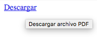
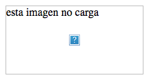
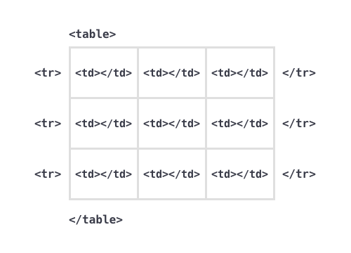

# Mi primera página web

Hasta ahora hemos visto una pequeña introducción a unos elementos básicos de HTML y CSS, pero hay más.

## Más etiquetas HTML

La etiquetas HTML nos permiten estructurar nuestro contenido según su función o carga semántica. Vamos a ver más etiquetas:

* para **definir nuestra página**
* para agrupar en **seciones**
* para identificar semánticamente el **contenido**
* para crear **tablas de datos**

		NOTA:
		Todavía no lo hemos dicho expresamente pero lo normal es anidarlas, meter etiquetas dentro de etiquetas.

```html
<html>
	<body>
		<header>
			<h1>Título</h1>
		</header>
		<main>
			<section>
				<h2>Subtítulo</h2>
				<p>Contenido y más contenido</p>
				<p>Contenido con <a href="">enlaces</a></p>
				<ul>
					<li>lista</li>
					<li>de</li>
					<li>cosas</li>
				</ul>
			</section>
		</main>
	</body>
</html>
```

## Secciones
Normalmente no vamos a querer meter nuestro contenido en la página y ya está, querremos darle una estructura y agruparlo en bloques. Para ello tenemos la etiqueta `<section>`.
Usaremos una sección para agrupar contenidos por temática:

	EJEMPLO:
	En la página de un producto agruparemos la descripción del producto por un lado y los comentarios de los compradores/usuarios por otro.

Hay una serie de secciones especiales que tienen asignado un significado semántico predeterminado:

* `<header>`: una cacebera o sección de presentación de un bloque
* `<main>`: Indica la principal sección de contenido
* `<footer>`: un pie o sección final de un bloque
* `<nav>`: un bloque de navegación, para un menú.
* `<aside>`: un bloque de contenido de menor importancia o con contenido relacionado
* `<article>`: un artículo

Estos bloques especiales se pueden usar unos dentro de otros según tenga sentido: por ejemplo, un `<article>` puede tener cabecera y pie, mientras que una cabecera no debería tener pie.

	NOTA: Si usamos mal estos elementos el navegador no va a dar error, pero estaremos haciendo un favor muy pobre a aquellos usuarios que necesiten este extra semántico para navegar (por ejemplo, un usario ciego).

## Contenido
Dentro de estas secciones querremos incluir nuestros contenidos. Además de los encabezados, párrafos y listas tenemos un juego importante de etiquetas:


### Enlaces
Uno de los conceptos básicos de HTML es el enlace que nos permite vincular páginas o partes de ellas de manera que la información no quede como algo aislado sino conectado:

Un ejemplo es la wikipedia, donde en cada artículo se añaden enlaces relacionados que hacen que puedas completar la información a medida que la vas consultando.

El enlace se escribe con la etiqueta `<a>` y con un atributo `href=""` que indíca a dónde enlaza.

Podemos enlazar a:
* una página o archivo
* una posicion dentro de la misma u otra página

El primer enlace es muy fácil, simplemente ponemos la dirección de nuestra página o archivo como valor del atributo href:

```html
<a href="https://www.wikipedia.org">Wikipedia.com</a>
```

El segundo tipo de enlace necesita de un atributo especial que es el `id=""`. Cualquier elemento de nuestra página puede llevar este atributo pero al tratarse de un identificador no debe haber dos elementos con la misma id en la misma página.

En mi página voy a identificar la cabecera y el contenido principal:
```html
<!doctype html>
<html lang="es">
<head>
	<meta charset="utf-8">
	<title>Mi página</title>
</head>
<body>
	<header id="top">
		<h1>Título de mi página</h1>
	</header>
	<main id="main">
		<h2>Texto en latín</h2>
		<p>Lorem ipsum dolor sit amet, consectetur adipisicing elit, sed do eiusmod tempor incididunt ut labore et dolore magna aliqua.</p>
	</main>
</body>
</html>
```

Ahora podría añadir un enlace abajo del todo para ahorrarme el scroll poniendo en el href el símbolo `#` seguido del id que quiero enlazar:

**index.html**
```html
<!doctype html>
<html lang="es">
<head>
	<meta charset="utf-8">
	<title>Mi página</title>
</head>
<body>
	<header id="top">
		<h1>Título de mi página</h1>
	</header>
	<main id="main">
		<h2>Texto en latín</h2>
		<p>Lorem ipsum dolor sit amet, consectetur adipisicing elit, sed do eiusmod tempor incididunt ut labore et dolore magna aliqua.</p>
	</main>
	<footer>
		<p><a href="#top">Volver arriba</a></p>
	</footer>
</body>
</html>
```

Si quisiese enlazar al contenido principal de mi página desde otra página usaría:

```html
<a href="index.html#top">Volver arriba</a>
```

En estos dos casos se dice que las rutas son **relativas** porque apuntan dentro de nuestro proyecto. Si incluímos el dominio donde está alojada la página o archivo, aunque sea en nuestro dominio, diremos que la ruta es **absoluta**.

Si conocemos una página que use id, podemos enlazar directamente a esa parte del contenido . Vamos a enlazar a la wikipedia, justo a la parte donde se habla de la piratería en la edad media:

```html
<a href="https://es.wikipedia.org/wiki/Piratería#La_Edad_Media">La piratería en la edad media</a>
```
Aquí el atributo href lleva la dirección de la página de la Wikipedia sobre la piratería y el id de la sección que se refiere a la edad media.

La etiqueta tiene varios atributos que debemos conocer:
* `title=""`: Donde podemos añadir un texto complementario que el navegador mostrará en un pequeño tooltip cuando pongamos el cursor sobre el enlace. Me interesa usarlo cuando tengo un enlace tipo "descargar" y quiero asociarle el texto "Descargar archivo PDF".  
**Ejemplo:**  

* `target=""`: Aquí podemos especificar si se abre en ventana nueva. Esto me interesa hacerlo cuando en mi página enlazo a páginas de otros y no quiero que el usuario "pierda" mi página al hacer clic en ellos.


### Negritas, cursivas
Tradicionalmente se usaban las etiquetas `<b>` y `<i>` para poner un texto en negrita (bold) o en cursivas o itálicas (italic). Estas etiquetas se mantienen aunque no tienen carga semántica, no significan nada más allá de que muestran el texto en negrita o cursiva.

Las nuevas etiquetas, `<strong>` y `<em>`, aunque visualmente hacen lo mismo (strong muestra el texto en negrita y em, en cursiva) sí que tienen una carga semántica, para indicar el nivel de énfasis o de importancia.
Con `<em>` resaltas un texto importante, y con `<strong>` resaltas un texto más importante.

```html
<p>Dentro de este párrafo tenemos <em>un texto importante</em> y <strong>uno que es muy importante</strong></p>
```

	NOTA:
	El aspecto visual de estas etiquetas es una convención entre los diferentes navegadores y, como veremos, se puede cambiar.

### Imágenes
Muchas veces querremos acompañar nuestro contenido con imágenes, ya sea para acompañarlo (imágenes de una noticia,… ), como motivo principal (una galería de ilustraciones,…).

Para ello tenemos la etiqueta ``, que tiene varios atributos:
* `src=""`: Aquí indicamos la ruta de nuestro archivo de imagen
* `title=""` Este atributo se puede aplicar a casi todas las etiquetas y siempre es un texto complementario que ayuda a entender mejor el texto enlazado y/o en temas de accesibilidad.
* * `alt=""`: El atributo alt es muy parecido pero es solo para imágenes y es el texto que va a mostrar el navegador en caso de la imagen no se pueda cargar.  
**Ejemplo:**  


### Saltos de línea
Aunque es recomendable usarlo con tiento tenemos unas etiquetas que fuerzan un salto de línea: `<br>`.
Desde que empezamos a separar el contenido y el diseño esta etiqueta ha quedado relegada a un lugar muy secundario pero todavía hay veces en los que vas a querer forzar una línea nueva en mitad de un texto y está bien conocerla.

```html
<h1>Mi título genial <br>en dos líneas</h1>
```

### Contenedores generales
Aparte de las secciones tenemos un par de contenedores sin propósito específico que nos sirven para hacer agrupaciones sin carga semántica. Son el `<div>` y el `<span>`. Mientras que el **div** es para bloques de contenido el **span** está indicado para partes del texto. Los iremos viendo más adelante.

### Tablas
Hubo un tiempo en el que las tablas eran la base sobre la que se maquetaba cualquier página web. Hoy se utilizan para lo que son: presentar datos tabulados.

La tabla básica tiene una estructura bastante simple y tiene tres etiquetas principales:
* una etiqueta que marque que se va a escribir una tabla
* una etiqueta para las filas
* una etiqueta para las celdas

En una imagen, una tabla de 3 filas y 3 columnas sería algo asi:


y en código quedaría así:
```html
<table>
	<tr>
		<td></td>
		<td></td>
		<td></td>
	</tr>
	<tr>
		<td></td>
		<td></td>
		<td></td>
	</tr>
	<tr>
		<td></td>
		<td></td>
		<td></td>
	</tr>
</table>
```

En principio, en las tablas siempre tiene que haber igual número de celdas en cada fila.

* * *
EJERCICIO 1

Hacer una tabla con la comida de cada día de la semana usando `<th>`.

* * *
EJERCICIO 2

Buscar información sobre todos estos elementos en  la [MDN](https://developer.mozilla.org/es/docs/Web/HTML/Elemento)

* Definición de página
	* doctype
	* html
	* head
	* title
	* link
	* meta
	* body
* Seciones de página
	* section
	* header, main, footer, nav, aside, article
* Contenido
	* div/span
	* h1-h6
	* p
	* blockquote
	* ol/ul, li
	* img
	* a
	* strong, em
	* small, abbr, sup, sub
	* br, hr
* Tablas
	* table
	* tr
	* td, th
	* caption
	* thead
	* tbody
	* tfoot
	* col, colgroup

* * *

## CSS
Todos los elementos HTML tienen una apariencia que comparte cada navegador, con pequeñas variaciones. Por defecto, el tamaño de texto por defecto es de 16px, con un intelineado de 1.15. Los encabezados y párrafos tienen un margen superior e inferior relacionado con el tamaño de texto: el `<h1>` se muestra a 32px y tiene 22px de margen. El fondo de la página es blanco y el color del texto es negro...

	NOTA:
	La médida básica en web es el pixel o px, cada dispositivo tiene su pantalla que tiene unas dimensiones definidas en pixels, por ejemplo, la pantalla de móvil más pequeña tiene 320x480px (si no se indica lo contrario siempre es "alto por ancho").

### Hojas de CSS reset
Debido a las pequeñas variaciones de la apariencia por defecto de los diferentes elementos html en cada navegador existen unas hojas de estilos más o menos estándar y más o menos completas que se llaman hojas de CSS reset.
Se trata de una hoja de estilos que intenta que todos los elementos se muestren igual en todos los navegadores y no hay un estándar para hacerlo.

Ahora mismo hay parte de la comunidad de desarrollo que no considera que estas hojas de reset sean necesarias porque:
* Las páginas deben verse bien en todos los navegadores, no exactamente igual
* Las últimas versiones de los navegadores son bastante decentes y la época dura de los navegadores antiguos, ya paso
* No hay un método estándar de reseteo de CSS

	NOTA: Aún así, en algúnos casos puede interesar usar una o incluso hacerse una propia, así que conocerlas es importante.

[Reset CSS](https://es.wikipedia.org/wiki/Reset_CSS)

### Selectores
Los navegadores ofrecen este aspecto por defecto pero nosotros lo podemos cambiar con CSS, creando estilos para definir la apariencia de nuestras página.

Para cambiar el aspecto de un elemento usamos un selector, hay varios tipos de selectores:
* la propia etiqueta del elemento: h1, a, p,…
* una clase que hayamos incluido con el atributo `class=""`
* a través de un identificador en el atributo `id=""`
* a través de una pseudo clase, que son unas palabras claves que añadidas al selector especifican un estado especial del elemento.
* a través de una mezcla de los anteriores

Vamos a ver cada uno de los casos.

#### El propio elemento como selector
Esto no es lo ideal y se aplica los estilos a cada elemento de este tipo que aparezca en la página, así que hay que usarlo con tiento.

Podemos, por ejemplo, hacer que todos los enlaces sean rojos.
```css
 a {
	 color: red;
 }
```

#### Clases como selectores
Las clases son palabras claves que atribuimos a elementos HTML para poder agruparlos por función o apariencia y diferenciarlos del resto de elementos de su mismo tipo.

Por ejemplo: La clase "text-link" nos permite aplicar estilos particulares a los enlaces que lleven dicha clase sin afectar al resto de enlaces.
```html
<a href="#" class="text-link">Enlace de texto</a>
```
En css creamos clases para aplicar a grupos de elementos como puede ser todos los enlaces de texto, o solo al listado de ingredientes o a los párrafos del pié de página.
La manera de indicar en css que se trata de una clase es escribiendo un `.` primero:
```css
.text-link {
	color: red;
}
```

#### Id como selector
Ya habíamos visto que los ID eran una palabra clave que usábamos como identificador para un único elemento. En css también los podemos usar como selector, pero al no poder haber más de uno por página no es recomendable usarlo salvo en casos muy excepcionales.

En una lista de acciones, por ejemplo, podemos tener unas clases para añadir estilos a los elementos del bloque y, ademas, añadir un identificador único para cada elemento.
```html
<ul class="actions">
	<li class="action">
		<a id="add-user" href="" class="button">Nuevo usuario</a>
	</li>
	<li class="action">
		<a id="rename-user" href="" class="button">Renombrar usuario</a>
	</li>
	<li class="action">
		<a id="delete-user" href="" class="button">Eliminar usuario</a>
	</li>
</ul>
```
Y ahora podríamos usar el ID para cambiar el tañamo del texto de uno de los elementos. Para ello, usamos la `#` seguida de la id como selector.
```css
#add-user {
	font-size: 24px;
}
```

#### Pseudo clase como selector
Las pseudo clases son palabras claves que añadidas a alguno de los selectores anteriores especifican un estado concreto del elemento. El más usado es el estado de `hover`, que es cuando colocamos el ratón encima del elemento.

Las pseudo clases se escriben usando el selector,  `:` y la palabra clave que toque.

Por ejemplo, como uno de los ejemplos anteriores tenemos un enlace que vamos a poner de texto rojo, pero cuando coloques el cursor encima invertiremos los colores y lo mostraremos con fondo blanco y color rojo. Partimos del mismo html que anteriormente.
```html
<a href="#" class="text-link">Enlace de texto</a>
```
Y el css sería:
```css
.text-link {
	color: red;
}
.text-link:hover {
	background: red;
	color: white;
}
```
[Codepen de ejemplo](https://codepen.io/oneeyedman/pen/wrLBQQ)

* * *

JUEGO

Para practicar los selectores, desde los más sencillos a los más complejos, te recomendamos [practicar con este divertido juego](https://flukeout.github.io/).

* * *

#### Las clases se pueden mezclar
De los ejemplos de las pseudo clases vemos que los selectores se pueden mezclar. Esto nos ayuda a contemplar casos particulares sin tener que usar las ID.

Un elemento HTML puede tener tantas clases como queramos y las indicamos en su atributo `class` separadas cada una por un espacio.

Por ejemplo, si tenemos una lista de botones como la anterior:
```html
<ul class="actions">
	<li class="action">
		<a href="" class="button button--new">Nuevo usuario</a>
	</li>
	<li class="action">
		<a href="" class="button button--rename">Renombrar usuario</a>
	</li>
	<li class="action">
		<a href="" class="button button--delete">Eliminar usuario</a>
	</li>
</ul>
```

Hemos eliminado el atributo id y hemos añadido una clase extra para cada tipo de botón. De esta manera tenemos por cada "botón" una clase general `.button` donde colocaremos los estilos comunes a todos los botones y luego una particular (`.button--new`, `.button--rename` y `.button--delete`) donde solo pondremos los ajustes particulares.
Digamos que queremos que los botones tengan una caja con bordes redondeados pero que el de añadir usuario sea verde, el de renombrar sea azul y el de borrar sea, claramente, rojo muerte.
```css
.button {
  background: grey;
  border-radius: 20px;
  color: white;
  display: inline-block;
  margin-bottom: 1em;
  padding: 10px 20px;
  text-decoration: none;
}
.button--new {
  background: green;
}
.button--rename {
  background: blue;
}
.button--delete {
  background: red;
}
```
[Codepen de ejemplo](https://codepen.io/oneeyedman/pen/gGNpaQ)

### Herencia
Hay una serie de estilos que se heredan, es decir, que se transmiten a los hijos. Entonces, si aplicamos una de estas propiedades a un elemento, todos los elementos anidados la heredarán también.

* * *
EJERCICIO 3

El color es una de la propiedades que se heredan así que si tenemos esta estructura:
```html
<article>
	<h2>Título</h2>
	<p>Lorem ipsum dolor sit amet, consectetur adipisicing elit</p>
	<p>Sed do eiusmod tempor incididunt ut labore et dolore magna aliqua</p>
	<aside class="links">
		<h3>Enlaces relaccionados</h3>
		<ul>
			<li><a href="#">Enlace 1</a></li>
			<li><a href="#">Enlace 2</a></li>
			<li><a href="#">Enlace 3</a></li>
			<li><a href="#">Enlace 4</a></li>
		</ul>
	</aside>
</article>
```
y al `<aside>` con clase `.links` le aplicamos una regla que ponga el texto rojo, ¿qué quedará en rojo?
* * *
* [Más info sobre herencia en la MDN](https://developer.mozilla.org/es/docs/Web/CSS/inheritance)


### Cascada y especificidad de selectores
CSS es, en español, Hojas de estilo en cascada. La "cascada" se refiere al proceso de combinación y aplicación de estilos en CSS y cómo se resuelven los conflictos entre ellos.

Acabamos de ver que a veces varios selectores se aplican al mismo elemento y es el algoritmo de la cascada lo que decide que propiedades se aplicaran.

La cascada depende de 4 factores:

1. La **importancia**: hay una palabra clave que hace que nuestra propiedad se aplique siempre.
2. La **especificidad**: es un arma de doble filo porque cuanto más específico sea un selector más fuerza tendrán sus reglas sobre las demás, pero el reto es escribir los selectores lo menos específicos posible.
3. El **orden** en el archivo CSS: Si varios selectores tienen la misma "fuerza" ganarán los que estén al final porque el css se aplica en orden de escritura.

[En la MDN viene perfectamente explicado](https://developer.mozilla.org/es/docs/Learn/CSS/Introduction_to_CSS/Cascada_y_herencia).

Dos enlaces sobre la especificidad más... a menos

* [CSS Specifity Wars](https://stuffandnonsense.co.uk/archives/css_specificity_wars.html)
* [CSS SPECIFITY](http://cssspecificity.com/#)


* * *
EJERCICIO 4

Partiendo de este [Codepen de ejemplo](https://codepen.io/oneeyedman/pen/vWEBex):
1. Por qué los enlaces son verdes y no rojos
2. Hacer que los enlaces sean rojos
3. Rehacer el HTML usando `<div>` en lugar de `<ul>` y `<li>`. ¿Qué pasa?
4. Comentar el CSS que no se puede tocar y reescribirlo usando una clase por selector para que se vea igual.
5. BONUS: Cambiar ahora entre `<div>` y `<ul>`/`<li>`
* * *
