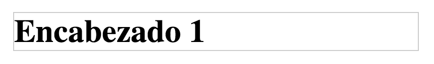
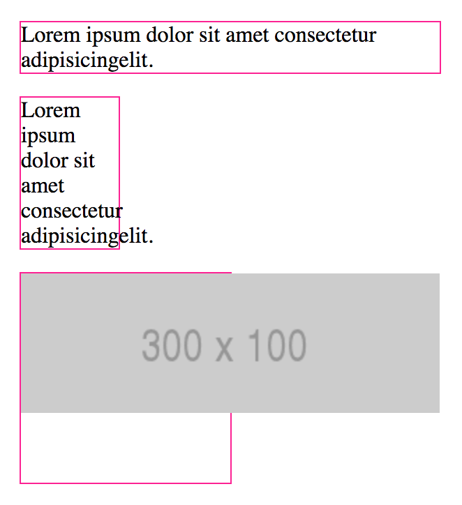
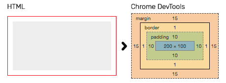
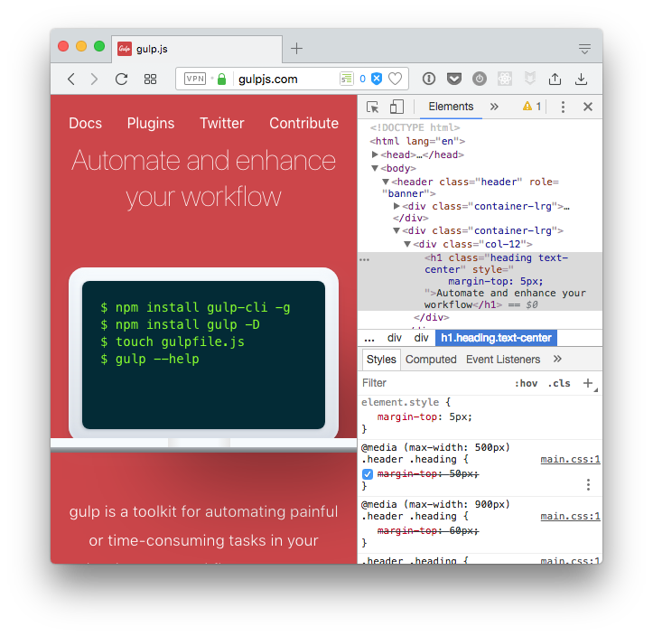
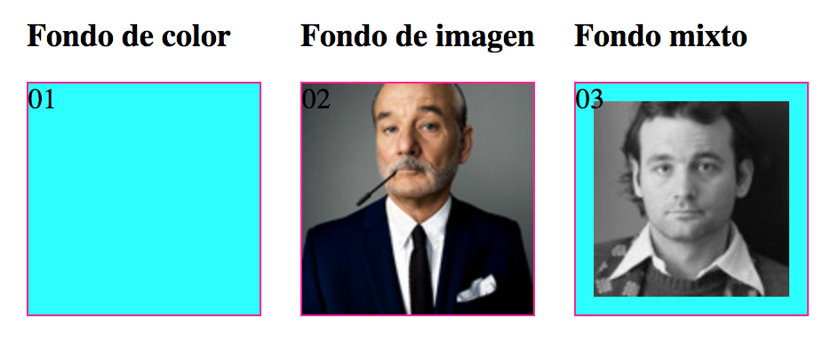

# Modelo de caja y herramientas

<!-- TOC START min:2 max:2 link:true update:true -->
- [Introducción](#introduccin)
- [¿Para qué sirve lo que vamos a ver en esta sesión?](#para-qu-sirve-lo-que-vamos-a-ver-en-esta-sesin)
- [Modelo de caja](#modelo-de-caja)
- [DevTools](#devtools)
- [BONUS: Colores](#bonus-colores)
- [BONUS: Background](#bonus-background)
- [BONUS: Usando fuentes de Google Fonts](#bonus-usando-fuentes-de-google-fonts)
- [BONUS: Paquetes de Atom que nos hacen la vida más fácil](#bonus-paquetes-de-atom-que-nos-hacen-la-vida-ms-fcil)
- [Recursos externos](#recursos-externos)

<!-- TOC END -->


## Introducción

En esta sesión veremos dos recursos fundamentales para construir nuestra web: modelo de cajas y las herramientas de desarrollo del navegador (DevTools).

Uno de los objetivos de la sesión es saber que hay dos modelos de caja, en qué se diferencian y cómo aplicar uno u otro.

El navegador Google Chrome nos ofrece una serie de herramientas llamadas Chrome Dev Tools que nos permiten obtener información sobre la página actual que tenemos y realizar pruebas y modificaciones sobre ella. Estas herramientas son las siguientes:

- El inspector. Nos permite ver el código de la página y los estilos que tiene aplicados a la vez que nos ofrece la posibilidad de modificarlo y cambiar los elementos de la web de sitio
- La herramienta Network. Muestra cuales son los recursos que carga la web actual, su peso y el tiempo que necesita para cargarlos. Además nos mostrará errores en caso de que algún recurso no pueda ser cargado debido a un error.

## ¿Para qué sirve lo que vamos a ver en esta sesión?

1. Para comprender cómo se comportan los contenedores cuando les cambiamos propiedades de apariencia como margen, borde, padding y ancho/alto. Y qué pasa cuando el contenido no cabe en nuestro contenedor.
2. Para entender cómo se aplican las imágenes de fondo
3. Para entender cómo se aplican los ajustes que realicemos a través del las Dev Tools

### ¿En qué casos se utiliza?

* Cuando tengamos que darle un aspecto determinado al contenido, es decir, siempre :)
* Cuando tengamos un problema en nuestra página para detectar dónde está el error.

## Modelo de caja
En HTML cada elemento se representa visualmente como una caja, lo podemos ver fácilmente añadiendo un borde a un elemento html y viendo cómo lo pinta el navegador, por ejemplo:  

```html
<h1>Encabezado 1</h1>
```  



El modelo de caja es una especificación que define las características específicas de esa caja y como infieren en el resto de elementos de la página; es el que le dice al navegador cómo debe pintar cada caja (elemento).

Antes de entrar en profundidad con los modelos de caja tenemos que ver las formas básicas de visualización de los elementos HTML:

### Visualización (display)

La propiedad CSS `display`, se encarga de definir cómo se va a visualizar un elemento HTML, cómo va a colocarse en la página y cómo se colocarán el resto de elementos respecto a este. Según el valor que tenga asignado display, un elemento puede ocupar el ancho entero de su contenedor, ocupar solo el espacio que necesite para mostrar su contenido, mostrarse como si fuese una casilla de una tabla o directamente ocultarse.

Los navegadores web aplican por defecto un valor `display` a todos los elementos HTML de nuestra web. Hay muchos valores distintos para `display` pero, por el momento, nosotros solo veremos cuatro:

* block
* inline
* inline-block
* none

#### Block

Los elementos en bloque se muestran ocupando el ancho completo de su contenedor, en otras palabras, si tenemos un elemento en bloque dentro de una etiqueta `aside`, este ocupará el ancho completo del `aside`, si por lo contrario el elemento está directamente dentro del `body`, este ocupará el ancho del `body` y así siempre. Los elementos en bloque siempre empiezan en una nueva línea y nunca van a tener más elementos a su misma altura dentro del mismo contenedor, estarán más arriba o más abajo.

Como hemos comentado antes, los navegadores asignan automáticamente un modo de visualización por defecto a todos los elementos HTML. Algunos elementos como los párrafos (`p`), los `div`s o las listas (`ol` y `ul`) por defecto se muestran en bloque debido a esos estilos que aplica el navegador.

[Elementos en bloque en Codepen](https://codepen.io/adalab/pen/WXQgrq)

Este Codepen representa cómo funcionan los elementos en bloque. En el resultado se ha puesto un fondo azul para que se vea el ancho total de cada elemento. Como se puede ver, en el caso del enlace, este ocupa el ancho de su contenido (del texto) mientras que los párrafos ocupan el ancho total del contenedor. El texto de los párrafos cabría perfectamente uno al lado del otro pero al ser bloques y ocupar ambos todo el ancho del contenedor, se muestran cada uno en una línea.

Usando CSS podemos hacer que un elemento que no se muestra en bloque cambie y se muestre de esta manera. Para ello aplicaremos `display: block` en el elemento. De esta forma, si queremos hacer que una clase imaginaria `.block` se muestre en bloque, utilizaremos el siguiente código:

```css
.block {
  display: block;
}
```

A continuación se muestra la lista completa de elementos HTML que, por defecto, los navegadores web muestran en bloque:

`<address>`, `<article>`, `<aside>`, `<blockquote>`, `<canvas>`, `<dd>`, `<div>`, `<dl>`, `<dt>`, `<fieldset>`, `<figcaption>`, `<figure>`, `<footer>`, `<form>`, `<h1>-<h6>`, `<header>`, `<hr>`, `<li>`, `<main>`, `<nav>`, `<noscript>`, `<ol>`, `<output>`, `<p>`, `<pre>`, `<section>`, `<table>`, `<tfoot>`, `<ul>` y `<video>`.

> **Nota:**  
> Como es difícil memorizar la lista completa de elementos que se muestran en bloque, podemos hacernos la siguiente pregunta para saber si un elemento se mostrará en bloque o no: _"¿Tendría sentido meter este elemento dentro de un párrafo?"_. Si la respuesta es "no", es muy probable que el elemento sea un bloque; si por lo contrario, la respuesta es sí, probablemente sea un elemento en línea. Por ejemplo, no tendría sentido meter una lista, un `aside` o un `div` dentro de un párrafo y por eso los navegadores muestran estos como bloques.

#### Inline

Los elementos en línea o _inline_ son aquellos que ocupan lo que ocupa su contenido. En estos, el tamaño será exactamente el tamaño de su contenido. Por ejemplo, si tenemos un enlace con el texto "púlsame", el ancho de ese enlace será el propio ancho del texto.

Debido a que los elementos en línea solo ocupan el ancho de su contenido, estos pueden colocarse uno al lado del otro hasta que no quede más espacio restante en la fila, en cuyo caso se colocarán en la fila siguiente. Cuando un elemento es muy largo y no cabe completamente en una línea, la parte que no cabe se baja a la línea siguiente. Por poner un ejemplo claro, un elemento en línea se comportaría como una letra más dentro de un texto, de hecho, estos también respetan los espacios entre ellos como se puede comprobar en el siguiente enlace de Codepen.

[Elementos en línea en Codepen](https://codepen.io/adalab/pen/vWNzLj)

Al ocupar solo el ancho de su contenido, los elementos en línea permiten colocar un elemento al lado del otro siempre y cuando ambos quepan en la misma fila, como sucede con los elementos en línea. Aquí también se respetarán los espacios entre los elementos en línea como si se tratasen de palabras normales y corrientes.

> **Nota:**  
> Las imágenes son un tipo especial de elemento en línea que por sus características actúa como una mezcla de elemento en línea y elemento en bloque, ya que pueden tener márgenes y padding verticales y se les pueden asignar un ancho y un alto.

Como norma general, los elementos `inline` no deberían contener otros elementos de bloque.

Una regla muy importante que se aplica sobre los elementos en línea es que estos no pueden cambiar su ancho ni su alto, no pueden tener márgenes horizontales y se puede aplicar margen y relleno vertical pero este no se tiene en cuenta a la hora de definir su altura y su posición vertical. Esto los diferencia de los elementos en bloque, que permiten tener un ancho y un alto específico y márgenes y padding tanto vertical como horizontal. Veremos la importancia de esto en esta misma sesión, cuando hablemos del modelo de cajas.

Usando CSS podemos cambiar la visualización de un elemento para hacer que se muestre en línea. Para ello aplicaremos `display: inline` en el elemento. Si quisiéramos hacer que una clase imaginaria `.inline` se muestre en bloque, utilizaríamos el siguiente código:

```css
.inline {
  display: inline;
}
```

A continuación se muestra la lista completa de elementos HTML que, por defecto, los navegadores web muestran en línea:

`<a>`, `<b>`, `<big>`, `<i>`, `<small>`, `<tt>`, `<abbr>`, `<acronym>`, `<cite>`, `<code>`, `<dfn>`, `<em>`, `<kbd>`, `<strong>`, `<samp>`, `<time>`, `<var>`, `<bdo>`, `<br>`, ``, `<map>`, `<object>`, `<q>`, `<script>`, `<span>`, `<sub>`, `<sup>`, `<button>`, `<input>`, `<label>`, `<select>` y `<textarea>`

> **Nota:**  
> Aquí podemos usar la misma pregunta que comentamos en la sección de elementos en bloque para deducir si un elemento está en línea: _"¿Tendría sentido meter este elemento dentro de un párrafo?"_. Si la respuesta es "sí", es muy probable que sea un elemento en línea.

#### inline-block

En este caso y como su nombre indica, el comportamiento de los elementos `inline-block` es una mezcla entre el comportamiento de los elementos en línea y los elementos en bloque.

Los elementos `inline-block` ocupan por defecto el ancho de su contenido y se comportan como si se tratase de una palabra más dentro de un texto, al igual que los elementos en línea, pero permiten tener un ancho, un alto y relleno y márgenes verticales, como sucede con los elementos en bloque.

[Elementos inline-block en Codepen](https://codepen.io/adalab/pen/KydxdP)

Para hacer que un elemento se comporte como `inline-block`, utilizaremos `display: inline-block;`, como hemos visto en los ejemplos con `inline` y `block`.

#### Elementos ocultos

A veces queremos que un elemento esté oculto, por ejemplo, el típico mensaje de aviso de cookies que aparece cada vez que entramos en una página. Con JavaScript, haremos que este mensaje se muestre o se oculte dependiendo si hemos visitado antes la página o no, pero desde JavaScript lo que haremos será añadir o quitar una clase CSS, los estilos los gestionaremos siempre desde el CSS.

Entonces, para poder ocultar un elemento (imaginemos que es una clase `hidden`) lo haremos desde el CSS. Para ello, haremos lo siguiente:

```css
.hidden {
    display: none;
}
```

Este código lo que hace es ocultar por completo cualquier elemento al que le añadamos la clase `.hidden`. Será como si ese elemento no existiese ya que no se mostrará y el resto de elementos de la página lo ignorarán.

Puedes ver un ejemplo en el siguiente Codepen:

[Elementos ocultos](https://codepen.io/adalab/pen/GOpXmw)

Por último, aquí tenemos un Codepen con la recopilación de los distintos tipos de visualización que hemos visto ahora.

[Elementos inline, inline-block y block en Codepen](https://codepen.io/adalab/pen/QOjVye)

* * *
EJERCICIO 1:

Usar la etiqueta `<mark>` dentro de varios párrafos y explicar para qué sirve y cómo funciona.
* * *
EJERCICIO 2:

Dentro de un párrafo de texto incluir una imagen de 100x100 y explicar cómo se distribuye el contenido.
* * *
EJERCICIO 3:

Entre dos párrafos añadir una imagen de 200x200 y explicar cómo se distribuye el contenido.
* * *

### Dimensiones: margen, borde, padding y ancho/alto
Una vez vistos los modos principales de visualización podemos entrar al modelo de caja. Recordemos que el modelo de caja es el que le dice al navegador cómo debe pintar cada caja.

Cada elemento tiene una *altura* (height) y *anchura* (width). Además, puede tener otros atributos relacionados que influyen en su tamaño y su posición, que son el padding o relleno, los márgenes y los bordes:
- el *borde* de un elemento es una línea que puede tener distinto grosor y que encuadra el contenido del elemento
- el *padding* es la distancia desde el contenido del elemento hasta el borde
- el *margen* es la distancia desde borde del elemento hasta los elementos que están a su alrededor

Si pensamos en el conjunto global, una página sería como un conjunto de cajas una dentro de otra, por lo tanto si pensamos en cada elemento a partir de ahora como un rectángulo nos será mucho más fácil visualizar cómo se compone la estructura de una web y cómo podemos pensar en ella combinando elementos que contienen otros elementos a su vez.

Puedes leer una [explicación más completa sobre el modelo de caja en la documentación de la MDN](https://developer.mozilla.org/es/docs/Learn/CSS/Introduction_to_CSS/Modelo_cajas).

* * *
EJEMPLO:

Si tengo una caja de 100x100px, con un borde de 2px y con un padding de 16px, tendría una caja de 2+16+100+16+2: 136x136px.
* * *

Con la propiedad `box-sizing` podemos cambiar el modelo de caja para un elemento (o para todos). Y podríamos asignarle `border-box`, que es el otro modelo existente.
En `border-box` tanto el borde como padding están incluidos en el ancho/alto del elemento, de manera que en el caso anterior nuestra caja tendría 100x100px pero el espacio para el contenido de nuestra caja no sería de 100x100 sino de 100-(2+2+16+16): 64x64px.

Mira y entiende este [ejemplo de modelo de caja en Codepen](https://codepen.io/adalab/pen/qoJNyN).

* * *
EJERCICIO 4:

Hacer un `div` de 100x100px usando las propiedades `width` y `height`, incluir dentro una imagen de 100x100px y probar:
- Añadir un padding de 10px
- Añadir un borde de 5px
- Cambiar el modelo de caja a `border-box` y explica qué ha pasado
* * *

### Overflow
Por defecto, nuestros contenedores tomarán el tamaño del contenido pero desde el momento en que definimos un tamaño para el contenedor puede pasar que el contenido no quepa ¿Y entonces, qué?

Pueden pasar dos cosas, que el contenido se pueda adaptar, como pasa con el texto o que el contenido simplemente se salga de nuestro contenedor (tb puede pasar con el texto):



[Mira este ejemplo en Codepen](https://codepen.io/adalab/pen/WzLBwq)

Podemos controlar cómo se comporta un contenedor en los casos en que el contenido se salga, tenemos 3 opciones:
1. No hacer nada y lidiar con las consecuencias
2. Ocultar todo lo que se salga
3. Incluir scroll en el contenedor

Podéis leer sobre la propiedad _overflow_::
* [overflow](http://devdocs.io/css/overflow)
* [overflow-x](http://devdocs.io/css/overflow-x)
* [overflow-y](http://devdocs.io/css/overflow-y)

* * *  
EJERCICIO 5:

Con estos enlaces, ¿sabrías resolver los casos de [este Codepen](https://codepen.io/adalab/pen/KobLGM)?

* * *
> **Nota:**  
> Recordad que para que el overflow se active, el contenedor tiene que tener definidas dimensiones (o ser un elemento de bloque y que el contenido sobrepase el ancho del contenedor)

## DevTools
Desde que aparecieron las Devtools en todos los navegadores decentes, la vida del frontend es mucho más tranquila. Estas herramientas nos permiten saber qué está pasando en un módulo concreto (medidas, posicionamiento, CSS aplicados) o qué está cargando nuestra web (hojas de estilos, imágenes, vídeos/audios, JavaScript).

### Devtools: Inspector
El inspector es una de las muchas herramientas de desarrollo que incluye el navegador web Google Chrome. Este grupo de herramientas recibe el nombre de Chrome DevTools.

#### ¿Cómo lo abrimos?

Para abrir el inspector tenemos varias opciones:
* Pulsando en el menú de tres botones de la derecha superior de Chrome > más herramientas > herramientas para desarrolladores
* Usar `Ctrl + Mayúscula + I` en Ubuntu o Windows y `Cmd + Opción + I` en Mac
* Pulsar con el botón derecho sobre un elemento de nuestra página y seleccionar la opción *Inspeccionar*

#### Si queremos cerrarlo...

* Pulsamos en la cruz que aparece en la esquina superior derecha del panel
* Usamos `Ctrl + Mayúscula + I` en Ubuntu o Windows y `Cmd + Opción + I` en Mac de nuevo

#### ¿Qué es?

El inspector es una herramienta que viene con nuestro navegador y por tanto es parte de la aplicación del navegador, está incluida en, prácticamente, todos los navegadores más famosos (Chrome, Firefox, Safari, Internet Explorer…) y sirve para leer, añadir, editar o eliminar tanto CSS como HTML (y sus atributos) de nuestra página. Con él haremos de cirujanos de la web, veremos sus tripas y las modificaremos a nuestro antojo.

El inspector nos permite indagar y modificar tanto en páginas que tengamos en nuestro ordenador como otras que estén publicadas en Internet. Cuando modifiquemos estas páginas no estaremos modificando las páginas como tal realmente, estaremos modificandolas temporalmente para ver qué sucedería si aplicamos ciertos cambios pero la web como tal, ya sea la de nuestro ordenador o la de Internet, no va a verse modificada. Esos cambios serán temporales y una vez que recarguemos la página se perderán y ésta volverá a su estado inicial.


#### ¿Para qué nos sirve?

Dado que nos permite controlar qué está pasando con una web, podemos ver los recursos que se están cargando y cuáles fallan. Nos permite ver el código tanto de nuestra página, para ver si está funcionando correctamente, como de otras, para ver cómo aplican ciertas técnicas o coger inspiración.

Por otro lado nos permite investigar qué cambios queremos hacer sin guarrear nuestro CSS o HTML y corregir de forma más rápida y sencilla los errores de nuestro código.

Por ejemplo, podemos ver información del modelo de caja:


Podemos colocarlo arriba, abajo, a la derecha o sacarlo a una nueva ventana.

* * *
EJERCICIO 6:

Entrar en [Wikipedia.org](Wikipedia.org) y:
* Cambiar el color de los enlaces a naranja
* Sobre los idiomas destacados que aparecen sobre la imagen de la pelota de Wikipedia, añadir uno falso
* Explicar cómo están compuestos estos módulos de idioma
* Explicar cómo están colocados
* Examinar la versión de tablet de Wikipedia
* Examinar la versión de móvil de Wikipedia
* Averiguar las dimensiones de la caja de búsqueda y
    * Cuánto tiene de separación con el botón de buscar
    * ¿Qué hay de raro con esa separación?
* * *

#### Cambiando css con el Inspector: el atributo style
Con el inspector no solo podemos consultar información sino cambiarla para hacer pruebas rápidas, en este ejemplo hemos aumentado el padding de la "caja" con el logo de **Atom** de `2em 1em` a `4em 1m`:


Esta edición rápida es posible gracias al atributo `style=""` que es otra forma de aplicar estilos y que se puede añadir a cualquier etiqueta html.

> **Nota:**  
> En principio no se deben aplicar estilos usando este atributo, en su lugar usaremos selectores css desde la hoja de estilos correspondiente.

Es una forma de aplicar estilos que ha quedado para usar principalmente desde programación (ya lo veremos más adelante) pero desde el inspector nos permite hacer cambios rápidos.

Usando este atributo los estilos se escriben en línea, seguidos y separados por `;`:
```html
<h1 style="color:black;font-size:3.2em;">Encabezado 1</h1>
```

* * *
EJERCICIO 7:

¿Sabriamos ir a la web https://duckduckgo.com, buscar el logo con el id "logo_homepage_link" y aplicarle estos estilos desde nuestro inspector?
```
background-color: black;
border-radius: 10px;
width: 250px;
```
* * *


### Devtools: Network
Sirve para ver qué recursos carga nuestra página y ver si se ha producido algún error cargando esos recursos. Network muestra tanto las imágenes como otros recursos que se cargan (CSS, JavaScript, fuentes, etc.)

Network también muestra cuánto tarda en cargarse un elemento y qué tamaño tiene. De esta forma podremos saber también si hemos metido un recurso muy pesado y si está afectando al tiempo que tarda la web en cargarse.

Podemos seleccionar qué tipo de archivos queremos que se muestren y ver la dirección desde la que se están cargando esos archivos. Este último punto es fundamental y nos permitirá saber, en caso de que un archivo esté dando error, por qué está fallando, ya que normalmente será porque hemos introducido una ruta (URL) errónea, es decir, hemos puesto en el código que el recurso está en una carpeta en la que no está realmente.

Otro recurso muy interesante que nos ofrece Network es que nos permite ver cuántos segundos tarda en cargarse nuestra página y tomar capturas de pantalla de cada momento para simular que será lo que verá un usuario durante el momento de la carga.

* * *

EJERCICIO 8:

Entrar en [Wikipedia.org](Wikipedia.org) y
* Averiguar el peso total de la página principal de Wikipedia
* Averiguar cuánto ha tardado en cargar la página
* Averiguar cuántas imágenes usa la página principal de Wikipedia
* * *

De momento veremos hasta ahí. Las herramientas para desarrolladores de Google Chrome ofrecen un sinfín de posibilidades más pero iremos viendo cada una en el momento en el que la necesitemos.

## BONUS: Colores

Para empezar, vamos a ver los distintos formatos que podemos usar para indicar colores, que podemos usar por ejemplo como valor de nuestro querida propiedad CSS `color`.

#### Colores con palabras clave

La primera forma de indicar un color es mediante la palabra clave que indica el nombre del color. Hay un montón de palabras clave para colores que podemos usar que podéis ver en [la tabla de este artículo](http://devdocs.io/css/color_value#Color_keywords).
* * *
EJEMPLO:

```css
p {
  color: fuchsia;
}
```
* * *

#### Colores en hexadecimal

De forma equivalente a las palabras clave, podemos expresar un color con formato hexadecimal. En este formato declaramos un color con una almohadilla `#` y sus 3 componentes RGB - R (rojo), G (verde), B (azul). Cada uno de los componentes se representa con 2 dígitos en hexadecimal, es decir, cada dígito puede tener 16 valores, entre 0 - 9 y A - F. Por ejemplo, el color fucsia se compone de una componente máxima de rojo (ff), nada de verde (00) y máxima de azul (ff).

* * *
EJEMPLO:

```css
p {
  color: #ff00ff;
}
```
* * *

Suele ser habitual expresar algunos colores comunes de forma simplificada. Si los dígitos de cada componente son iguales (por ejemplo, `ff`) puede escribirse el color de una forma simplificada escribiendo sólo una vez el dígito repetido. Por ejemplo, el fucsia puede simplificarse porque todos los componentes tienen el dígito repetido.

* * *
EJEMPLO:

```css
p {
  color: #f0f;
}
```
* * *

#### rgb y rgba

Como hemos visto en el caso anterior, los colores podemos expresarlos con sus componentes RGB (Red, Green, Blue). En CSS existe la posibilidad de, en lugar de usar 2 dígitos hexadecimales, expresar el color usando el valor decimal (número normal) de cada componente RGB, que tendrá un valor entre 0 y 255 (los mismos valores que podíamos indicar con 2 dígitos hexadecimales).

* * *
EJEMPLO:

```css
p {
  color: rgb(255, 0, 255);
}
```
* * *

Existe además la posibilidad de indicar un nivel de opacidad al color con el formato RGBA que añade el canal alpha o transparencia. Este último componente tiene valores decimales entre 0 (totalmente transparente) y 1 (totalmente opaco).

* * *
EJEMPLO:

```css
p {
  color: rgba(255, 0, 255, 0.7);
}
```
* * *

#### hsl y hsla

Igual que el RGB nos permite expresar colores a partir de sus componentes de color rojo/verde/azul, existe otro sistema, HSL, que nos permite expresarlos a través de H (hue - matiz), S (saturation - saturación), L (lightness - luminosidad). El matiz se expresa con un valor numérico y tanto saturación como luminosidad con un valor en %. En este caso, también existe la posibilidad de añadir un canal alpha para indicar transparencia.

* * *
EJEMPLO:

```css
p {
  color: hsl(300, 100%, 50%)
}

p {
  color: hsl(300, 100%, 50%, 0.7)
}
```
* * *

Para más información, consultad [la guía de colores de MDN](http://devdocs.io/css/color_value).

## BONUS: Background
Una vez entendido que cada elemento se puede ver como una caja, veamos cómo añadir un fondo a dicha "caja":

Gracias a la propiedad _background_ podemos rellenar el fondo de nuestro contenedor con una imagen, con un color, o ambos:




La propiedad background se construye con estos posibles valores:
- url de la imagen
- posición de la imagen dentro del contenedor (horizontal y vertical)
- modo de repetición de la imagen
- color de fondo

```css
  .box {
    background: url('url-de-la-imagen') left top no-repeat #ffcc00;
  }
```

> **Nota:**  
> El orden no tiene que ser necesariamente ese, pero os proponemos usarlo.

Realmente, la propiedad _background_ es una versión acortada de estas propiedades:
* **background-image:**: [Ver detalle](http://devdocs.io/css/background-image)
* **background-position:** [Ver detalle](http://devdocs.io/css/background-position)
* **background-repeat:** [Ver detalle](http://devdocs.io/css/background-repeat)
* **background-color:** [Ver detalle](http://devdocs.io/css/background-color)

* * *
EJERCICIO 9:  

¿Sabrías replicar los ejemplos de fondo usando [este Codepen](codepen.io/adalab/pen/JLwQpz)?
* * *

### Cuando usar las propiedades de background o la versión acortada
Usar estas dos propiedades produce el mismo resultado pero no son lo mismo:
```css
.box {
	background-color: green;
}
.box {
	background: green;
}
```
Mientras que en el primer caso estamos diciendo que el color de fondo sea `green`, en el segundo estamos diciendo eso y que el resto de valores pasen a su valor por defecto.
* * *
EJEMPLO:  

¿Sabrías adelantar el resultado de aplicar esta clase?:
```css
.box {
	background-image: url('https://fillmurray.com/150/1500');
	background: red;
}
```
- [ ] Se verá a Bill Murray de fondo
- [ ] Se verá a Bill Murray de fondo pero lo que no rellene la imagen será de color rojo
- [ ] Solo se verá un color rojo de fondo
- [ ] Otra

* * *
Cuando usamos un acortador estamos definiendo TODAS las opciones, aunque no las usemos, por eso siempre deberíamos usar las propiedades que necesitemos, y solo usar los acortadores cuando realmente estemos usando la mayoria de las propiedades que acortan :)

Si solo queremos cambiar el color de fondo deberíamos usar
`background-color`.
Si por el contrario queremos poner una imagen, en una posicion y con una repeticion, deberíamos usar el acortador `background` ya que realmente se escribe menos:

```css
.box {
	background-image: url('https://fillmurray.com/150/150');
	background-position: left top;
	background-repeat: no-repeat;
}
```
```css
.box {
	background: url('https://fillmurray.com/150/150') left top no-repeat;
}
```
### Background-size
Desde hace tiempo hay una propiedad nueva que nos permite redimensionar la imagen de fondo y hasta definir cómo se debe ajustar a nuestro contenedor: `background-size`.

Nosotros vamos a ver cómo ajustar el fondo a nuestro contenedor pero puedes consultar la [documentación completa](http://devdocs.io/css/background-size).

Hay dos valores especialmente interesantes ya que permiten definir cómo se ajustará nuestra imagen de fondo al contenedor: **contain** y **cover**.  

#### Contain
Aumenta o reduce la imagen proporcionalmente todo lo que pueda sin deformarla para que quepa en nuestro contenedor.

#### Cover
Aumenta o reduce la imagen proporcionalmente para asegurarse que siempre cubre todo el área de nuestro contenedor, aunque eso signifique que parte de la imagen pueda quedar oculta.

[Ejemplos de uso de Contain y Cover](https://codepen.io/adalab/pen/aGojMd)

## BONUS: Usando fuentes de Google Fonts

Para utilizar fuentes tipográficas de un sitio externo como Google Fonts, tenemos que seguir 2 sencillos pasos:
1) Añadir una etiqueta link a nuestro body con un enlace que cargue la fuente

```html
<link rel="stylesheet" href="https://fonts.googleapis.com/css?family=Font+Name">
```
2) Usar esta fuente desde nuestro CSS
```css
p{
  font-family: 'Font Name', serif;
}
```

#### ¿Cómo construimos la URL para enlazar la tipografía?

En la propia URL añadimos `family=` y escribimos el nombre de la tipografía a usar. Si tiene espacios, los sustituimos por `+`. Si queremos importar varias fuentes, podemos cargar todas en el mismo enlace a Google Fonts poniendo los nombres separados por `|`.

* * *
EJEMPLO:  

`https://fonts.googleapis.com/css?family=Tangerine|Inconsolata|Droid+Sans`

Para cada tipo de fuente se importa por defecto la fuente normal, pero puede que queramos usar la fuente con otro peso (como negrita) o estilo (como cursiva). Para esto, añadimos al final del nombre de la fuente `:` y separados por `,` los estilos o pesos extra que necesitemos. El peso puede expresarse también como valor numérico que indica el grosor (400 es normal, 700 es negrita).

* * *
EJEMPLOS:  
```
https://fonts.googleapis.com/css?family=Tangerine:bold
https://fonts.googleapis.com/css?family=Tangerine:bold,italic
https://fonts.googleapis.com/css?family=Tangerine:400,700
```
* * *
Para más información consultad la [guía de inicio de Google Fonts](https://developers.google.com/fonts/docs/getting_started).

## BONUS: Paquetes de Atom que nos hacen la vida más fácil

Como estáis comprobando, el editor es una de las herramientas que más usamos en nuestro día a día. Conocer algunos paquetes y trucos nos harán la vida más fácil.

#### Live server

Cuando creamos una web, al final será "servida" por un servidor web en Internet para que todo el mundo pueda visitarla. Por tanto, es útil tener un servidor web local en nuestro ordenador de desarrollo. En Atom, contamos con el paquete [`atom-live-server`](https://atom.io/packages/atom-live-server), que nos permite lanzar un servidor web local desde una carpeta de nuestro ordenador y ejecutándose en un puerto concreto.

Por defecto, el servidor web se lanza con origen en la carpeta raíz que tengamos en nuestro proyecto actual. Como cualquier servidor web, busca en la raíz un fichero `index.html` como punto de entrada a la web. Si no lo encuentra, un servidor web real daría un error, pero live-server muestra una página que nos permite navegar por las subcarpetas de nuestro ordenador hasta llegar al html que queramos mostrar.

Cada vez que modifiquemos los ficheros usados en la web que estamos visualizando en el navegador con Live Server, ésta se recargará *automágicamente* en el navegador.

Para lanzar el servidor, podemos usar los shortcuts (`Ctrl + Alt + 3`, `Crtl + Alt + 4`, etc.) o mostrar el lanzador (`Ctrl + Shift + p`), buscar 'server' y dar Enter sobre la opción para lanzar el servidor. Si no le decimos lo contrario, el servidor se está ejecutando todo el rato en nuestro ordenador. Si cambiamos de proyecto o tenemos algún problema, es importante pararlo con `Ctrl + Alt + q` o también desde el lanzador.

#### Auto-indent

Desde el lanzador de comandos (`Ctrl + Shift + p`) podemos buscar una opción de auto-indent que hace que el fichero actual adquiera una indentación correcta. Como sabéis indentar el código es muy importante para su legibilidad y para que nuestros compañeros entiendan mejor nuestro código. Nos puede ayudar a encontrar fallos (por ejemplo, etiqueta no cerrada) que de otra manera nos llevarían mucho tiempo.

Podéis mirar más [info del paquete de auto-indent](https://atom.io/packages/auto-indent).

#### Emmet

Es un lenguaje abreviado para escribir HTML, que quizá hayáis conocido en codepen. También podemos usarlo en Atom, instalando [el paquete correspondiente](https://atom.io/packages/emmet).

El uso básico es escribir una porción de código en Emmet, que al finalizar se convierte (expande) a HTML usando una tecla (por defecto, la tecla `Tab`).


Con este lenguaje abreviado podemos por ejemplo conseguir:
- 4 párrafos con `p*4`
- un párrafo y una imagen escribiendo `p+img`
- un párrafo con una imagen dentro con una imagen con `p>img`
- un párrafo con clase main con `p.main`
- un div con clase container `.container`

Podéis aprender más en la propia [web de Emmet](https://emmet.io/).

## Recursos externos

#### Sobre el modelo de caja
- [Libro Introducción a CSS - 4. Modelo de cajas](https://librosweb.es/libro/css/capitulo_4.html)
- [Libro de Introducción a CSS - 4.1. Anchura y altura](https://librosweb.es/libro/css/capitulo_4/anchura_y_altura.html)

#### Sobre las DevTools

- [Explicación detallada sobre las DevTools](https://developers.google.com/web/tools/chrome-devtools/?hl=es)
- [Videos de las herramientas para desarrolladores de Chrome - inglés](http://discover-devtools.codeschool.com/chapters/1?locale=en)

> **Nota:**  
> Estos videos están en inglés y no poseen subtítulos pero son muy buenos. Están realizados por el propio equipo de Google que fué el que en su día desarrolló las herramientas que explican en los videos.

- [Shortcuts del inspector](https://developers.google.com/web/tools/chrome-devtools/shortcuts?hl=es)
- [Usando las herramientas de desarrollador](https://es.khanacademy.org/computing/computer-programming/html-css/web-development-tools/a/using-the-browser-developer-tools)

> **Nota:**  
> Los dos videos de esta sección del curso de Khan Academy se pueden abrir en Youtube. Si los abrís en Youtube, activar los subtítulos y cambiáis la configuración a Auto-translate, podréis ver el video sin problemas ya que el traductor funciona muy bien.
