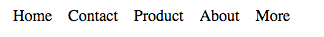

# Posicionamiento

## Introducción

En esta sesión veremos dos recursos fundamentales para modificar la apariencia de nuestra web: visualización (o display) y posicionamiento. Ambos permiten modificar cómo se muestran los elementos de la página ya sea modificando su tamaño, su posición o ambos a la vez.

## ¿Para qué sirve lo que vamos a ver en esta sesión?

1. Para saber las diferentes opciones que tenemos de colocarlos según el diseño que nos manden.

## ¿En qué casos se utiliza?

Cuando tengamos que darle un aspecto determinado al contenido, es decir, siempre :)
Algunos casos concretos son:
1. Un listado de elementos distribuidos por columnas
1. El típico módulo que lleva el corazón de "like" en una esquina
1. Una galería donde las flechas de anterior/siguiente estén, una cada lado, y centradas verticalmente
1. El típico módulo de precios "desde 5€ al mes" donde el diseñador ha desplegado toda su creatividad compositiva con un diseño con elementos a diferentes tamaños.
1. El menú que se mantiene en la parte superior del navegador al hacer scroll
1. El menú que aparece por uno de los laterales

## Objetivos de la sesión
1. Aprender los principales modos de presentación de los elementos HTML: inline, inline-block y block
1. Conocer los modos de posicionamiento: static, relative, absolute y fixed.

## Visualización (display)

La propiedad CSS `display`, se encarga de definir cómo se va a visualizar un elemento HTML, como va a colocarse en la página y cómo se colocarán el resto de elementos respecto a este. Según el valor que tenga asignado display, un elemento puede ocupar el ancho entero de su contenedor, ocupar solo el espacio que necesite para mostrar su contenido, mostrarse como si fuese una casilla de una tabla o directamente ocultarse.

Los navegadores web aplican por defecto un valor `display` a todos los elementos HTML de nuestra web. Hay muchos valores distintos para `display` pero, por el momento, nosotros solo veremos cuatro:

* block
* inline
* inline-block
* none

### Block

Los elementos en bloque se muestran ocupando el ancho completo de su contenedor, en otras palabras, si tenemos un elemento en bloque dentro de una etiqueta `aside`, este ocupará el ancho completo del `aside`, si por lo contrario el elemento está directamente dentro del `body`, este ocupará el ancho del `body` y así siempre. Los elementos en bloque siempre empiezan en una nueva línea y nunca van a tener más elementos a su misma altura dentro del mismo contenedor, estarán más arriba o más abajo.

Como hemos comentado antes, los navegadores asignan automáticamente un modo de visualización por defecto a todos los elementos HTML. Algunos elementos como los párrafos (`p`), los `div`s o las listas (`ol` y `ul`) por defecto se muestran en bloque debido a esos estilos que aplica el navegador.

[Elementos en bloque en Codepen](https://codepen.io/adalab/pen/WXQgrq)

Este codepen representa cómo funcionan los elementos en bloque. En el resultado se ha puesto un fondo azul para que se vea el ancho total de cada elemento. Como se puede ver, en el caso del enlace, este ocupa el ancho de su contenido (del texto) mientras que los párrafos ocupan el ancho total del contenedor. El texto de los párrafos cabría perfectamente uno al lado del otro pero al ser bloques y ocupar ambos todo el ancho del contenedor, se muestran cada uno en una línea.

Usando CSS podemos hacer que un elemento que no se muestra en bloque cambie y se muestre de esta manera. Para ello aplicaremos `display: block` en el elemento. De esta forma, si queremos hacer que una clase imaginaria `.block` se muestre en bloque, utilizaremos el siguiente código:

```css
.block {
    display: block;
}
```

A continuación se muestra la lista completa de elementos HTML que, por defecto, los navegadores web muestran en bloque:

`<address>`, `<article>`, `<aside>`, `<blockquote>`, `<canvas>`, `<dd>`, `<div>`, `<dl>`, `<dt>`, `<fieldset>`, `<figcaption>`, `<figure>`, `<footer>`, `<form>`, `<h1>-<h6>`, `<header>`, `<hr>`, `<li>`, `<main>`, `<nav>`, `<noscript>`, `<ol>`, `<output>`, `<p>`, `<pre>`, `<section>`, `<table>`, `<tfoot>`, `<ul>` y `<video>`.

**Nota:** Como es difícil memorizar la lista completa de elementos que se muestran en bloque, podemos hacernos la siguiente pregunta para saber si un elemento se mostrará en bloque o no: _"¿Tendría sentido meter este elemento dentro de un párrafo?"_. Si la respuesta es "no", es muy probable que el elemento sea un bloque; si por lo contrario, la respuesta es sí, probablemente sea un elemento en línea. Por ejemplo, no tendría sentido meter una lista, un `aside` o un `div` dentro de un párrafo y por eso los navegadores muestran estos como bloques.

### Inline

Los elementos en línea o _inline_ son aquellos que ocupan lo que ocupa su contenido. En estos, el tamaño será exactamente el tamaño de su contenido. Por ejemplo, si tenemos un enlace con el texto "púlsame", el ancho de ese enlace será el propio ancho del texto.

Debido a que los elementos en línea solo ocupan el ancho de su contenido, estos pueden colocarse uno al lado del otro hasta que no quede más espacio restante en la fila, en cuyo caso se colocarán en la fila siguiente. Cuando un elemento es muy largo y no cabe completamente en una línea, la parte que no cabe se baja a la línea siguiente. Por poner un ejemplo claro, un elemento en línea se comportaría como una letra más dentro de un texto, de hecho, estos también respetan los espacios entre ellos como se puede comprobar en el siguiente enlace de Codepen.

[Elementos en línea en Codepen](https://codepen.io/adalab/pen/vWNzLj)

Al ocupar solo el ancho de su contenido, los elementos en línea permiten colocar un elemento al lado del otro siempre y cuando ambos quepan en la misma fila, como sucede con los elementos en línea. Aquí también se respetarán los espacios entre los elementos en línea como si se tratasen de palabras normales y corrientes.

**Nota:** Las imágenes son un tipo especial de elemento en línea que por sus características actúa como una mezcla de elemento en línea y elemento en bloque, ya que pueden tener márgenes y padding verticales y se les pueden asignar un ancho y un alto.

Como norma general, los elementos `inline` no deberían contener otros elementos de bloque.

Una regla muy importante que se aplica sobre los elementos en línea es que estos no pueden cambiar su ancho ni su alto, no pueden tener márgenes horizontales y se puede aplicar margen y relleno vertical pero este no se tiene en cuenta a la hora de definir su altura y su posición vertical. Esto los diferencia de los elementos en bloque, que permiten tener un ancho y un alto específico y márgenes y padding tanto vertical como horizontal. Veremos la importancia de esto en esta misma sesión, cuando hablemos del modelo de cajas.

Usando CSS podemos cambiar la visualización de un elemento para hacer que se muestre en línea. Para ello aplicaremos `display: inline` en el elemento. Si quisiéramos hacer que una clase imaginaria `.inline` se muestre en bloque, utilizaríamos el siguiente código:

```css
.inline {
    display: inline;
}
```

A continuación se muestra la lista completa de elementos HTML que, por defecto, los navegadores web muestran en línea:

`<a>`, `<b>`, `<big>`, `<i>`, `<small>`, `<tt>`, `<abbr>`, `<acronym>`, `<cite>`, `<code>`, `<dfn>`, `<em>`, `<kbd>`, `<strong>`, `<samp>`, `<time>`, `<var>`, `<bdo>`, `<br>`, ``, `<map>`, `<object>`, `<q>`, `<script>`, `<span>`, `<sub>`, `<sup>`, `<button>`, `<input>`, `<label>`, `<select>` y `<textarea>`

**Nota:** Aquí podemos usar la misma pregunta que comentamos en la sección de elementos en bloque para deducir si un elemento está en línea: _"¿Tendría sentido meter este elemento dentro de un párrafo?"_. Si la respuesta es "sí", es muy probable que sea un elemento en línea.

### inline-block

En este caso y como su nombre indica, el comportamiento de los elementos `inline-block` es una mezcla entre el comportamiento de los elementos en línea y los elementos en bloque.

Los elementos `inline-block` ocupan por defecto el ancho de su contenido y se comportan como si se tratase de una palabra más dentro de un texto, al igual que los elementos en línea, pero permiten tener un ancho, un alto y relleno y márgenes verticales, como sucede con los elementos en bloque.

[Elementos inline-block en Codepen](https://codepen.io/adalab/pen/KydxdP)

Para hacer que un elemento se comporte como `inline-block`, utilizaremos `display: inline-block;`, como hemos visto en los ejemplos con `inline` y `block`.

### Elementos ocultos

A veces queremos que un elemento esté oculto, por ejemplo, el típico mensaje de aviso de cookies que aparece cada vez que entramos en una página. Con JavaScript, haremos que este mensaje se muestre o se oculte dependiendo si hemos visitado antes la página o no, pero desde JavaScript lo que haremos será añadir o quitar una clase CSS, los estilos los gestionaremos siempre desde el CSS.

Entonces, para poder ocultar un elemento (imaginemos que es una clase `hidden`) lo haremos desde el CSS. Para ello, haremos lo siguiente:

```css
.hidden {
    display: none;
}
```

Este código lo que hace es ocultar por completo cualquier elemento al que le añadamos la clase `.hidden`. Será como si ese elemento no existiese ya que no se mostrará y el resto de elementos de la página lo ignorarán.

Puedes ver un ejemplo en el siguiente Codepen:

[Elementos ocultos](https://codepen.io/adalab/pen/GOpXmw)

Por último, aquí tenemos un Codepen con la recopilación de los distintos tipos de visualización que hemos visto ahora.

[Elementos inline, inline-block y block en Codepen](https://codepen.io/adalab/pen/QOjVye)

* * *
EJERCICIO 1

Usar la etiqueta `<mark>` dentro de varios párrafos y explicar para qué sirve y cómo funciona.
* * *
EJERCICIO 2

Dentro de un párrafo de texto incluir una imagen de 100x100 y explicar cómo se distribuye el contenido.
* * *
EJERCICIO 3

Entre dos párrafos añadir una imagen de 200x200 y explicar cómo se distribuye el contenido.
* * *

## Posicionamiento
Aparte de modificar esa distribución, podremos hacer que cambien su comportamiento a la hora de hacer scroll en la página y que modifiquen la posición de otros objetos al modificar la suya propia.

La propiedad `position` de CSS será la que nos permita modificar la forma en la que se distribuyen los objetos a través de una página web.

El atributo `position` es fundamental en las webs actuales porque sin él todo el contenido sería lineal, es decir, no podríamos tener ciertas superposiciones y no podríamos sacar a un elemento del flujo de la página, el resto de elementos (contenedor y elementos hermanos) no lo tienen en cuenta, lo ignoran.

La propiedad `position` tiene cuatro valores posibles:
* `static`: es el tipo de posición por defecto en todos los elementos HTML
* `relative`: Permite modificar la posición de un elemento en función de su posición actual en la página
* `absolute`: Saca al elemento del flujo de la página, es decir, hace que su contenedor y los elementos de antes y después no lo tengan en cuenta a la hora de posicionarse y definir su tamaño y por otro lado posiciona el elemento en función de la posición del body o en su defecto del primer elemento contenedor que tenga una posición diferente a static (posicion por defecto)
* `fixed`: Saca a un elemento del flujo normal de la página y permite posicionarlo en función de la ventana del navegador. Aparte, este tipo de elementos mantienen su posición cuando hacemos scroll en la página (como si se mantuviesen anclados en un mismo punto), de ahí su nombre fixed (fijo)

- Video explicatorio de [posicionamiento web](https://www.youtube.com/watch?v=13CbCpAnvYI)
- Video para entender [position: static](https://www.youtube.com/watch?v=whqnlupzpNk)
- Video para entender [position: relative](https://www.youtube.com/watch?v=X6lG1biGJa8)
- Video para entender [position: absolute](https://www.youtube.com/watch?v=wpuP2kCN6QE)

* * *
EJERCICIO 4

Hacer un botón con un icono alineado a la izquierda y centrado verticalmente.
* * *
EJERCICIO 5

Hacer un enlace de descarga con una etiqueta del tipo de archivo que siempre esté a la derecha.
* * *
EJERCICIO 6

Hacer una página que tenga una cabecera que se mantenga fija.
* * *
EJERCICIO 7

Define un documento HTML con un div padre (divPadre), dentro del cual existan otras 3 cajas contenedoras div (div1, div2 y div3), cada una de ellas con unas dimensiones de 300x300px, 40 píxeles de margin en todas direcciones, 30 píxeles de padding en todas direcciones y un background color diferente. Usando posicionamiento relativo genera un desplazamiento de los div de la siguiente manera:S

a) El div 1 deberá desplazarse 100 píxeles a la derecha y 50 píxeles hacia abajo respecto a lo que sería su posición normal.

b) El div 2 deberá desplazarse 150 píxeles a la izquierda y 320 píxeles hacia arriba respecto a lo que sería su posición normal.

c) El div 3 deberá desplazarse 180 píxeles a la derecha y 240 píxeles hacia arriba respecto a lo que sería su posición normal.

* * *
EJERCICIO 8

Define un documento HTML con 3 cajas contenedoras div (div1, div2 y div3), la primera con unas dimensiones de 500x500px y un background color amarillo. La segunda con dimensiones 300x300px y un background color verde. La tercera con dimensiones 150x150px y background color azul. Usando posicionamiento absoluto establece para el div2 y el div3 el mismo origen que para el div1, de modo que el efecto generado sea ver un cuadrado amarillo dentro del cual hay un cuadrado verde dentro del cual hay un cuadrado azul.

Haz que las cajas estén centradas vertical y horizontalmente. Pon 40px de padding y 2px de borde al div1, 75px de padding al div 2 y 20px de borde de puntos al div3. Para esto usad box-sizing border-box
* * *
EJERCICIO 9

Define un documento HTML con varios div que contengan suficiente texto como para que la página se muestre con scroll (barras de desplazamiento). El primero de los div debe contener el texto “Esta página web utiliza cookies. Si continúa navegando acepta el uso de cookies.”, un valor height (altura) de 100 píxeles y color de fondo amarillo. Usando posicionamiento fixed, fija este div en la parte superior de la página de modo que se continúe visualizando aún cuando hagamos scroll.
* * *
EJERCICIO 10

Crea una lista de cinco elementos que se muestre en línea y con espacios entre cada elemento de 12 píxeles.

Vista de la lista sin estilos


Vista de la lista con estilos

* * *
EJERCICIO 11

Crea un texto que ocupe el 86% de la pantalla y esté centrado dentro del body. Usaremos la propiedad max-width para dar un ancho máximo de 600px. [Más info acerca de max-width](https://developer.mozilla.org/es/docs/Web/CSS/max-width).
* * *
EJERCICIO 12

Crea una composición similar a la de la imagen.


Las dimensiones de esta composición serían las siguientes:
- El body tendrá un borde de 8px
- El contenido estará centrado dentro del body e irá dentro de un div que tendrá 106px de margen superior
- En el primer texto irá el nombre del autor con una fuente de 18px y un margen inferior de 40px
- El titular irá después con un tamaño de fuente de 32px y un margen inferior de 32px
- Cada párrafo tendrá un tamaño de fuente de 18px y un margen inferior de 27px
- El enlace tendrá un padding superior e inferior de 8px y otro izquierdo y derecho de 16px y un margen izquierdo de -16px
* * *
EJERCICIO 13

La web que vamos a crear consta de las siguientes características:
1. Toda la web usa una tipografía sin serifa (sans-serif)
1. Tiene como título "Tecnologías web"
1. Tiene un párrafo que describe qué son las tecnologías web
1. Al final del párrafo, tiene un listado de tecnologías compuesto por: HTML, CSS y JavaScript, cada una de las cuales aparece subrayada para indicar que se puede interactuar
1. Al poner el ratón sobre cualquiera de ellas
  1. el cursor cambia para indicar que estamos obteniendo ayuda
  1. aparece un tooltip (recuadro flotante de 400px por 200px) de color blanco, con el nombre de la tecnología como título del tooltip y una breve descripción de la misma
* * *
EJERCICIO 14

Vamos a crear una web simple, con las siguientes características:
1. Una cabecera que consta únicamente de un título
1. Un cuerpo principal que consta de un montón de párrafos, tantos como para que la página tenga scroll
1. Un pie de página con
  1. El nombre de la empresa
  1. Un listado de redes sociales de la empresa (en formato texto o imagen) que aparezcan en línea
1. Un texto para indicar que el sitio web usa cookies con un enlace para ver más info, que aparece en la esquina inferior derecha de la pantalla y que sigue ahí al hacer scroll
* * *

## Recursos externos

- [Cómo funciona float](https://www.youtube.com/watch?v=AoAy4jCFDDw)
- [Libro Introducción a CSS - 5.1. Tipos de elementos](https://librosweb.es/libro/css/capitulo_5/tipos_de_elementos.html)
- [Libro Introducción a CSS - 5.2. Posicionamiento](http://librosweb.es/libro/css/capitulo_5/posicionamiento.html)
- [Libro Introducción a CSS - 5.3. Posicionamiento normal (static)](http://librosweb.es/libro/css/capitulo_5/posicionamiento_normal.html)
- [Libro de Introducción a CSS - 5.4 Posicionamiento relativo](http://librosweb.es/libro/css/capitulo_5/posicionamiento_relativo.html)
- [Libro de Introducción a CSS - 5.5 Posicionamiento absoluto](http://librosweb.es/libro/css/capitulo_5/posicionamiento_absoluto.html)
- [Libro de Introducción a CSS - 5.6 Posicionamiento fijo](http://librosweb.es/libro/css/capitulo_5/posicionamiento_fijo.html)
- [Libro de Introducción a CSS - 5.7 Posicionamiento flotante](http://librosweb.es/libro/css/capitulo_5/posicionamiento_flotante.html)
