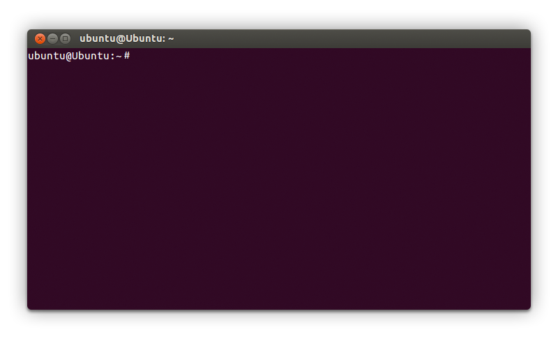
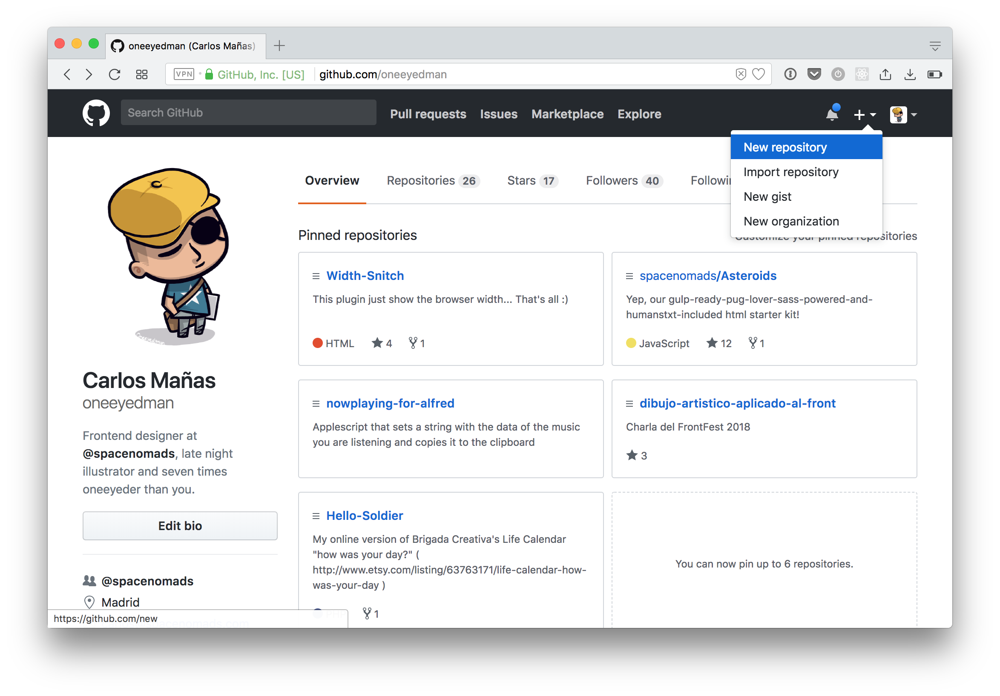
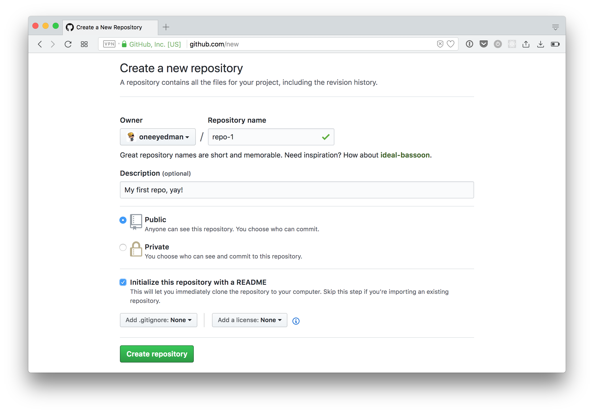
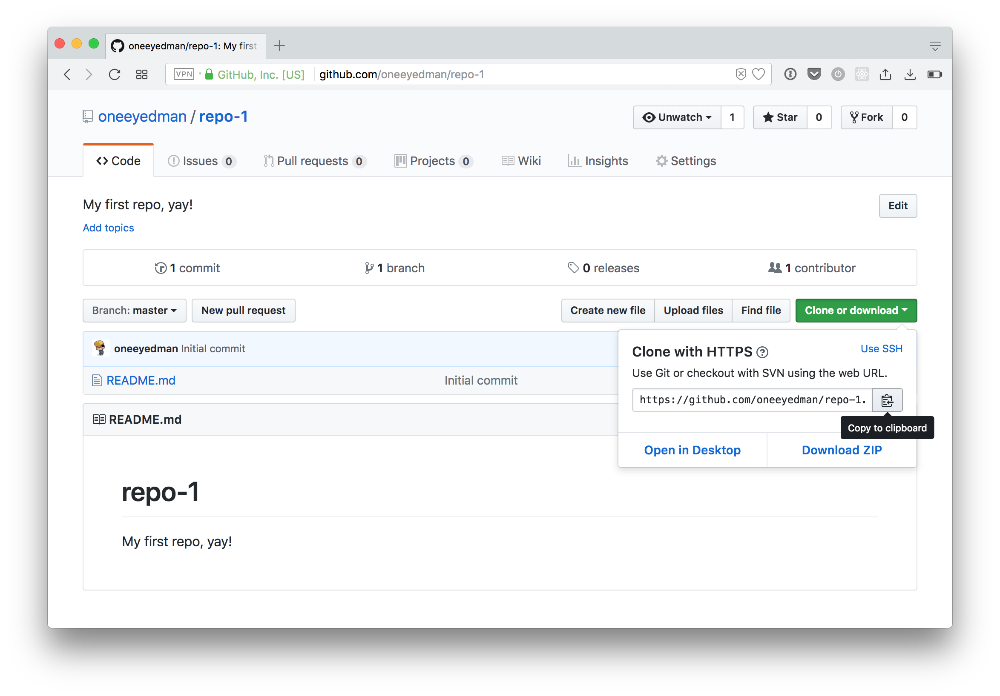
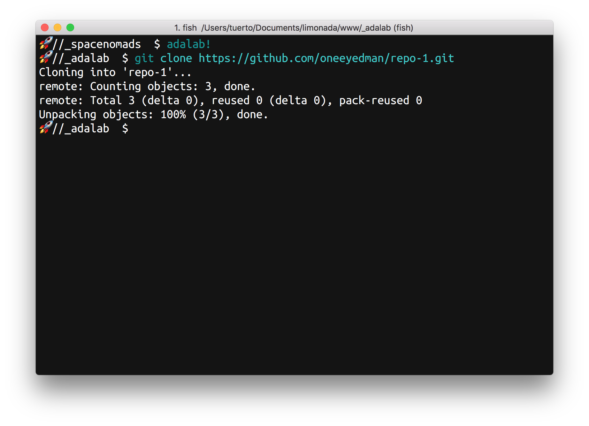
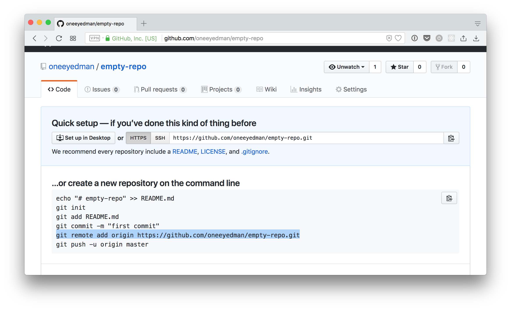

# Publicando nuestra web

<!-- TOC START min:2 max:2 link:true update:true -->
- [Introducción](#introduccin)
- [Resumen de la sesión](#resumen-de-la-sesin)
- [¿Para qué sirve lo que vamos a ver en esta sesión?](#para-qu-sirve-lo-que-vamos-a-ver-en-esta-sesin)
- [¿En qué casos se utilizan?](#en-qu-casos-se-utilizan)
- [Terminal](#terminal)
- [Git](#git)
- [GitHub](#github)
- [GitHub Pages](#github-pages)
- [Github Classroom](#github-classroom)
- [Recursos extra](#recursos-extra)

<!-- TOC END -->


## Introducción

La terminal es una herramienta fundamental para el desarrollo front-end. Su finalidad es ejecutar comandos mediante instrucciones. Estos comandos serían similares a las interacciones que haríamos en una aplicación normal (clics, escribir en campos, cambiar de sección, etc.) pero en este caso se hacen escribiendo órdenes en la ventana. Muchas de las herramientas para programación están hechas sin interfaz por ser más sencillas, aprender a usar la terminal nos ayudará en el futuro a poder usar esas herramientas y mejorar nuestro flujo de trabajo gracias a ellas.

La terminal parece muy agresiva al principio pero poco a poco le iremos pillando cariño. Te permite hacer prácticamente todo lo que puedes hacer con la interfaz gráfica del sistema operativo y bastantes cosas más.

También vamos a aprender cómo funciona el control de versiones y cómo utilizarlo para ir, poco a poco, añadiéndolo a nuestro flujo de trabajo. En esta sesión vamos a ver las dos herramientas que utilizaremos para gestionar las versiones de nuestro proyecto, Git y GitHub.

Git será la herramienta que utilizaremos para realizar un control de versiones sobre nuestros archivos. Es una herramienta que se utiliza a través de la línea de comandos de nuestro ordenador, es decir, para trabajar con Git escribiremos comandos en nuestra Terminal.

GitHub es la plataforma social más famosa a la hora de publicar y colaborar en desarrollo de código. Además, permite guardar en un servidor nuestro código y sincronizarlo con el código que tendremos en nuestro ordenador. Todo esto lo hace apoyándose en Git.

Otra cosa que veremos durante la sesión es el servicio de GitHub Pages que ofrece GitHub. Este servicio nos permite publicar nuestro código como si se tratase de un sitio web y que la gente pueda verlo en internet desde cualquier parte del mundo. Al final de esta sesión veremos cómo habilitarlo para poder mostrar al mundo nuestra primera página web.

## Resumen de la sesión

En esta sesión se intenta acercar el control de versiones para que lo acabemos incluyendo en nuestro flujo de trabajo.

Además presentamos la plataforma GitHub y su servicio de hosting: GitHub Pages.

## ¿Para qué sirve lo que vamos a ver en esta sesión?

En la terminal hoy solo vamos a aprender a movernos por las carpetas y crear algún archivo pero más adelante será una herramienta fundamental al trabajar en grupo y con control de versiones.

Por ahora solo hemos empezado a arañar el mundo front-end pero el uso de un control de versiones nos ofrece algo que antes no teníamos:

* Si me dejé el trabajo en casa, ¿Cómo puedo continuar trabajando?
* ¿Cómo puedo deshacer un cambio que acabo de realizar?
* ¿Cómo puedo saber de forma clara en qué punto hice un cambio concreto?
* ¿Cómo trabajo con otros sin que sea un caos y nos estemos pisando todo el rato?

La solución a todas esas preguntas es simple: usando un control de versiones.

Por su parte, GitHub, como hemos comentado, es una plataforma web que nos ofrece una serie de funcionalidades y herramientas para facilitarnos nuestro trabajo a la hora de realizar y mantener código. Algunas de las posibilidades que ofrece GitHub son las siguientes:

* Usarlo como servidor donde sincronizar y hacer una copia de seguridad de nuestro proyecto
* Formar parte de una red social que gira en torno a la programación, con perfil de usuario, posibilidad de interactuar con otros usuarios y posibilidad de usarla como portafolio de nuestros trabajos de desarrollo web
* Acceder a herramientas para gestionar mejor los proyectos y facilitar el desarrollo del código
* Tener una plataforma donde alojar nuestro sitio web y poder mostrarla al resto del mundo de forma sencilla (GitHub Pages)

## ¿En qué casos se utilizan?

Git se utiliza tanto en los casos más simples, como un pequeño proyecto o un archivo de configuración; hasta una locura con varios compañeros y que luego os vaya a hacer ricos. Siempre y cuando queráis (y podáis) tenerlo subido y disponible para todos.

Nosotros lo utilizaremos siempre que queramos llevar un control de los cambios que hemos hecho en un proyecto para no perder información. Al principio será sólo en determinados proyectos de código, pero a medida que le vayáis cogiendo el gustillo, empezareis a sentiros vacías sin él. En Adalab, por ejemplo, lo utilizamos para gestionar el contenido del curso. Si, este contenido que estáis leyendo ahora mismo está creado utilizando Git :).

Por poneros un ejemplo que hayáis vivido en vuestra piel, no tendría sentido utilizar Git para los pequeños ejercicios que hacemos para practicar los conocimientos pero sí que tendría sentido usar este control de versiones para gestionar el proyecto grupal del primer sprint.

Respecto a GitHub, lo utilizaremos siempre que queramos compartir un código con el resto de la comunidad o si queremos tenerlo en lo que se llama "la nube" para no perderlo y que cualquier persona con acceso y permisos de escritura pueda editarlo desde cualquier parte del mundo.

Por último, GitHub Pages, al ser un servicio gratuito y sencillo para publicar páginas, es un recurso muy útil si queremos colgar en internet algún proyecto de forma gratuita.

Es importante saber que todos los servicios de GitHub son gratuitos siempre y cuando nuestro código sea público. En caso de querer hacerlo privado deberemos pagar por el servicio. Por el momento como queremos darle visibilidad al código y que otras personas puedan verlo, no tendremos ningún problema en que nuestro código sea público.

## Terminal

### Introducción a la Terminal
La terminal o consola es una de nuestras herramientas principales en el desarrollo front. Nos permite comunicarnos con el sistema mediante pequeñas instrucciones de texto (las llamamos *comandos*) sin necesidad de una interfaz gráfica.

La terminal nos permite obtener información del sistema, realizar tareas y hasta automatizarlas, y ganar en productividad.

La terminal de nuestro ordenador tiene este aspecto:



En esta ventana iremos escribiendo nuestros comandos para interactuar con el ordenador o con aplicaciones que no tengan una interfaz gráfica.

Por defecto la terminal nos mostrará una línea (el *prompt*) a partir de la cual podremos escribir nuestros comandos.

Normalmente nuestro prompt tendra este aspecto:  
**usuario@nombre-de-equipo: ruta por defecto $**
```shell
ubuntu@ubuntu: ~$
```
Esto nos dice que el usuario de nuestro equipo es **ubuntu**, que nuestro equipo se llama **ubuntu** y que estamos en la carpeta raíz de nuestro usuario (que se representa con `~`).


### Comandos básicos de GNU/Linux
#### PWD
Principalmente usaremos la terminal para movernos por el sistema de archivos del ordenador. Así que es fundamental saber dónde estamos en cada momento. El comando `pwd` (_Print Working Directory_) se encargará de mostrarnos en qué carpeta nos encontramos.

```shell
$ pwd
```
> **NOTA**: Muchas veces nos encontraremos los comandos que tenemos que introducir precedidos por el símbolo `$`, pero no hay que escribirlo.  

Devolverá la ruta absoluta de la carpeta en la que estemos, con este aspecto:
```shell
/user/nombre-de-usuario
```
Esto es una ruta absoluta, que se construye a partir de la carpeta raíz de nuestro equipo, representada por el carácter inicial `/`. Nos estaría indicando que nos encontramos en la carpeta `nombre-de-usuario`, que está dentro de `user`, que está en la carpeta raíz de nuestro equipo.

Las rutas pueden ser *absolutas*, como la que nos devuelve el comando `pwd`, y empiezan por `/`. También pueden ser *relativas*, que usaremos más adelante.
Las relativas usan los caracteres especiales `..` para referirse a la carpeta madre de nuestra carpeta actual, o `.` (o nada) para referirnos a una carpeta que está dentro de nuestra carpeta actual.

```shell
../carpeta-madre
```

```shell
./carpeta-hija
carpeta-hija
```

### LS
El comando `ls` nos muestra un listado de los archivos y carpetas que hay en nuestra carpeta actual.

### CD
El comando `cd` (Change Directory) nos ofrece diferentes posibilidades a la hora de cambiar de carpeta:


```shell
cd nombre-de-carpeta
```

Nos permite entrar en la carpeta `nombre-de-carpeta` que estaría en nuestra carpeta actual.  

***

```shell
$ cd /ruta/absoluta/a/una/carpeta
```
También podemos escribir la ruta absoluta desde la raíz de nuestro equipo `/` a la carpeta a la que queremos entrar.

***

```shell
$ cd
```
`cd` solo nos devuelve a la carpeta de nuestro usuario (esta es la localización por defecto donde se abrirá nuestra terminal)

***

```shell
$ cd ..
```
`..` nos permite subir un nivel, esto es, ir a la carpeta que contiene nuestra carpeta actual

***

```shell
$ cd -
```
Este comando permite "deshacer" el último cd realizado: vuelve a la localización anterior al último cambio de carpeta.


### MKDIR
Nos permite crear una carpeta. PERO NO ENTRA EN LA CARPETA NUEVA.

Si no especificamos una ruta se creará en la localización actual pero se puede indicar la ruta usando `/` y `..`. Por ejemplo, vamos a crear una carpeta "proyecto" en la carpeta madre de la carpeta actual:
```shell
$ mkdir ../proyecto
```

### CLEAR
A veces va a pasar que hemos introducido muchos comandos y sería genial poder "limpiar" la ventana. Para eso existe el comando `clear`, que nos limpia la ventana de la terminal.

### CP y MV
Si queremos copiar o mover archivos usaremos los comandos `cp` o `mv`. El formato será `cp`/`mv` archivo-de-origen archivo_de_destino.

Vamos a mover el archivo index.html de nuestra carpeta actual a la carpeta madre:
```shell
$ mv index.html ../index.html
```
> **NOTA**: `mv` también sirve para renombrar ficheros o carpetas

### Abrir nuestra carpeta actual en el explorador de archivos desde la terminal
A veces nos interesará abrir nuestra carpeta actual en el explorador de archivos y esto se puede hacer fácilmente desde la terminal con el comando:
```shell
$ nautilus .
```

y sí, `$ nautilus ..` nos abrirá nuestra carpeta madre en el explorador de archivos ;)


***
EJERCICIO 1:

Ir a nuestra carpeta de documentos y crear la siguiente estructura de carpetas y archivos (vacíos):
```txt
nombre
    datos
        mis-datos.txt
    proyecto
        ruta-del-proyecto.txt
```
- En el archivo **mis-datos.txt** vamos a escribir el Nombre y la comida favorita.
- En el archivo **ruta_del-proyecto.txt** pondremos la ruta del nuestro proyecto desde nuestra carpeta de `Documentos`
- Mover los dos archivos a la carpeta principal, que sería **nombre**
***
EJERCICIO 2:

Desde la terminal, vamos a crear un nuevo proyecto en nuestra carpeta de proyectos que se llame `rutas-relativas`, con las carpetas `images` y `styles`. Y los archivos `index.html` (en la raíz del proyecto), `style.css` (en la carpeta `styles`) y `imagen-de-prueba.jpg` (la podéis descargar desde [este enlace](assets/images/1-7/imagen-de-prueba.jpg)).

Ahora, en `index.html` se tiene que ver la imagen de dos formas:
1. Con un ``
2. Como fondo de un `div` del mismo tamaño que la imagen

¿Cómo es la ruta de ambas imágenes? ¿Absoluta? ¿Relativa?
¿Es diferente en los dos casos? ¿por qué?
***

## Git

### Introducción a Git

Vamos a ver una pequeña introducción a Git, para ello hemos seleccionado el siguiente video ya que pensamos que explica de forma breve y sencilla qué es Git y algunos de sus conceptos básicos.

- [1.- Curso Git - Introducción a Git](https://www.youtube.com/watch?v=zH3I1DZNovk)

### Instalar Git en nuestro ordenador

Vamos a ver cómo instalar Git en nuestro ordenador. Para llevarlo a cabo, primero comprobaremos si tenemos instalada una versión reciente de Git. Si la versión que tenemos no es reciente, realizaremos los cambios necesarios para actualizarla. Si por el contrario, tenemos instalada una versión actual, iremos directamente al paso 3 para configurar en git nuestro nombre, email y contraseña.

**Nota:** La idea es que a medida que vayáis viendo cuáles son los pasos para instalar Git, los vayáis realizando en la Terminal para configurar Git en vuestro ordenador.

#### 1. Comprobar que Git está instalado y actualizado

Para comprobar si tenemos instalado Git en nuestro ordenador, debemos abrir la Terminal y ejecutar el comando `git --version`. Esto mostrará el texto `git version` seguido de la versión de Git que tenemos instalada. Para poder trabajar de forma correcta, lo indicado sería que tuviésemos una versión igual o posterior a la `2.11.0`.

Si nuestra versión es anterior, continuaremos con el proceso de instalación que aparece a continuación. Si por el contrario, tenemos instalada la versión `2.11.0` o una posterior (ej: `2.14.0`), podemos continuar con el siguiente paso.

##### En Ubuntu

**Importante:** Antes de realizar los comandos que aparecen a continuación, es importante que sepas que tras ejecutarlos te pedirá que introduzcas la contraseña de tu ordenador. A medida que la escribas no aparecerá nada por seguridad, así no se verá tu contraseña. Aunque no se muestre nada, puedes teclear tu contraseña y pulsar intro y, si es correcta, procederá con la ejecución de los comandos.

Para instalar Git en Ubuntu, primero obtendremos la información para poder descargar la última versión disponible, para ello ejecutamos el siguiente comando:

```shell
sudo add-apt-repository ppa:git-core/ppa
```

Una vez tengamos la información disponible para poder descargar la versión más reciente, actualizaremos la info que tenemos en el ordenador:

```shell
sudo apt-get update
```

Por último, ejecutaremos el comando para instalar Git:

```shell
sudo apt-get install git -y
```

Con esto deberíamos tener ya instalado Git en nuestro ordenador, para estar seguros volveremos a ejecutar el comando `git --version`, esta vez debería de aparecernos un número de versión mayor que `2.11.0`.

##### En Mac

**Importante:** Antes de realizar los comandos que aparecen a continuación, es importante que sepas que tras ejecutarlos te pedirá que introduzcas la contraseña de tu ordenador. A medida que la escribas no aparecerá nada por seguridad, así no se verá tu contraseña. Aunque no se muestre nada, puedes teclear tu contraseña y pulsar intro y, si es correcta, procederá con la ejecución de los comandos.

Para instalar Git en nuestro Mac, vamos a instalar primero un gestor de paquetes, llamado `Homebrew`, que nos ayudará a instalar herramientas como Git de forma sencilla. Este gestor es de código abierto, seguro y está mantenido por una gran comunidad, por lo que no tenemos por qué preocuparnos. Para instalar Homebrew, abrimos la Terminal y ejecutamos el comando que aparece en la línea que hay más abajo.

```shell
/usr/bin/ruby -e "$(curl -fsSL https://raw.githubusercontent.com/Homebrew/install/master/install)"
```

**Nota:** Al pulsar intro tras introducir este comando, se empezarán a imprimir líneas en nuestra Terminal y nos pedirá que pulsemos Intro para continuar con la instalación del gestor de paquetes.

Después de haber instalado `Homebrew`, podremos instalar la última versión de Git de forma simple con el siguiente comando:

```shell
brew install git
```

Una vez haya terminado de instalarse Git, tendremos todo listo para continuar con el siguiente paso.

#### 2. Añadimos nuestro nombre a la configuración de Git

Abrimos la aplicación de la terminal e introducimos el siguiente comando, tal y como se muestra abajo, sustituyendo `"John Doe"`. Una vez lo hayamos introducido, pulsamos intro para que se ejecute.

**Importante:** Escribiremos nuestro nombre entre comillas para evitar problemas a la hora de ejecutar el comando.

```shell
git config --global user.name "John Doe"
```

#### 3. Configuramos nuestro email para trabajar con Git

Ahora introducimos el siguiente comando para guardar la configuración de nuestro email:

```shell
git config --global user.email "johndoe@example.com"
```

Sustituiremos en este caso `"johndoe@example.com"` por el email que hemos utilizado para crear nuestra cuenta de GitHub.

**Nota:** Es importante que el email coincida con el que hemos utilizado en GitHub, ya que se utilizará para comprobar nuestros credenciales a la hora de subir información a un repositorio en esta plataforma.

#### 4. Añadimos la configuración para que se guarde nuestra contraseña para GitHub

Por defecto, cada vez que intentamos conectarnos con GitHub, el servidor de GitHub nos pedirá la contraseña de nuestro usuario. Como vamos a subir y descargar cambios de GitHub de forma constante, puede ser un poco molesto tener que introducir la contraseña cada vez que queramos conectarnos con el servidor. Para evitar esto, vamos a almacenar la contraseña de forma segura en nuestro ordenador.

##### En Ubuntu

Para poder almacenar la contraseña de GitHub en Ubuntu, realizaremos los siguientes comandos uno por uno:

1. `sudo apt-get install libgnome-keyring-dev`
1. Nos solicitará una contraseña, aquí debemos introducir la contraseña de nuestro ordenador, no la de GitHub.
1. `cd /usr/share/doc/git/contrib/credential/gnome-keyring`
1. `sudo make`
1. `cd -`
1. `git config --global credential.helper /usr/share/doc/git/contrib/credential/gnome-keyring/git-credential-gnome-keyring`

Al hacer esto, la próxima vez que introduzcamos nuestra contraseña de GitHub, esta se almacenará de forma segura en nuestro ordenador y no será necesario volver a introducirla de nuevo.

Una vez hayamos realizado ese paso, no necesitaremos hacer ningún cambio más.

##### En Mac

Para poder almacenar la contraseña de GitHub en Mac, simplemente ejecutamos el siguiente comando:

```shell
git config --global credential.helper osxkeychain
```

Una vez hayamos realizado ese paso, no necesitaremos hacer ningún cambio más.


### Cómo trabajar con Git

Para trabajar con Git lo haremos usando comandos a través de la Terminal, como comentábamos en la introducción de esta sesión. Para ello tendremos que aprender unos comandos básicos.

Una vez instalado Git en nuestro equipo tendremos que activar el control de versiones en nuestro proyecto, esto lo haremos con `git init`. Este comando lo usaremos solo una vez en la carpeta de nuestro proyecto y activa que se controle cada cambio que hacemos a nuestros archivos del proyecto.

A partir de este momento, cada vez que hagamos cambios, Git sabrá qué archivos hemos modificado.

En cualquier momento podremos pedir que nos diga en qué estado está el proyecto con un `git status`, lo que nos dirá si hemos cambiado archivos.

Normalmente trabajaremos con cambios cortos o tareas pequeñas, y cuando hayamos terminado, querremos indicarle a Git que ya hemos terminado un paquete de cambios, para lo que tenemos dos comandos:
1. `git add -A` para añadir los archivos que hemos modificado. Una vez añadidos Git sabrá qué cambios hemos hecho.
2. `git commit -m "Mensaje"` nos permite crear como un paquete de cambios y "guardarlo en nuestro sistema de versiones", nos dejará escribir un mensaje corto para asociarlo al paquete de cambios o *commit*.
3. Si queremos ver la lista de commits realizados en un proyecto usaremos `git log`.

En el video que añadimos a continuación se explican los comandos básicos para empezar a trabajar con Git.

- [3.- Curso Git - Nuestro primer proyecto](https://www.youtube.com/watch?v=vH9pkFf1D7M)

>**Nota:** En el video pone los mensajes de los commits en español pero nosotros los escribiremos en inglés.

#### Mensaje del commit

Es importante acompañar el commit con un mensaje. Este mensaje debe ser suficientemente corto para que no sea una locura leerlo y, a la vez, explique qué cambio se ha hecho de forma clara. Normalmente trabajaremos con otros compañeros en un mismo proyecto y será fundamental que todos entiendan que se ha hecho en cada paso para poder trabajar de forma más rápida y no tener que estar preguntando qué es cada cosa. Crear mensajes claros en los commits, nos servirá también para que si volvemos nosotros mismo a ver un commit del pasado, podamos entender qué es lo que hicimos.

A la hora de escribir un mensaje para un commit hay múltiples maneras de plantearlo e infinidad de guías. Como estamos empezando tengamos en cuenta sólo la siguiente serie de normas para crear un mensaje lo suficientemente bueno:
* Debe estar escrito en inglés
* Tiene que ser corto. Máximo 72 caracteres
* Debe explicar brevemente y a nivel general los cambios que se han hecho (añade el footer, corrige los enlaces del artículo, etc.)
* No tiene que detallar los cambios hechos en el código, sino en general. Recordemos que ya tenemos un control de versiones que muestra, exactamente, qué se ha hecho. (ej: no pongáis "Añade dos <p>s", poned mejor "Añade el texto de la introducción")
* Usaremos el imperativo (ejemplo: `Change header styles`) para decir qué hace el commit. (Ej: Cambia los estilos del header)

Un ejemplo de un buen commit:

```
git commit -m "Fix typo in article title"
```

***
EJERCICIO 3:

Vamos a crear nuestro primer proyecto con Git, al que llamaremos `testing-git`. Dentro de él, crearemos un archivo HTML con un título en el que ponga "Testing Git" y un `h1` con el mismo texto. Además, crearemos un archivo para los estilos (`main.css`) dónde añadiremos un estilo para que la familia de texto que se use en la web sea `sans-serif`. Organizaremos el proyecto siguiendo la estructura de siempre:
```txt
testing-git
    styles
        main.css
    images
    index.html
```
Una vez creado el proyecto con el HTML y el CSS indicado. Inicializa el repositorio Git en nuestro proyecto y haz el primer commit con el mensaje `Initial commit`
***
EJERCICIO 4:

Modificar el archivo `index.html` para que en el título de la página ponga "My first Git project" y en el texto de la cabecera aparezca una sonrisa `:)`. Añadir los cambios y hacer un commit para guardarlos.

**Nota:** El mensaje del commit deberá explicar de forma clara los cambios que hemos realizado

***
EJERCICIO 5:

Vamos a realizar un tercer cambio dónde añadiremos un archivo `README.md` en la raíz de nuestro proyecto. Este archivo se utiliza para poner información acerca de nuestro código y, por defecto, GitHub lo muestra en la página principal de nuestro proyecto. Dentro de ese archivo escribiremos el siguiente texto:

```markdown
# My first Git project

Dummy project to learn Git basics
```

**Nota:** El mensaje del commit deberá explicar de forma clara los cambios que hemos realizado
***

## GitHub

Como hemos explicado anteriormente, GitHub es una plataforma de desarrollo colaborativo para alojar proyectos utilizando el sistema de control de versiones de Git. Está muy enfocada a proyectos de código abierto, por lo que es de uso gratuito siempre que tus proyectos estén disponibles para todos. Pagando puedes tener proyectos privados, pero la verdadera fuerza de GitHub está en la comunidad tan grande que se ha montado sobre la idea de código abierto u open source :)

***
EJERCICIO 6:

Crea una cuenta en GitHub y ponte una foto de perfil.

***

Hasta ahora sabemos crear un repositorio Git local pero ahora vamos a conectarlo con un repositorio remoto que crearemos en GitHub, de esta forma podremos acceder al código desde cualquier equipo y podremos colaborar con nuestras compañeras.

Para ello, nos vamos a nuestro perfil y buscamos el botón `+` para crear un nuevo repositorio:



Rellenamos los datos que nos piden: nombre del repositorio, descripción y marcamos que queremos inicializarlo con un `Readme.md`:


Una vez creado, nos llevará a la página principal de nuestro repo donde podremos conseguir la url para descargarlo en nuestro equipo. Esta es una descarga especial que llamamos, clonar, que nos hace una copia local del proyecto contactada con la versión remota.



Ahora, con esta url podemos irnos a nuestra terminal y clonarlo con `git clone`:



Esto nos generará una carpeta con nuestro proyecto. **Recordad que crea la carpeta pero no nos mete dentro** por lo que tendremos que usar el comando `cd` de nuestra terminal para cambiar la ruta actual.

> **Nota**:  
> Por defecto git nos creará una carpeta con un nombre automático, si queremos un nombre específico para la carpeta de nuestro proyecto podemos declararlo tras la url que nos da GitHub:

```shell
$ git clone url-del-repositorio-que-me-da-github nuevo-nombre-de-carpeta
```  
En el video que mostramos a continuación se hace un pequeño tour alrededor de la plataforma para ver cómo funciona y las funcionalidades que ofrece. En el video pone el nombre del repositorio con mayúsculas y minúsculas, nosotros lo pondremos en minúsculas y con el texto separado por guiones, como hacemos con las carpetas de nuestros proyectos. En el video también explica ramas, pero lo ignoraremos. De momento solo vamos a trabajar con una rama (master), más adelante veremos cómo es el flujo a la hora de trabajar con varias ramas, pero vayamos poco a poco.

> **Nota:**  
> Sólo veremos hasta el min 21:34. Porque en el resto del video habla de cosas que no vamos a aprender por el momento.

### ¿Y si ya tengo un proyecto con Git en local?
A la hora de conectar el repo local y el remoto lo mas cómodo es empezar creando el repo en GitHub, clonándolo y seguir a partir de ahí con la conexión ya hecha. Pero puede pasar que ya tuviésemos un proyecto en local que hubiésemos inicializado con `git init`, en este caso seguiremos estos pasos:  

1. Creamos un repo vacío en GitHub **SIN INICIALIZARLO CON README.ME, GITIGNORE O LICENCIA**.
2. Esto nos llevará a una página diferente con las instrucciones para conectar un repo local con nuestro repo remoto: 

3. Copiamos la línea con `git remote add origin url-del-repositorio-que-me-da-github`
4. Desde la terminal, nos vamos a la carpeta de nuestro proyecto que ya tiene inicializado un repo local y la ejecutamos. Esto conectará los dos repos.

En el siguiente vídeo tenemos una pequeña intro a Github. Echadle un ojo hasta el minuto 21:34, ya veremos el resto de contenidos más adelante:

- [5.- Curso Git - Empezando con GitHub (sólo hasta el min 21:34)](https://www.youtube.com/watch?v=Qn186NyDqOk)

***
EJERCICIO 7:

Vamos a:
1. Crear un proyecto vacío en GitHub. Le pondremos como nombre `testing-git`.
1. Añadimos el repositorio que acabamos de crear como repositorio remoto en nuestro proyecto usando `git remote` como se muestra en el video.
1. Hacer _push_ para mandar la info del proyecto al repositorio remoto y, de esta forma, almacenar los datos del proyecto en GitHub. Comprobar tras hacerlo que, al abrir la página del proyecto en GitHub, se muestran los cambios que hemos realizado en nuestro ordenador.
1. Realizar un cambio en el CSS del proyecto para que el texto de la cara sonriente se muestre centrado vertical y horizontalmente en la página.
1. Una vez que estemos conforme con nuestro tipo sonriente, haremos un commit para añadir el cambio a nuestro repositorio y otro push, para sincronizar los cambios de nuestro repositorio local con los del remoto y, de esta forma, subir los cambios a GitHub.
***


## GitHub Pages

Como hemos comentado previamente, GitHub ofrece un servicio llamado [GitHub Pages](https://pages.GitHub.com) que pueden utilizar los usuarios como hosting gratuito para los proyectos que estén alojados en GitHub.

Un hosting es un servicio de almacenamiento de datos para poder tener tu web en un servidor y que esté disponible en internet y esto es lo que ofrece exactamente GitHub Pages.

***
EJERCICIO 8:

Desde la página de nuestro proyecto `testing-git` en GitHub, activar GitHub Pages.

**Pista:** Hay que ir a la pestaña _settings_ del proyecto ;)
***

## Github Classroom
GitHub Classroom es un "módulo" de GitHub que permite automatizar el control de acceso y la creación de repositorios. Durante este curso lo usaremos para asignar ejercicios.

Classroom permite asignar repositorios vacíos o con un código inicial.

***
EJERCICIO 9:  

Haz clic en el siguiente enlace [https://classroom.github.com/a/uISrxCY8](https://classroom.github.com/a/uISrxCY8) para crear tu primer repositorio a través de GitHub Classroom, y luego:
1. Clónatelo en tu equipo
2. Crea un archivo `readme.md`
3. Dentro, escribe tu nombre precedido de un `#`: `# NOMBRE APELLIDOS`
4. Haz `add` y `commit`
5. Haz un `push` al repo remoto :)
***

## Recursos extra

### Pro Git

Como recurso extra para aprender Git, el libro de "Pro Git" es uno de los mejores. Está escrito por dos desarrolladores que trabajaron en implementar libgit, el sistema que utiliza GitHub en el núcleo de su plataforma para lidiar con Git. Aparte, ambos han formado parte del desarrollo de Git y la comunidad que mantiene este software, por lo que saben muy bien de lo que hablan. El libro está explicado de forma sencilla y fácil de entender y es gratuito.

**Nota:** Es un libro bastante denso pero los capítulos 1 y 2 se centran en lo básico, por lo que puede ser interesante leer estos y en el futuro leer el resto.

- [Enlace a la página del libro Pro Git (versión inglesa y más actual)](https://git-scm.com/book/en/v2)
- [Enlace a la página del libro Pro Git (versión española, menos actual y no disponible para descargar)](https://git-scm.com/book/es/v2)
