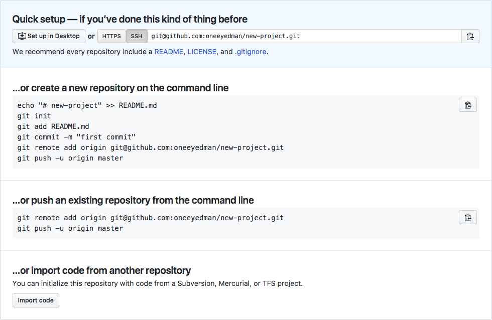
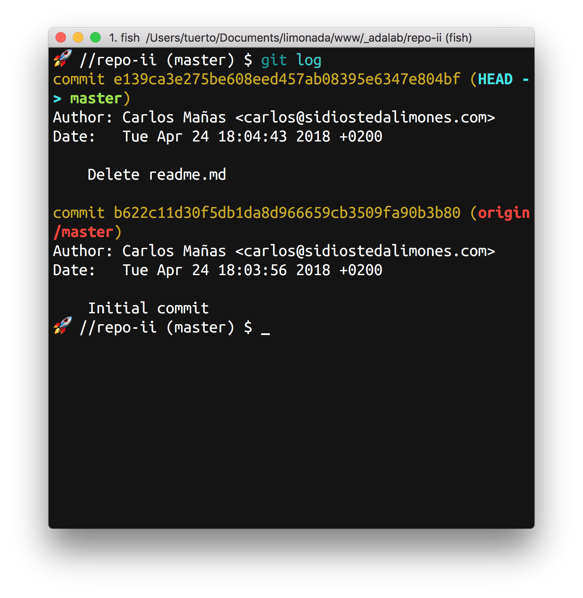
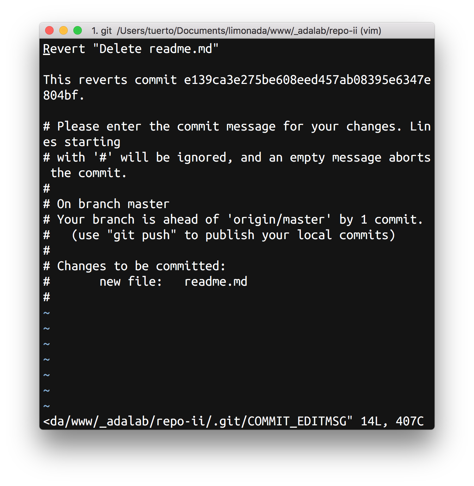
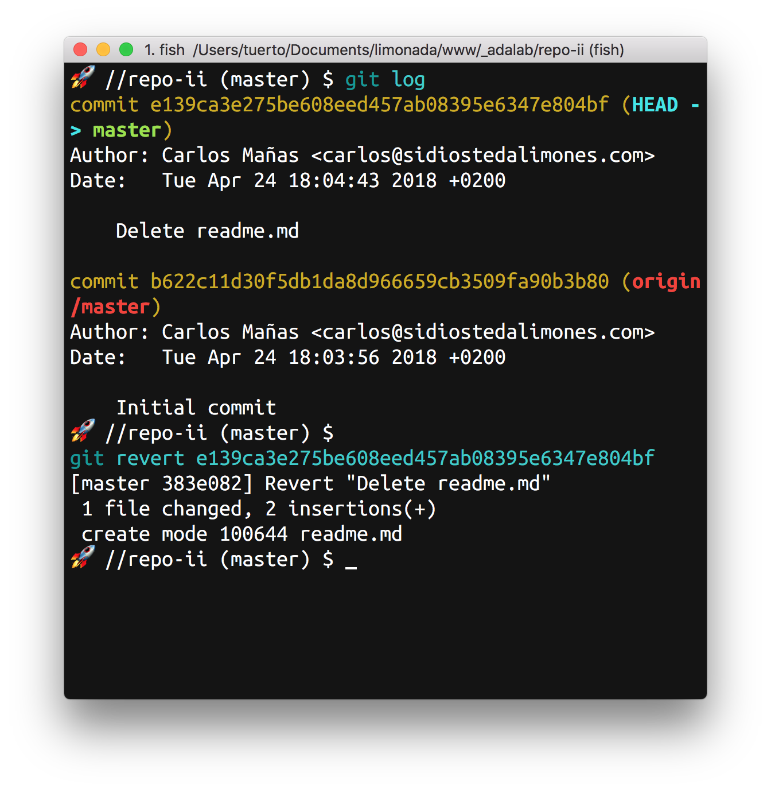
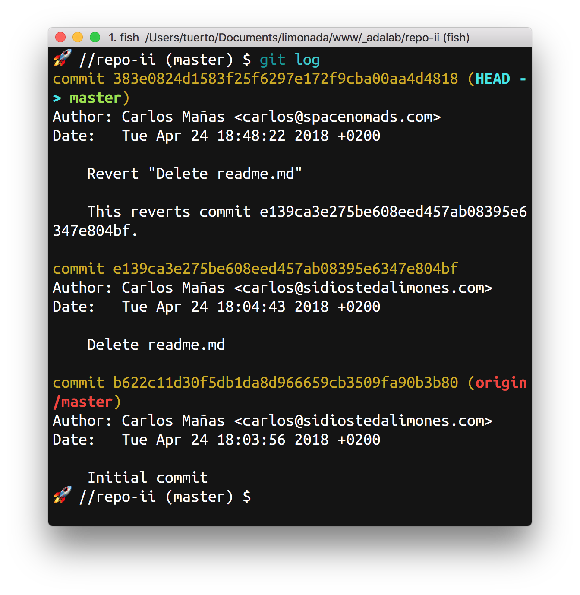

# Control de versiones
<!-- TOC START min:2 max:2 link:true update:true -->
- [Introducción](#introduccin)
- [Repaso del proceso de creación de un proyecto Git](#repaso-del-proceso-de-creacin-de-un-proyecto-git)
- [Oh, dios mío! He subido un commit que no quería subir!!](#oh-dios-mo-he-subido-un-commit-que-no-quera-subir)
- [Issues](#issues)
- [¿Qué vamos a hacer hoy?](#qu-vamos-a-hacer-hoy)
- [BONUS: Paquete de Atom para Git](#bonus-paquete-de-atom-para-git)

<!-- TOC END -->


## Introducción

Hasta ahora hemos hecho una primera aproximación a Git, nada menor.

Primero vimos cómo crear un repositorio local con `git init` y mantener nuestros cambios con `git add -A` y `git commit -m "Mensaje del commit"`.
Pero no solo eso, también hemos aprendido a conectar nuestro proyecto local con un repositorio remoto alojado en GitHub con `git remote add`, o , directamente a crearlo en Github y clonarlo en nuestro equipo con `git clone`.

Y más, porque actualmente estamos trabajando en grupo sobre el mismo proyecto y sobre los mismos archivos, y publicando nuestro trabajo a través del sistema de hosting propio de GitHub: GitHub Pages.

## Repaso del proceso de creación de un proyecto Git

### Inicio de proyecto
#### Desde GitHub
Lo más sencillo es crear el proyecto de cero desde nuestro servicio de Git, en este caso, GitHub:
1. Vamos a nuestro perfil
2. Creamos un nuevo repositorio
3. Rellenamos el nombre y la descripción
4. Ahora podemos elegir tres acciones (se pueden elegir las tres, alguna o ninguna):
	1. Añadir un archivo `readme.md`
	2. Añadir un archivo `.gitignore`
	3. Añadir una licencia
5. Una vez creado solo faltaría clonarlo a nuestro ordenador para trabajar con él, hay dos formas:
	1. Desde la terminal voy a la carpeta donde quiero clonar el proyecto y, con la url que me da github para clonar, se escribe: `git clone url-del-repositorio-que-me-da-github`.
	2. Si quiero clonarlo y usar un nombre específico para la carpeta de mi repositorio sigo el paso uno pero se escribe: `git clone url-del-repositorio-que-me-da-github nuevo-nombre-de-carpeta`

##### Readme.md
Este archivo `readme.md` es un documento escrito en [markdown](https://es.wikipedia.org/wiki/Markdown) que se presenta en la página principal del repositorio y tiene como objeto aportar una primera documentación o presentación del proyecto.  
Esto es una convención, pero hay que tenerla en cuenta.

	Markdown es un lenguaje de marcado como HTML pero más simple.

Ejemplos de readme.md:
* [Sistema de plantillas PUG](https://github.com/pugjs/pug)
* [Editor de código VSCode](https://github.com/Microsoft/vscode)
* [Gulp (Automatizador de tareas)](https://github.com/gulpjs/gulp)

##### .gitignore
Git tiene un sistema para poder ignorar archivos de un proyecto.  
**¿Y por qué querríamos hacer esto?** Porque habrá archivos que necesitemos en nuestra carpeta de trabajo local pero que no queramos subir al repositorio ni controlar sus cambios.

En proyectos pequeños como los que tenemos ahora vamos a querer siempre todos nuestros archivos pero podría pasar que tuviésemos una carpeta con los archivos de diseño de ciertas partes del proyecto o archivos comprimidos que usamos para enviar a nuestro cliente los avances.

	Es muy común que el propio sistema operativo cree en cada carpeta una serie de archivos o carpetas ocultas que le ayudan a realizar tareas como la búsqueda de archivos.

Estos archivos que no tiene sentido tener "controlados" pero que en nuestra carpeta local queremos mantener se listan en este archivo especial, `.gitignore` para decirle al algoritmo de Git que no los tenga en cuenta.

En [gitignore.io](https://www.gitignore.io) podemos encontrar una serie de configuraciones ya hechas que nos ayudan a ignorar tipos de archivos comunes según el Sistema operativo o el lenguaje en el que trabajemos.

##### Licencia
Uno de los puntos claves un entorno social donde poner al alcance de todos tus proyectos es indicar cómo y en qué términos se deben usar. Para esto están las licencias, que son archivos legales que especifican qué se puede y qué no se puede hacer con los archivos asociados.

Github nos ofrece un enlace donde nos intenta orientar sobre qué licencia elegir en cada caso: [choosealicense.com](https://choosealicense.com).


#### Desde un proyecto existente
¿Cómo? ¿Que ya teníamos un proyecto local y queremos subirlo a GitHub? Bueno, tampoco es tan malo:

1. **IMPORTANTE**: Antes de inicializar un repositorio debemos estar en la carpeta correcta, si no, crearemos un repositorio en la carpeta donde estemos. **Desde la terminal, con `cd`, nos iremos dentro de la carpeta de nuestro proyecto.**
2. Inicializamos el repositorio local Git con `git init` (se hace desde la terminal y tenemos que asegurarnos de estar en la carpeta correcta).
3. Vamos a Github.com y creamos un repositorio nuevo (esta vez no añadiremos ni licencia, ni `readme.md`, ni `.gitignore`) y GitHub nos redirigirá a una página con las instrucciones a seguir
4. Como ya hemos inicializado nuestro proyecto Git simplemente añadiremos el repositorio remoto (el `readme.md` lo podemos crear cómodamente desde nuestro editor de código). Usaremos `git remote add origin url-del-repositorio-que-me-da-github`
5. Añadimos los archivos con `git add -A`
6. Hacemos un primer commit `git commit -m "First commit"`
7. Y subimos, esta primera vez, con `git push -u origin master`



### Compartir con mi equipo
Otras de las bondades de Git es que hace que trabajar en grupo sea seguro y más fácil ya que nos evita todo el envío de archivos por email, o que alguien a sobreescrito el archivo de alguien, y así.

Desde la página de nuestro repositorio accedemos a `settings` y desde allí a `Collaborators & teams` donde podremos añadir a nuestro colaboradores favoritos, o a los que nos toquen ;)

### Modificar archivos y registrar el cambio
Ya lo hemos ido viendo estos días:
1. Se modifican archivos
2. Se añaden para su control con `git add -A`(añade todos los archivos modificados) o con `git add nombre-de-archivo`(añade solo el archivo especificado)
3. Creamos el commit con `git commit -m "Descripción breve del commit"`

Hasta aquí todo normal. Ahora llega el momento de subir los archivos al repositorio remoto con `git push origin master`, pero pueden pasar varias cosas:
1. Que se suba bien, sin problemas ni conflictos. Yay!
2. Que no estemos trabajando con la última versión y nos diga que no podemos subir nuestros cambios sin bajarnos la última versión con `git pull`.
3. Que nos hayamos bajado antes la última versión pero que mientras que trabajábamos duramente, una compañera haya subido cambios, y tengamos que hacer de nuevo un `git pull`.

#### ¿Qué pasa cuando hacemos un `git pull`?
Pasan varias cosas:
1. Comprueba si hay una versión más nueva en el repositorio remoto
2. Se la baja y la intenta mezclar con la nuestra

Y aquí tenemos dos escenarios diferentes:
1. Se mezcla sin problemas, añade la nueva mezcla y crea un commit automático que nos muestra usando el editor por defecto que tenemos configurado en nuestra terminal.
2. Nos da un aviso de que hay conflictos y tenemos que resolverlos. Nos mostrará la lista de archivos donde encuentra conflictos.

En el primer caso podremos cambiar el mensaje del commit automático o poner uno nuevo. Guardamos aceptando el nombre que nos propone, salimos, y hacemos un push.

##### ¿Qué pinta tiene un conflicto?
Un conflicto ocurre cuando el sistema se encuentra con dos versiones del mismo bloque de código. Entonces, te marca en el documento que hay un conflicto y te muestra las dos opciones para que nosotros elijamos qué hacer:
```
<<<<<<< HEAD
1ª versión del bloque en conflicto
=======
2ª versión del bloque en conflicto
>>>>>>> 4e2b407f501b68f8588aa645acafffa0224b9b78
```

**<<<<<<<**: Indica el inicio de la zona de conflicto, en la línea siguiente muestra el primer bloque en conflicto.  
**=======**: Separa las dos versiones, seguidamente muestra el bloque alternativo que está dando conflicto.  
**>>>>>>>**: Indica el final e la zona de conflicto

Aquí puede pasar que queramos la primera opción, la segunda, las dos, o una mezcla de las dos.

La manera de afrontar este conflicto es elegir lo que queremos que ponga en ese bloque, quitar los separadores que añade Git, guardar el archivo y luego add y commit con normalidad.

Los conflictos más pequeños los resolveremos sobre la marcha, en los más complicados tendremos que hablar quién los haya hecho para decidir qué hacer.

### Entonces, ¿cómo se supone que tengo que trabajar con Git?
Lo normal es que antes de empezar a trabajar comprobemos si tenemos la última versión. También puede no hacerse y seguir trabajando en lo que se estuviese trabajando.
En cualquier caso, podemos comprobar si hay una versión nueva del proyecto con `git fetch` o comprobar y descargar una versión nueva con `git pull`.

Luego seguimos trabajando con normalidad, añadimos y hacemos commit cuando lo necesitemos o creamos convenientes. Siempre es buena idea hacer commit tras pequeñas tareas o cambios.

Y subimos con `git push` cuando terminemos la tarea que nos toca.

## Oh, dios mío! He subido un commit que no quería subir!!
¿Qué pasa si hago un cambio, lo añado, hago commit y luego... querría no haberlo hecho? Pues no pasa nada, para eso trabajamos con un control de versiones.

Esto pasará de vez en cuando, unas veces por inexperiencia, otras por descuido y otras por otras razones, pero no hay miedo porque cada commit queda registrado y podemos volver a consultar uno anterior o revertir el último. Vamos a ver cómo:

Si queremos ver nuestra actividad en el proyecto usaremos `git log` para tener un listado de los commits realizados:  



En este caso, con el último commit, hemos borrado el archivo `readme.md` y ahora vemos que ha sido un error...

Nos gustaría deshacer el commit `e139ca3e275be608eed457ab08395e6347e804bf`, para ello usaremos `git revert`:

```
$ git revert e139ca3e275be608eed457ab08395e6347e804bf
```



y si aceptamos el commit, ya lo tenemos:



Si ahora hacemos un `git log` podemos ver cómo queda el historial de commits:




## Issues
Github, como otros servicios de control de versiones tienen un sistema de tickets, los issues. Te permiten crear pequeñas tareas donde solicitas información, avisas de un problema o de alguna mejora.

## ¿Qué vamos a hacer hoy?
Hoy vamos a repasar la creación de repositorios, gestión de conflictos y algún issue.
Como otras veces, los haremos por parejas e iremos alternando quién va a los mandos.

***
EJERCICIO 1: Crear repositorio en GitHub

Hay que crear un repositorio vacío en GitHub:
- Qué licencia hemos elegido
- ¿Por qué es importante añadir un README.md?

***

EJERCICIO 2: Clonar repositorio

Clonaremos el repositorio de nuestra compañera y le añadiremos un issue para que nos añada como colaboradora con permisos de escritura.

***

EJERCICIO 3: Eliminar un repositorio

No es tan habitual pero de tanto en tanto querremos hacer limpieza en nuestra cuenta de GitHub. Seremos capaces de borrar el repositorio que acabamos de crear? Sí, no? :)

***

EJERCICIO 4.1: Crear repositorio local conectar con remoto

Ahora vamos a trabajar de una manera menos habitual y un poco más complicada, pero a veces pasa: crearemos un proyecto en nuestro equipo, algo sencillito, podemos elegir entre:
- Un html básico con un "hola, mundo" centrado en la ventana del navegador
- Un html básico con una sonrisa centrada en la ventana -> :) o :D

Una vez conseguido vamos a:
1. inicializar un repositorio local
2. Hacer algún cambio y un commit.

Y ahora, no sería genial conectarlo con un repositorio remoto y tenerlo siempre accesible? claro que sí.

1. Crearemos un repo vacío SIN añadir licencia ni README.me (¿Por qué?)
2. Seguiremos las instrucciones para conectarlo
3. Subiremos los cambios hechos
4. Añadiremos a nuestra compañera como colaboradora y se clonará el repositorio

***

EJERCICIO 4.2: Solucionar un conflicto

Una vez que tenemos las dos el repositorio clonado en nuestro equipo vamos a modificar index.html a la vez. Cada miembro del equipo hará un cambio, su commit y lo subirá. El conflicto lo resolveréis entre las dos :)

***


## BONUS: Paquete de Atom para Git

Desde hace algunas versiones, Atom trae por defecto un paquete para integración con Git y GitHub que nos ayuda con las tareas de control de versiones de nuestro día a día.

En el explorador (menú de la izquierda), aparecen...
- de color amarillo los ficheros modificados desde el último commit local
- de color verde los ficheros nuevos respecto al último commit local

También en el panel principal, el editor del fichero que estamos editando, aparece a la izquierda del número de línea una franja de color
- amarillo para las líneas modificadas desde el último commit
- verde las líneas nuevas desde el último commit

Este paquete también facilita una herramienta gráfica para resolver conflictos, que ayuda a elegir la versión del código que nos interesa mantener.

Podéis leer más sobre las posibilidades de este paquete esta [web de GitHub](https://github.atom.io/).
