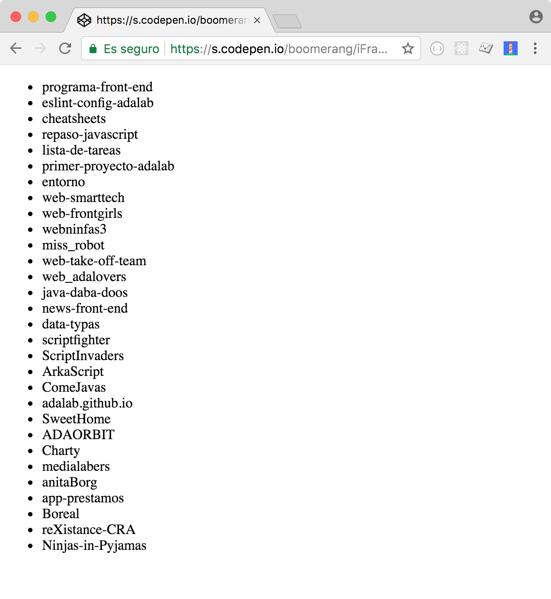

# AJAX

## Contenidos

- [Introducción](#introducción)
- [¿En qué casos se utiliza?](#¿en-qué-casos-se-utiliza)
- [Promesas](#promesas)
- [El formato JSON](#el-formato-json)
- [Peticiones encadenadas](#peticiones-encadenadas)
- [Peticiones en paralelo](#peticiones-en-paralelo)

## Introducción

En esta sesión vamos a aprender a utilizar AJAX que es el puente entre el cliente (navegador) y el servidor, entre el front-end y el back-end de nuestra aplicación. Las peticiones AJAX nos permiten acceder y manipular datos en el servidor, pero iniciando el proceso en el front-end.

AJAX viene de Asynchronous JavaScript And XML porque cuando se creó servía para hacer peticiones al servidor desde JS y normalmente el formato de datos que nos devolvía era XML (una forma de escribir los datos para poder enviarlos). Pero actualemente no es así y AJAX ahora utiliza otros tipos de datos, desde texto hasta JSON que veremos más adelante. Pero el hecho de que sea *asíncrono* sí es importante. Aunque sea una palabra que asusta, asíncrono simplemente significa trabajar con eventos (como hemos visto en las sesiones anteriores), es decir, que cuando sucede un evento se ejecuta una función. Se llama asíncrono porque nosotros no ejecutamos el código de forma síncrona (una instrucción detrás de otra) sino que *el código se ejecuta cuando sucede un evento*.

El uso de AJAX, por tanto, nos permite acceder a información en un servidor que normalmente se accede mediante un API. API viene de Application Programming Interface, es decir, es una interfaz que está pensada para ser accedida desde una aplicación de código. Dicho de otra forma, el servidor define una forma de pedirle datos que está pensado para que desde una aplicación le pidan datos y él sepa enviárselos. Hay otra interfaces, como una página web, que están pensadas para ser usadas por personas. Pero las APIs están pensadas para ser usadas desde la programación, en nuestro caso desde JavaScript. Durante esta sesión vamos a ver varios ejemplos de APIs.


## ¿En qué casos se utiliza?

Algunos ejemplos de uso de AJAX en nuestra webapp (aplicación web):

- Cuando realizamos una búsqueda de pisos en Airbnb, hacemos una petición AJAX al servidor, y cuando nos devuelve los datos de los pisos lo pintamos en el HTML
- Cuando en nuestra app de tareas marcamos una tearea como terminada, se envía una petición al servidor para que almacene en base de datos que esa tarea ha sido completada; así, al abrir la app en nuestro móvil aparecerá como completada
- En GMail, el listado de nuestros correos se obtiene de una petición al servidor; cuando marcamos un correo como leído se envía la info al servidor; o cuando enviamos un correo, éste se envía a un servidor para que lo lleve a su destinatario

## Fetch

A día de hoy la manera estándar de acceder a datos en el servidor desde nuestro front-end es `fetch`, una nueva API del navegador que funciona gracias a una nueva forma de manejar la asincronía de JavaScript llamada *Promesas*. Hasta ahora el estándar ha sido usar el objeto `XMLHttpRequest` que trabaja con callbacks y que veremos al final de esta sesión como bonus.

[Tutorial de MDN sobre el uso de fetch](https://developer.mozilla.org/en-US/docs/Web/API/Fetch_API/Using_Fetch).

### Promesas

Hasta ahora hemos trabajado siempre con callbacks para gestionar la asincronía. Pero nos hemos dado cuenta que si queremos hacer algo complejo como varios callbacks encadenados, el código es bastante complejo y poco intuitivo.

Las promesas nos ofrecen una alternativa a los callbacks para intentar escribir código más claro y limpio. Es decir, podemos hacer las mismas cosas que con callbacks pero de una forma más elegante.

### Usando fetch

Vamos a realizar un ejemplo de petición usando `fetch` un API para obtener fotos de gatos aleatorias en [http://thecatapi.com/](http://thecatapi.com/).  Vamos a ver cómo queda un ejemplo de petición a este API con `fetch`:

```js
fetch('https://thecatapi.com/api/images/get?format=html')
  .then(function(response){
    return response.text();
  })
  .then(function(html){
    document.body.innerHTML = html;
  });
```

En primer lugar, vemos que a la función `fetch` solo le pasamos un parámetro: la URL a donde queremos hacer la petición, así de sencillo. La URL la hemos construido como se indica [en la documentación](http://thecatapi.com/docs.html), es decir, a la URL base 'https://thecatapi.com/' le hemos añadido '/api/images/get' para pedir una imagen aleatoria de gatete. También añadimos `?format=html` al final de la URL para que el servidor nos devuelva código HTML directamente: un enlace `<a>` con una imagen aleatoria de un gato en un ``.

Al ejecutar `fetch(URL)`, este método devuelve una promesa, es decir, algo sobre lo que podemos hacer `.then()`. Una promesa se llama así porque mientras se ejecuta el fetch (se hace la petición al servidor, responde y nos llega la respuesta) podemos trabajar con la respuesta en otra variable `response` donde 'nos prometen' que estará la respuesta del servidor cuando llegue. Es decir, que seguimos trabajando de forma asíncrona (en respuesta a eventos) pero las promesas nos ocultan esa complejidad.

Entonces, sobre una promesa podemos hacer un `.then()` pero ¿para qué? Para poder indicar qué hacer cuando se complete esa promesa. Al método `then()` le tenemos que pasar una función (en este caso es anónima, pero puede ser una normal con nombre) que toma como parámetro el resultado de la promesa cuando esté resuelta. En este caso el parámetro `response` representa a la respuesta del servidor, y sobre él ejecutamos el método `.text()` que devuelve otra promesa. Esto es porque el método `text` trabaja de forma asíncrona y obtiene la respuesta del servidor en formato texto. Como trabaja de forma asíncrona necesitamos otro `then()` para recoger la respuesta. A este segundo `then()` le pasamos como parámetro otra función que toma como parámetro `html` que contiene el HTML que devuelve el servidor. En esta última función lo único que hacemos es meter el HTML en el DOM usando `innerHTML` sobre el `body` de la página.

> NOTA: es **MUY IMPORTANTE** no olvidar hacer un `return` al final de la función que pasamos a `then` para encadenar con el siguiente `then`. En el último no hace falta porque ya no hay más `then` a quien tener que pasarlo.

Tenéis el código del ejemplo ([en este codepen](https://codepen.io/adalab/pen/GxYVww?editors=0010)).

***
EJERCICIO 1

Vamos a jugar un poco con el código en codepen del ejemplo anterior. Mirando la [documentación de thecatAPI](http://thecatapi.com/docs.html) podemos jugar añadiendo otros parámetros a la URL del tipo `clave=valor` separamos por `&`:
- `results_per_page`: para mostrar más imágenes
- `type`: probamos a mostrar sólo tipo gif
- `size`: para indicar distintos tamaños de las imágenes

***

## BONUS: XMLHttpRequest

Para ver la diferencia del uso de callbacks y promesas (verás que con promesas el código es mucho más simple y legible), te dejo explorar este mismo ejemplo usando `XMLHttpRequest` [en este codepen](https://codepen.io/adalab/pen/yPwxgP?editors=0010):

```js
var request = new XMLHttpRequest();
request.open('GET', 'https://thecatapi.com/api/images/get?format=html');

request.addEventListener('load', showPicture);

function showPicture() {
  var response = request.responseText;
  document.body.innerHTML = response;
}

request.send();
```

## El formato JSON

En el ejemplo anterior hemos hecho una petición a un API (thecatapi) cuyo formato de respuesta era directamente HTML que metemos en nuestra página. Pero esto no es lo habitual, porque estos servicios suelen ser usados por distintos tipos de clientes, no sólo navegadores web.

Un formato muy habitual para el intercambio de información en la web es el formato JSON (pronunciado en inglés como *Jason*). Son las siglas de JavaScript Object Notation, es decir, que es como se definen los objetos en JavaScript... **¡¡¡algo que ya sabemos!!!** Serán lo que llamamos *objetos literales*, es decir, que sólo contendrán datos (propiedades) pero nunca métodos (funciones). Esto es un ejemplo de JSON sencillo que devuelve el [Dog CEO API](https://dog.ceo/dog-api/):

```js
{
"status": "success",
"message": "https://dog.ceo/api/img/terrier-australian/n02096294_4492.jpg"
}
```

Como vemos, es simplemente un objeto JavaScript que tiene los datos que devuelve el servidor. En este caso, nos da una imagen aleatoria de un perro en la propiedad `message`. Vamos a ver el ejemplo completo de cómo hacer la petición con `fetch`:

```js
fetch('https://dog.ceo/api/breeds/image/random')
  .then(function(response){
    return response.json();
  })
  .then(function(json){
    var img = document.querySelector('img');
    img.src = json.message;
  });
```

Vamos a ver los cambios respecto al ejemplo anterior de los gatos. En primer lugar, la URL en el `open` cambia para usar la URL de Dog API que nos da una imagen de perro aleatoria. El segundo cambio está en la función del primer `then()` ya uqe en lugar de recoger la respuesta del servidor y convertirla en texto, la convertimos directamente en JSON.

En el segundo `then` tenemos la información que nos da el servidor convertida en JSON en el parámetro de la función `json`. Así que podemos acceder a su propiedad `message` (que es donde el servidor nos ha dejado la URL de la imagen) y asignamos su valor al atributo `src` de una `img` del HTML.

Podéis jugar con [este ejemplo en Codepen](https://codepen.io/adalab/pen/oqQNvK?editors=1010).

***
EJERCICIO 2

Sigamos jugando un poco con el [Dog API](https://dog.ceo/dog-api/):

a) Vamos a modificar el ejemplo anterior para que las fotos de nuestra página salgan sólo perros de la raza *Chihuahua*.

b) Vamos a encapsular toda la lógica para crear una petición en una función. Añadimos un botón a la página con el título 'Enséñame otro Chihuahua' de forma que al pulsarlo se haga otra petición al servidor de una imagen aleatoria y aparezca una nueva imagen de Chihuaua.

***
EJERCICIO 3

Ahora vamos a explorar un nuevo API: [el API de usuarios de GitHub](https://developer.github.com/v3/users/). La URL de este API es `https://api.github.com/users/{username}`, donde `{username}` es el nombre del usuario en GitHub. Por ejemplo, aquí tenéis la URL para obtener información del usuario de Isra `https://api.github.com/users/gootyfer`. Si ponéis esta URL en una nueva pestaña del navegador podréis observar qué datos nos devuelve el API.

Vamos a crear una página en la que haya un input de texto y un botón de buscar. El usuario escribirá en el input un nombre de usuario de GitHub. Haremos una petición al API para obtener información de ese usuario y mostrarla en nuestra página:
- nombre
- número de repositorios
- avatar (imagen)


***

## Peticiones encadenadas

Comenzamos con este ejemplo en el que pedimos al API de Dog CEO el listado de razas de perro usando promesas ([el código en este codepen](https://codepen.io/adalab/pen/WdZegK?editors=1010)). El código es similar al último ejemplo, solo cambia como pintamos las razas en el DOM.

```js
fetch('https://dog.ceo/api/breeds/list')
  .then(function(response){
    return response.json();
  })
  .then(function(json){
    var breeds = json.message;
    var ul = document.querySelector('ul');
    for (var i = 0; i < breeds.length; i++) {
      var li = document.createElement('li');
      var content = document.createTextNode(breeds[i]);
      li.appendChild(content);
      ul.appendChild(li);
    }
  });
```

Ahora vamos a partir del ejemplo anterior para pedir al servidor una foto de una raza concreta de perro. Para ello, por tanto, necesitamos conocer primero el listado de razas (como en el ejemplo anterior) y luego, con esta información, pedir al servidor una foto de una raza concreta. Por tanto son dos callbacks encadenados, es decir, que la segunda petición depende de los datos que llegan en la primera. Vamos a ver un [ejemplo de este codepen](https://codepen.io/adalab/pen/baoNZq#0):

```js
fetch('https://dog.ceo/api/breeds/list')
  .then(function(breedsResponse){
    return breedsResponse.json();
  })
  .then(function(breedsJSON){
    var breeds = breedsJSON.message;
    return fetch('https://dog.ceo/api/breed/' + breeds[0] + '/images/random');
  })
  .then(function(imageResponse){
    return imageResponse.json();
  })
  .then(function(imageJSON){
    var img = document.querySelector('img');
    img.src = imageJSON.message;
  });

```
Una de las características principales de las promesas es que nos facilitan encadenas peticiones como en este caso, y el código resultante es muy sencillo. En el código hemos encadenado hasta 4 promesas: 1) petición al servidor de las razas, 2) convertir a JSON la respuesta, 3) segunda petición de la foto de una raza y convertir la segunda respuesta a JSON. Como hemos indicado antes, es importante que al final de los `then()` devolvamos una promesa para pasar los datos al siguiente `then()`. Así que en el segundo `then()` tenemos que devolver una promesa, es decir, el resultado del `fetch`.

***

EJERCICIO 4: LISTADO DE REPOS DE ADALAB

Vamos a seguir explorando el API de GitHub explorando la parte del [API para acceder a la info sobre organizaciones](https://developer.github.com/v3/orgs/). La URL de este API es `https://api.github.com/orgs/orgname`, donde `orgname` es el nombre de la organización en GitHub. Por ejemplo, aquí tenéis la URL para obtener información de la organización Adalab `https://api.github.com/orgs/Adalab`. Si ponéis esta URL en una nueva pestaña del navegador podréis observar qué datos nos devuelve el API.

El objetivo de este ejercicio es mostrar en una web el listado completo de los repositorios de Adalab que hay creados en GitHub. El resultado final debería ser similar a este:



Para ello vamos a hacer lo siguiente:

1. acceder a la información de la organización Adalab como primera petición al servidor.
1. recogeremos la información de la URL donde consultar la información de los repositorios de Adalab en la respuesta del servidor (en la propiedad `repos_url`) y haremos una nueva petición a esa URL.
1. en el último `then` pintaremos en nuestra web el nombre de todos los repositorios de la organización en una lista (propiedad `name` de cada objeto repositorio).

***

EJERCICIO 5: PETICIONES ENCADENADAS CON PROMESAS

Vamos a seguir con el API de organizaciones de GitHub pero ahora vamos a acceder a él usando promesas. Vamos a acceder a la URL de los eventos de una comunidad (en la propiedad `events_url`) del [JSON de la comunidad Adalab](https://api.github.com/orgs/Adalab). Y vamos a realizar una petición nueva a esta URL para pintar en pantalla el tipo (propiedad `type`) del primer evento del array. Si el código es correcto, debería de verse en la pantalla la palabra _"PushEvent"_. ¡A darle caña!

***

## Peticiones en paralelo

Ya hemos visto la utilidad de tener peticiones encadenadas, en las que una petición depende de las anteriores. Ahora vamos por qué usar petciones en paralelo, es decir, que se ejecutan a la vez pero que queremos hacer alguna acción cuando todas se han completado.

Para trabajar con varias promesas en parelelo usamos el método `Promise.all` que toma como parámetro un array de promesas y devuelve otra promesa que se resuelve cuando todas las del array se han resuelto. Por tanto, sobre el resultado podremos hacer un `then()` que recibe como parámetro un array con todos los resultados de las promesas anteriores, es decir, donde tendremos todos los JSON de la respuesta del servidor. [Veamos el ejemplo de codepen](https://codepen.io/adalab/pen/xpXGaG?editors=1010).

```js
function createPromise(){
  return fetch('https://dog.ceo/api/breeds/image/random')
    .then(function(response){
      return response.json();
    });
}

var promises = [createPromise(), createPromise()];

Promise.all(promises)
  .then(function(responses){
    for (var i = 0; i < responses.length; i++) {
      var img = document.querySelector('.dog' + (i + 1));
      img.src = responses[i].message;
    }
  });

```
Hemos creado una función `createPromise` que crea las promesas de las peticiones al servidor con `fetch` y parsea a JSON en el `then()`. Luego creamos el array de promesas ejecutando 2 veces la función anterior. Sobre ese array ejecutamos el `Promise.all` que cuando todas las peticiones al servidor hayan terminado, ejecutará la función del `then()` a la que le llegan todos los resultados mediante el parámetro  `responses`. Luego recorremos eses array para ir pintando las imágenes en los `img` del HTML.

***

EJERCICIO 6: PINTANDO VARIAS IMÁGENES A LA VEZ

Partiendo el ejemplo anterior en codepen, vamos a modificarlo para que en lugar de pedir 2 imágenes en paralelo pida 10, y el resultado sólo se pinte en la pantalla cuando las 10 imágenes hayan llegado del servidor. Ahora sí que se nota el efecto de que se pintan todas a la vez, ¿verdad? Vamos a probar también con 25 imágenes, para ver bien este efecto.

***


## Recursos externos

- [Exploring JS: promises](http://exploringjs.com/es6/ch_promises.html)
- [MDN: using promises](https://developer.mozilla.org/en-US/docs/Web/JavaScript/Guide/Using_promises)
- [We have a problem with promises](https://pouchdb.com/2015/05/18/we-have-a-problem-with-promises.html)
