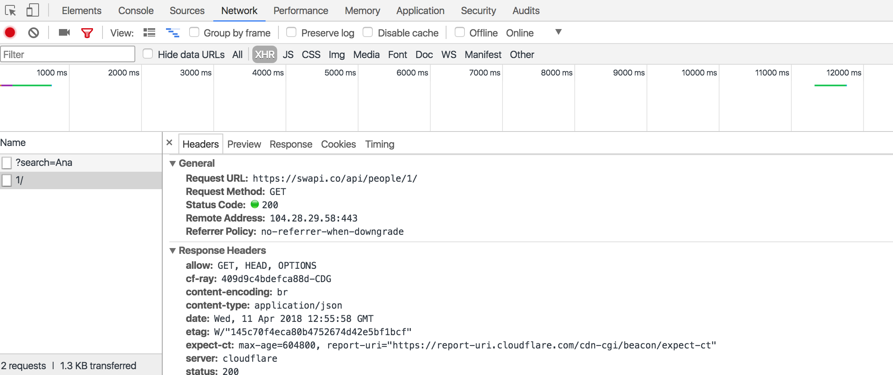
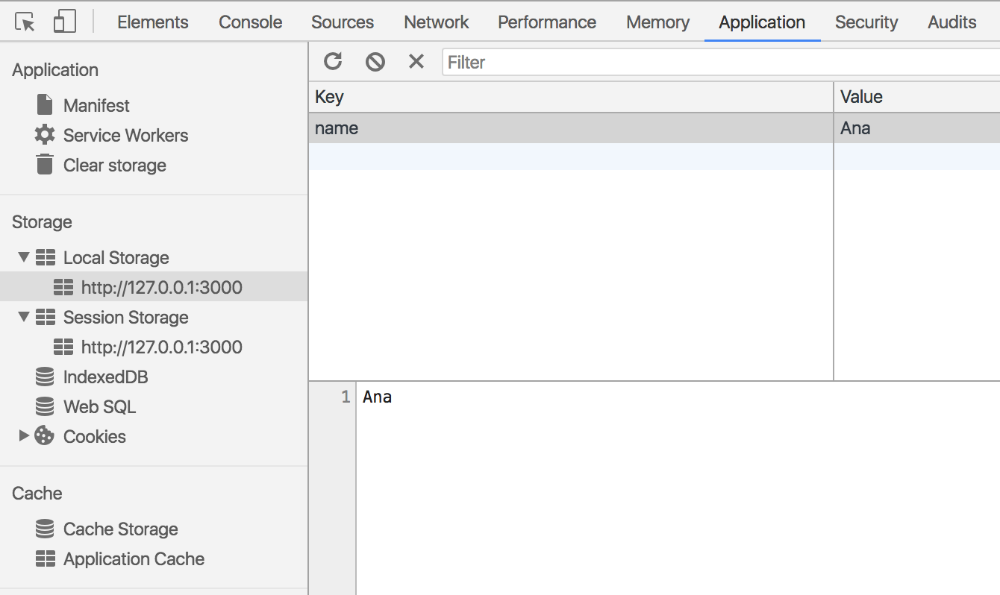
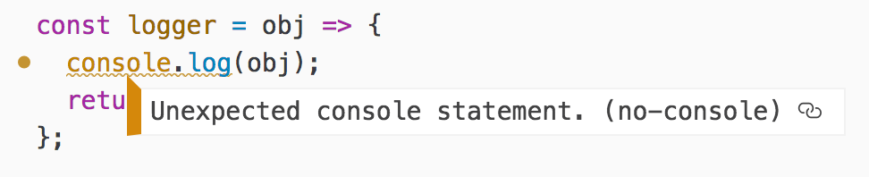

# APIs y linter

<!-- TOC START min:4 max:4 link:true update:true -->
- [EJERCICIO 1](#ejercicio-1)
- [EJERCICIO 2](#ejercicio-2)
- [EJERCICIO 3](#ejercicio-3)
- [EJERCICIO 4](#ejercicio-4)
- [EJERCICIO 5](#ejercicio-5)

<!-- TOC END -->


## Introducción

En esta sesión vamos a tratar 2 temas diferentes: 1) las APIs, concepto que ya conocemos, pero vamos a entender un poco mejor cómo funcionan; y 2) el linter, una herramienta que nos ayuda a mejorar nuestro código JavaScript.

*API* viene de *Application Programming Interface*, es decir, es una interfaz que está pensada para ser accedida desde una aplicación de código. Dicho de otra forma, el servidor define una forma de pedirle datos que está pensado para que sea una aplicación (un programa) quien los pida y él sepa enviárselos. Hay otra interfaces, como una página web, que están pensadas para ser usadas por personas. Pero las APIs están pensadas para ser usadas desde la programación, en nuestro caso desde nuestro programa JavaScript. Durante esta sesión vamos a ver varios ejemplos de APIs.

Un *linter* es una herramienta que nos sirve para prevenir errores y nos ayuda a mantener un estilo homogéneo en nuestro código. Veremos cómo usar un linter para JavaScript llamado *ESLint* y cómo integrar los mensajes que nos manda en nuestro editor de código, en este caso Atom.


## ¿Para qué sirve lo que vamos a ver en esta sesión?

Entender mejor el concepto de API y ver ejemplos nos ayudará a entender mejor cómo trabajar con ellas. Además, entenderemos mejor cómo están construidas y cómo se espera que las usemos gracias a conocer mejor el protocolo HTTP que es el usado en Internet.

Usar un linter en nuestro proyecto nos sirve para que mientras desarrollamos un código JavaScript mantengamos una coherencia de estilos con el resto del equipo. También nos sirve para poder detectar errores típicos al escribir código, por ejemplo, si tengo variables no usadas o estoy usando variables antes de declararlas.


## ¿En qué casos se utiliza?

Las APIs van a estar presentes en prácticamente cualquier desarrollo web que hagamos porque, al final de todo, es casi seguro que tengamos que enviar y recibir datos de un servidor. Si se ha diseñado bien, en la interfaz de comunicación de ambos (front-end y back-end) debería haber un API.

Utilizaremos un linter en un entorno de trabajo donde varias personas estamos trabajando sobre una base de código y/o queramos mantener unas reglas de estilo concretas (cuando trabajamos en solitario sigue teniendo sentido usarlo). Por ejemplo, qué indentación de código usar o el uso de los punto y coma.


## El mundo de las APIs

Como ya hemos dicho, las APIs son la forma en que desde un programa (en nuestro caso un código JavaScript en el front-end) podemos acceder a datos en un servidor web, que están en un back-end (un servidor, es decir, un ordenador conectado a Internet). En el back-end normalmente tendremos un programa ejecutándose, que podría estar escrito en distintos lenguajes de programación (PHP, python, ruby, o incluso JavaScript), y que tiene acceso a una base de datos (una base de datos es un tipo especial de programa que sirve para almacenar datos y poder consultarlos). Pero a nosotros nos da igual el lenguaje de programación en que esté escrito el back-end, lo que nos importa es que **podemos interactuar con él a través de una URL**.

Como hemos visto en la sesión anterior, haciendo una petición con `fetch` a una URL del servidor conseguíamos obtener datos, desde fotos de gatos hasta los repos de una organización en GitHub. Por tanto el servidor de una aplicación web (página web que maneja datos dinámicos) tiene establecida una API, es decir, un conjunto de URLs especiales con las que podemos interactuar desde nuestro programa para consultar y almacenar datos. Estas URLs no están escogidas al azar sino que siguen una serie de convenciones a la hora de crearse. La convención más usada para la creación de APIs se llama REST (*REpresentational State Transfer*) por eso muchas veces oiremos hablar de **APIs REST**. La convención que define REST está basada en HTTP, el protocolo de comunicación entre los ordenadores de la web (la World Wide Web - WWW). Estos dos acrónimos seguro que nos suenan mucho porque los escribimos millones de veces al escribir un URL en nuestro navegador web.

### Un poquito de HTTP

Las máquinas que están conectadas a Internet para entenderse entre ellas utilizan un protocolo, es decir, una forma estándar de enviarse información para poder entenderse. HTTP viene de *Hyper Text Transfer Protocol*, en español protocolo para transferencia de hiper-texto, es decir, para que las máquinas intercambien información entre ellas más allá del simple texto (texto, imágenes, videos, etc).

La forma de funcionar de HTTP es mediante **petición y respuesta**. Un ordenador hace una petición (el que llamamos cliente, en nuestro caso el navegador) y otro ordenador (el que llamamos servidor) recibe esa petición, la procesa (hace cosas) y envía de vuelta una respuesta.

La **petición**, como hemos visto en los ejemplos de la sesión anterior, siempre lleva asociada una URL que indica dónde está el servidor y el tipo de datos que le pedimos. Por ejemplo la URL `https://thecatapi.com/api/images/get?format=html` de una petición a catAPI nos muestra que
- el servidor del API está en `https://thecatapi.com/api/` (se le llama normalmente *URL base*)
- el servicio (tipo de datos que pedimos) que accedemos es `images/get` nos da una imagen de gato aleatoria
- los parámetros `?format=html` (también llamado *querystring*) indica que el formato de la respuesta que queremos el de tipo HTML

La petición HTTP también tiene asociado un *método* que indica la *intención* con la que hacemos la petición. Los métodos más usados son *GET* y *POST*. *GET* lo usamos para decir al servidor que esa petición es para consultar datos que él ya tiene, como por ejemplo las fotos de gatos. *POST* lo usamos para enviar nosotros datos al servidor. Si recordáis estos mismo métodos los podíamos definir para el método de envío de un formulario HTML que sirve para enviar datos al servidor. Existen otros métodos HTTP menos conocidos, por ejemplo, *PUT* y *PATCH* sirven para actualizar datos ya existentes en el servidor, y *DELETE* sirve para borrar datos.

 El método HTTP junto a la URL es lo que define la acción que queremos realizar en el servidor según la convención de REST. Aquí vemos algunos ejemplos de un API para manejar información de usuarios:
- petición `GET` a la URL `/users`: el servidor devuelve un listado (array) de usuarios
- petición `GET` a la URL `/users/1`: el servidor devuelve un la información del usuario 1
- petición `POST` a la URL `/users` con los datos de un usuario: el servidor crea un usuario nuevo

Otra característica habitual de un API REST es que cuando accedo a un listado de cosas, si hay muchas, no me devuelva todas en la misma petición sino que me devuelve solo las primeras. A esto se le llama *paginación* y al hacer la petición recibiré solo *la primera página* de resultados, por ejemplo 10. Y tendré que añadir un parámetro a la querystring para recuperar el resto de página, por ejemplo, `?page=2`.

***
#### EJERCICIO 1

Vamos a explorar [un API abierto de información sobre el mundo Star Wars](https://swapi.co/). En esta página tenemos la documentación completa del API y formulario que nos permite hacer peticiones a la URL que indiquemos. Identifica la siguiente información sobre SWAPI:
- la URL base del API
- si necesita autenticación
- método HTTP deben usar las peticiones a este API
- URL para acceder a la info del personaje "Luke Skywalker"
- URL para acceder a la info de la película "A New Hope"
- qué otros recursos puedo acceder desde el API además de personajes y pelis
- URL para acceder al listado de personajes, ¿está paginada?
- cómo puedo buscar personajes mediante la URL
- cómo puedo hacer que el JSON de una petición se me devuelva traducido a Wookiee

***

#### EJERCICIO 2

Ahora que conocemos mejor el API de Star Wars vamos a hacer una sencilla web usándolo. En la web aparece una caja de texto donde escribimos el nombre de un personaje (o parte del nombre) y nuestra web muestra debajo un listado con los personajes que coinciden con la búsqueda indicando su nombre y género.

***

Seguimos aprendiendo un poco de HTTP. Para poder hacer una petición compleja con `fetch` tenemos que pasar un segundo parámetro para establecer opciones, donde podemos indicar
- *el método*, por ejemplo, `method: 'POST'` (por defecto es *GET*)
- *datos a enviar*, que son los datos que enviamos al servidor, por ejemplo, `body: '{adalaber: 1}'`
- *cabeceras HTTP*, que son *metadatos* (datos sobre los datos a enviar), como por ejemplo el tipo de los datos que enviamos que puede ser en JSON o en texto plano

Puedes leer más detalles en [el tutorial de uso de `fetch` en MDN](https://developer.mozilla.org/en-US/docs/Web/API/Fetch_API/Using_Fetch).

***

**¡Vamos a parar un momento!** ¿Entonces me estás diciendo que muchas aplicaciones web, como Twitter o GMail, tienen un API al que yo puedo acceder desde mi programa en JavaScript? ¿Y que a través de un API yo puedo no solo consultar datos sino también enviarlos? ¿Qué me impide entonces enviar un tweet en Twitter como si fuera Mariano Rajoy?

Pues porque las APIs normalmente requieren de una *autenticación*, es decir, que tengas que identificarte de alguna forma desde tu programa para que tus peticiones funcionen. Por ejemplo, en el API de GitHub que ya hemos usado podemos consultar datos sobre los repositorios públicos de Adalab. Pero no podemos, por ejemplo, crear un repositorio nuevo porque necesitamos ser miembro de la organización para poder hacerlo. En este curso por simplicidad vamos a trabajar con APIs abiertas, es decir, que no requieren autenticación y normalmente nos van a servir solo para consultar datos pero no para modificarlos.

***

La **respuesta** HTTP que viene del servidor tiene más información además de los datos que le hemos pedido. Uno de ellos es código del estado de la respuesta, en inglés *HTTP status code*. Existe un estándar definido para saber qué indica este código, y los principales son:
- 200: las respuestas con código 2xx (doscientos y lo que sea) indican que la petición ha ido bien (OK)
- 400: las respuestas con código 4xx (cuatrocientos y pico) indican que ha sucedido un error en la petición; por ejemplo, que el usuario no ha enviado todos los datos que el servidor necesita, o que no está autorizado a acceder a a ese servicio
- 500: las respuestas con código 5xx (quinientos y pico) indican que el servidor ha tenido un error (¿os suena la ballena de Twitter? 😜)

Si queréis profundizar en los código de respuesta HTTP, [qué mejor que hacerlo con gatitos](https://http.cat/).

### Herramientas para trabajar con APIs

No todas las APIs tienen una web como la del SWAPI para poder probar las peticiones. Con la herramienta [Postman](https://www.getpostman.com/) podemos hacer eso mismo nosotros: realizar peticiones a un servicio cambiando la URL, el método HTTP, los datos, las cabeceras, etc.

Otra herramienta fundamental son las propias DevTools del navegador en la pestaña *Network*.



***
#### EJERCICIO 3

En la página de SWAPI o en la que habéis creado en el ejercicio 2 inspecciona las petiones que has hecho al servidor. Al abrir la pestaña Network aparece vacía así que comienza a hacer peticiones con la pestaña abierta. Con la información que obtienes de esta pestaña averigua:
- dónde está el método de petición
- el código de la respuesta (recuerda que 200 es OK)
- en las cabeceras de la petición busca una llamada `user-agent`, ¿qué puedes decir de su contenido?
- la respuesta del servidor en JSON
- al recargar la página aparecen un montón de peticiones en la pestaña Network, ¿sabrías filtrar solo las que son de AJAX? Pista: ante de `fetch` las peticiones se hacían con el objeto `XMLHttpRequest` (XHR)

***

## LocalStorage

Una característica muy interesante a la que podemos acceder con JavaScript es la posibilidad de guardar datos en el propio navegador. Esto se hace mediante el llamado LocalStorage o SessionStorage. El primero que pemite almacenamiento permanente de datos, y el segundo solo para una sesión. Es decir, si cerramos la página se borrarán. En el curso solo vamos a explicar LocalStorage pero SessionStorage tiene un uso similar.

Hasta ahora, la única fuente de datos que hemos usado es un API en el servidor, pero con el LocalStorage podemos almacenar también datos en local, es decir, en el propio navegador del usuario. De esta forma, vamos a poder guardar algunos datos interesantes solo para este usuario y que mejore su experiencia en nuestra página. Algo habitual es *cachear* datos del servidor, es decir, guardar algunos datos que obtenemos del servidor de forma que la próxima vez que lo necesitemos no tengamos que hacer una petición sino recogerlo directamente del almacenamiento local. Por ejemplo, en mi web de perros tengo un listado de las razas que obtengo del servidor y lo guardo en local porque es algo que nunca va a cambiar. De esta forma, la próxima vez que entre en la página voy a comprobar si tengo guardada información en local y si la hay así me evito una petición al servidor y la página va más rápido.

Usar el LocalStorage es bastante sencillo: solo necesitamos un nombre (clave) y unos datos (valor).

Para guardar datos es tan sencillo como usar `setItem` cuyo primer parámetro es el nombre que le ponemos a los datos y luego los datos que queremos guardar, que pueden ser de cualquier tipo (cadena, número, booleano). Por ejemplo:

```js
localStorage.setItem('name', 'Ana');
```

Para recuperar los datos es tan sencillo como usar `getItem` y pasar el nombre que le dimos a los datos. Por ejemplo:

```js
var name = localStorage.getItem('name');
console.log(name); //Ana
```

Para borrar los datos es tan sencillo como usar `removeItem` y pasar el nombre que le dimos a los datos. Por ejemplo:

```js
localStorage.removeItem('name');
```
Podemos ver los datos guardados usando las devtools en la pestaña "Application":



### Guardando arrays y objetos

En LocalStorage solo podemos guardar datos de tipo primitivo (número, cadena, booleano). ¿Qué pasa si queremos guardar un array o un objeto? Pues necesitamos convertirlo a una cadena para poder guardarlo.

Para eso existe una función en JavaScript `JSON.stringify` que convierte un objeto literal o un array en una cadena. Para realizar la acción contraria, es decir, pasar de una cadena que tiene la información de un objeto a un objeto JavaScript usamos `JSON.parse`. Vamos a ver un ejemplo:

```js
var tasks = [
  {name: 'Recoger setas en el campo', completed: true},
  {name: 'Comprar pilas', completed: true},
  {name: 'Poner una lavadora de blancos', completed: true},
  {name: 'Aprender cómo funcionan los objetos de JavaScript', completed: false}
];

localStorage.setItem('taks', JSON.stringify(tasks));

var savedTasks = JSON.parse(localStorage.getItem('taks'));
console.log(savedTasks.length); //4
```
***
#### EJERCICIO 4

Sobre el ejercicio 2 vamos a *cachear* las búsquedas al servidor. De forma que cuando a busquemos una cadena a través del campo de búsqueda, primero busque en localStorage si ya tenemos un resultado en local para esa cadena. Si no lo hay se pide al servidor y luego se guarda en `localStorage` usando como clave el texto de la búsqueda; si al buscarlo en `localStorage` lo encontramos pues le enseñamos el resultado directamente al usuario y nos evitamos una petición al servidor.

***

## Linter

Un linter es una herramienta que nos ayuda a prevenir errores y tener un formato homogéneo en nuestro código. Existen linters para varios lenguajes de programación, pero aquí veremos ESLint que es un linter para JavaScript.

En un linter definimos una serie de reglas en un fichero de configuración que son las que queremos comprobar en el código. Luego el programador que usa un linter ejecutará esas reglas, normalmente el propio editor (Atom) lo hace por ti, y si no se cumplen te mostrará un error o un warning (aviso).

Hemos creado una configuración específica de linter para vosotras, adalabers, porque queremos que os ayude a detectar algunos errores y a escribir código con un estilo correcto. Algunas de estas reglas son:
- da error si no se pone `;` al final de una sentencia
- da error si no se usa indentación correcta
- da warning si dejáis `console.log()` en el código
- da warning si dejáis una función vacía

Para usarlo en un proyecto, tenéis que
- descargar el fichero de configuración `.eslintrc.json` de [este repositorio](https://github.com/Adalab/linter-adalab)
- instalar ESLint de forma global mediante `npm install -g eslint`
- en el editor (Atom) tenemos instalado el plugin `linter-eslint` y activa la opción `Use Global Eslint`
- una vez configurado, al abrir un fichero JS en Atom nos aparecen los errores y warnings, y para los errores solucionables, un botón para resolverlo.



A veces nos resultará molesto tener algunos errores o warnings en el editor porque, por ejemplo, queremos usar un `console.log` para algo. Podemos deshabilitar el uso del linter en una línea concreta usando [las instrucciones de configuración](https://eslint.org/docs/user-guide/configuring).

***
#### EJERCICIO 5

Para el proyecto anterior de la búsqueda en SWAPI, incluye el linter y corrige todos los errores detectados.

***

## Recursos externos

- [localStorage](https://developer.mozilla.org/en-US/docs/Web/API/Window/localStorage)
- [ESLint](https://eslint.org/)
