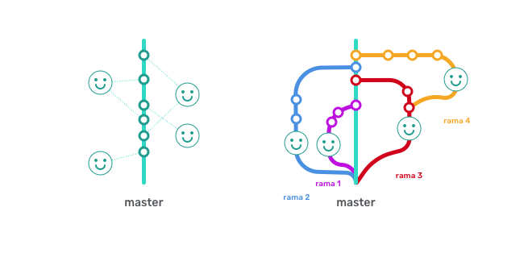
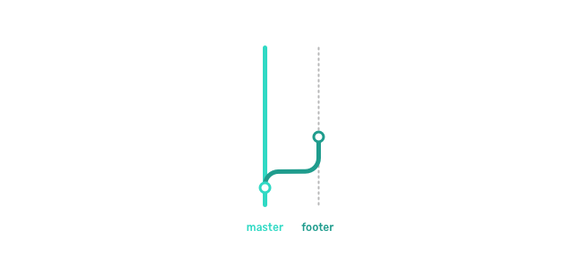
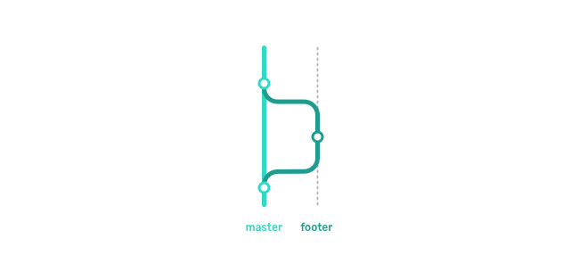
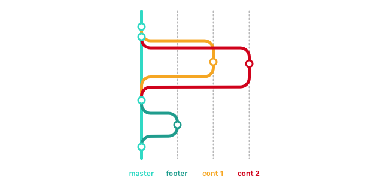
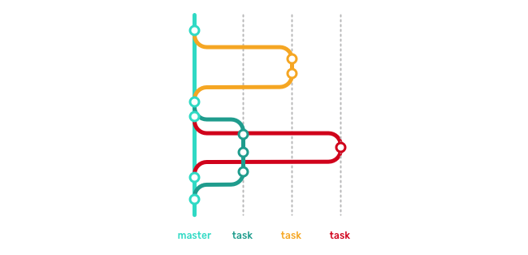

# Control de versiones en equipo

## Contenidos
- Ramas (branch, merge y checkout)
- Flujo de trabajo con ramas
- Pull requests y reviews de equipo en GitHub


## Introducción
A veces vamos a tener una versión de nuestro proyecto sobre la que vamos a querer aplicar modificaciones o ampliar características pero si trabajamos como hasta ahora pasa que hasta que terminemos ese trabajo extra pero nuestro proyecto no se podrá tocar hasta que dichas modificaciones terminen. Para eso tenemos las ramas, que nos permiten afrontar desarrollos paralelos como nuevas características, tareas de mantenimiento o integrar un nuevo diseño.

## ¿Para qué sirve lo que vamos a ver en esta sesión?
Una característica de Git (también de otros sistema de control de versiones) es la posibilidad de ramificar el proyecto permitiendo tener una versión principal del proyecto y versiones paralelas donde aplicar nuevas secciones o características o probar funcionalidades, de manera que si hay que hacer un pequeño cambio no tengamos que esperar a que nuestra nueva funcionalidad o sección esté acabada. Tendremos varias versiones, ramas, una donde mantener nuestro proyecto y coloca estos pequeños ajustes y otra(s) donde realizar trabajos paralelos.

## ¿En qué casos se utiliza?

Si tenemos en cuenta que, por defecto, nuestro repositorio v sobre una rama llamada "master", entonces podemos decir que siempre trabajamos en ramas :)

Fuera de la anécdota, estos son algunos casos donde usar ramas.

Tenemos una versión de nuestro proyecto y:

* Queremos tener un lugar donde realizar pequeños mantenimientos del proyecto como corrección de erratas o cambios rápidos
* Queremos desarrollar un nuevo diseño que aplicaremos cuando esté terminado
* Queremos desarrollar una nueva funcionalidad y no sabemos si al final la aplicaremos o no
* Queremos mantener varias versiones de nuestro proyecto, la de desarrollo, la de producción y un histórico versiones completas
* Varios equipos van a desarrollar diferentes funcionalidades sobre nuestro proyecto

## Ramas
Las ramas nos permiten crear una línea paralela de desarrollo que luego se integrará o no en la línea principal:



Cuando iniciamos un repositorio Git se crea una primera rama, y se llama `master` por convención. Hasta ahora hemos trabajado en esa rama.

Vamos a ver el trabajo en ramas a través de un ejemplo, como un mini proyecto de grupo, porque al fin y al cabo, Git va de trabajar en grupo:

***
EJERCICIO 1:  
1. Vamos crear un repositorio por grupo, dentro del equipo de Adalab y lo llamaremos `clarke-s2-gX`, donde `X` será el número del grupo, de 1 a 4 :)
2. Crearemos una primera versión de nuestra web (solo en html) tendrá:
	1. Un `<header>` con un `<h1>` con el nombre del grupo
	2. Un `<main>` con dos secciones:
		1. `<section class="motivación"></section>`
		2. `<section class="contenido"></section>`
	3. Un `<footer>` con un `<p>` con el texto: "Maquetado en grupo en Adalab"
3. Lo subiremos a Github

Nos tiene que quedar algo así:
```html
<!DOCTYPE html>
<html lang="en">
<head>
	<meta charset="UTF-8">
	<title>Grupo nombre-de-grupo</title>
</head>
<body>
	<header>
		<h1>Grupo nombre-de-grupo</h1>
	</header>
	<main>
		<section class="motivacion"></section>
		<section class="contenido"></section>
	</main>
	<footer>
		<p>Maquetado en grupo en Adalab</p>
	</footer>
</body>
</html>
```
***

### Creando ramas
Para crear ramas escribimos `git branch nombre-de-la-rama` y nos movemos a ella con `git checkout nombre-de-la-rama`.

Tenemos un atajo para crear la rama y cambiarnos a ella directamente
```
git checkout -b nombre-de-la-rama
```

En cualquier caso, si queremos movernos de una rama a otra usaremos `git checkout nombre-de-la-rama`, de esta manera podemos movernos a nuestra nueva rama si usamos `git branch nombre-de-la-rama` o volver a `master` en cualquier momento.

Añadir archivos y crear un commit funciona igual pero cuando queramos hacer un push usaremos:
```
git push -u origin nombre-de-la-rama
```

La primera vez usaremos el git push con `-u`.

***
EJERCICIO 2:  
1. Vamos a crear una rama `footer`, a movernos a ella y a modificar un poco nuestro proyecto: añadiremos a nuestro footer el enlace a la web de Adalab, quedando así:
```html
<footer>
	<p>Maquetado en grupo en <a href="http://adalab.es">Adalab</a></p>
	</footer>
```
2. Como siempre, añadimos, commiteamos y hacemos push, esta vez usando `git push origin footer`.
3. Si ahora cambiamos a la rama `master` veremos que permanece como la dejamos y que el cambio del enlace solo está hecho en nuestra rama `footer`.


***

### Fusionar ramas
Una vez que hemos terminado el trabajo en nuestra nueva rama y lo hemos subido al servidor remoto querremos aplicar estos cambios en nuestra rama principal, `master`.

Para ello nos vamos a la rama destino (en este caso `master`) con `git checkout master`,  y escribiremos:
```
git merge nombre-de-la-rama
```
Esto nos mezclará nuestra versión local de la rama `nombre-de-la-rama` con la rama donde estemos, en este caso, `master`. Si todo va bien nos mezclará las ramas, creará un commit automático y si hacemos un `git status` nos dirá que solo queda hacer un `git push origin master` y ya.

	NOTA:
	Es importante haber hecho un `git pull` en la rama que vamos a fusionar, en este caso `nombre-de-la-rama` antes de empezar el proceso de fusión para asegurarnos de que tenemos la última versión.


***
EJERCICIO 3:  
Vamos a fusionar nuestra rama `footer` con `master` para que nuestra web tenga el enlace que hemos añadido anteriormente.
Para ello:
1. Nos movemos a la rama `footer`
2. Comprobamos que está correcto y tenemos la última versión
3. Nos movemos a la rama `master` (sí, es super buena idea asegurarnos de que tb tenemos la última versión)
4. Hacermos un merge de la rama `footer`
5. Resolvemos los conflictos si los hay
6. Comprobamos que los cambios está hechos
7. Y subimos al repositorio remoto

```html
<footer>
	<p>Maquetado en grupo en <a href="http://adalab.es">Adalab</a></p>
	</footer>
```
2. Como siempre, añadimos, commiteamos y hacemos push, esta vez usando `git push origin footer`.
3. Si ahora cambiamos a la rama `master` veremos que permanece como la dejamos y que el cambio del enlace solo está hecho en nuestra rama `footer`.


***

EJERCICIO 4:  
Ahora que hemos hecho un primer acercamiento a las ramas, vamos a hacer lo mismo pero haremos dos grupos por cada grupo y cada equipo estará encargado de un trabajo diferente que tendrá que realizar en una rama y posteriormente mezclar en la rama principal



Como en la imagen vamos a hacer dos ampliaciones de contenido:
1. el primer equipo de cada grupo tiene que añadir el contenido de la sección con una frase motivadora
2. el segundo equipo de cada grupo tiene que añadir el contenido de la sección con un título y un pequeño párrafo

**Sección con frase motivadora**
```html
<section class="motivacion">
	<h2>Frase súper motivadora, ¡a tope!</h2>
</section>
```

**Sección con frase y título**
```html
<section class="contenido">
	<h2>Contenido normal</h2>
	<p>Lorem ipsum dolor sit amet, consectetur adipisicing elit, sed do eiusmod tempor incididunt ut labore et dolore magna aliqua.</p>
</section>
```

Ahora realmente da igual el orden, el equipo que acabe su trabajo, que suba su rama al repositorio remoto, y siga los pasos para fusionarlo con master.

***

### Flujo de trabajo con ramas
Vale, y ahora ¿cómo trabajamos con las ramas? ¿Hacemos las que necesitemos? ¿Las llamamos como queramos? ¿Sin orden? No, claro, que no: sin orden solo hay caos.

Vamos a tener dos tipos de ramas, las de largo recorrido o permanentes y las de corta duración o puntuales.



#### Ramas permanentes
Los equipos suelen tener una o dos ramas permanentes, una donde está la versión estable de nuestro proyecto (suele ser la rama `master`), la que vamos a subir a nuestro servidor (o a Github Pages) y, quizás, una intermedia donde ir fusionando los diferentes cambios/mejoras (nombres comunes para esta rama son `dev`, `develop`...). Esta seguna rama no siempre tiene código estable, pero cuando lo tiene la fusionaremos hacia `master`.

Por ahora vamos a tener solo 1 permanente: `master`.

#### Tamas puntuales
Cuando tenemos una tarea nueva (modificar o crear contenido, por ejemplo) crearemos una nueva rama solo para dicha tarea, y trabajaremos sobre ella con normalidad, haciendo los commits necesarios y subiéndola a su correspondiente rama remota como hemos venido haciendo hasta ahora con `master`.

Recordad que usaremos `git push origin nombre-de-la-rama`

Una vez terminada la tarea la y comprobado que todo funciona correctamente la fusionaremos con `master`.

### Pull Request y revisión de código
Pero todavía hay más. Esta es una forma de trabajar pero en muchas empresas el equipo que se encarga de una tarea, crea la rama, ejecuta la tarea y la sube a la rama remota, pero no la fusiona: crea un **Pull Request** y puede que haya un equipo, o algún miembro del equipo, encargado de revisar el código y dar el visto bueno a la fusión.

La mecánica del Pull Request no es propia de Git sino de quién da el servicio de git, en este caso Github tiene su propio sistema para las Pull Requests.

***

EJERCICIO 5:

Vamos a hacer un Pull Request con revisión de código en vivo, para ello 1 voluntaria sale a hacer parte del ejercicio y el profesor hace la revisión de código, en directo.

***


## Recursos externos

- [Ayuda de Github sobre los Pull Requests (Inglés)](https://help.github.com/articles/about-pull-requests/)
- [6.2 GitHub - Participando en Proyectos](https://git-scm.com/book/es/v2/GitHub-Participando-en-Proyectos)
