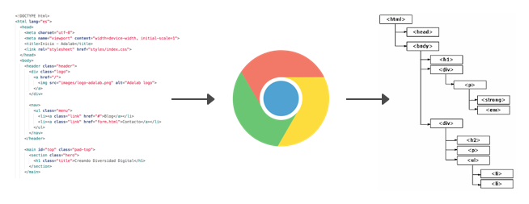
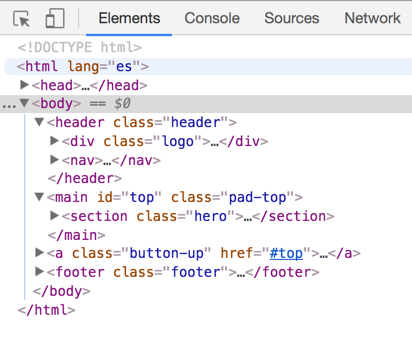
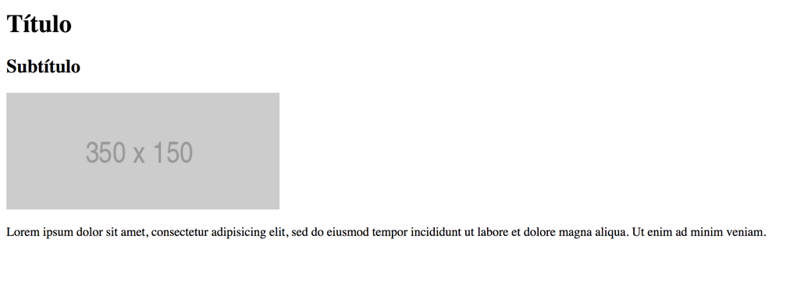
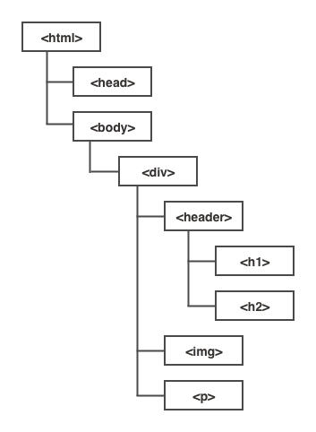
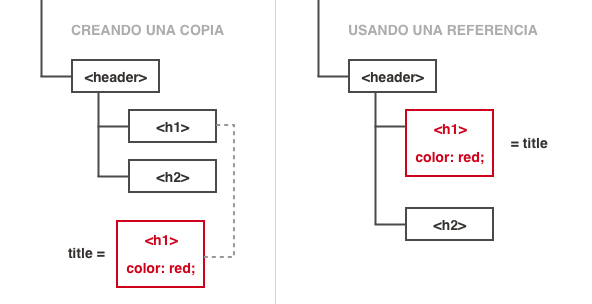
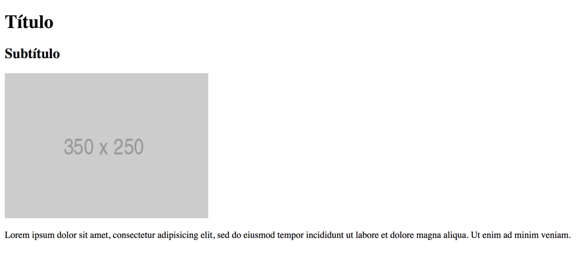
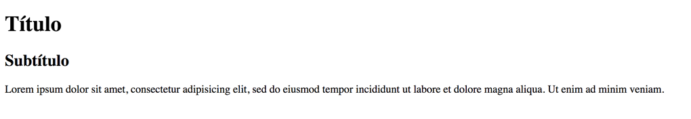

# JavaScript en la web

## Contenidos

- [Introducción](#introducción)
- [¿Para qué sirve lo que vamos a ver en esta sesión?](#¿para-qué-sirve-lo-que-vamos-a-ver-en-esta-sesión)
- [¿En qué casos se utiliza lo que vamos a aprender?](#¿en-qué-casos-se-utiliza-lo-que-vamos-a-aprender)
- [Introducción al DOM](#introducción-al-dom)
- [Trabajar con el DOM](#trabajar-con-el-dom)
  - [Obtener información del contenido de un elemento y modificarlo](#obtener-información-del-contenido-de-un-elemento-y-modificarlo)
  - [Obtener información sobre las clases y añadir o quitar clases](#obtener-información-sobre-las-clases-y-añadir-o-quitar-clases)
  - [Obtener información sobre los atributos de un elemento y modificarlos](#obtener-información-sobre-los-atributos-de-un-elemento-y-modificarlos)
  - [Trabajar con varios elementos](#trabajar-con-varios-elementos)


## Introducción

Hasta ahora hemos visto cómo utilizar JavaScript sin realizar ninguna acción sobre la web, pero eso está a punto de cambiar.

En esta sesión vamos a ver como empezar a interactuar con nuestra página web a través de JavaScript. Veremos qué es el DOM y su importancia en este proceso y conoceremos algunas de las herramientas que se nos brinda para poder modificar los elementos de nuestra página y obtener información a partir de ellos.


## ¿Para qué sirve lo que vamos a ver en esta sesión?

Todo lo que vamos a ver en esta sesión nos servirá en el futuro para poder sacar provecho a JavaScript más allá de mostrar una ventana de alerta. Vamos a aprender a obtener información y aplicar cambios en nuestra página con JavaScript, por lo que en primer lugar nos servirá para sacarle partido realmente a los conocimientos que hemos obtenido hasta ahora.

Poco a poco, durante las sesiones anteriores hemos ido profundizando en el lenguaje y en las características fundamentales de este y ahora que estamos preparados y nos hemos familiarizado un poco con la sintaxis y con el cómo y el porqué de JavaScript, tenemos los conocimientos para empezar a trabajar con él sobre nuestra página sin que sea tan mágico para nosotros y podamos entender a grandes rasgos qué estamos haciendo hasta que, poco a poco le cojamos el tranquillo, ¡que lo haremos!.


## ¿En qué casos se utiliza lo que vamos a aprender?

Dado que vamos a aprender a aplicar cambios y obtener información de nuestra página con JavaScript, se podría decir que lo que aprenderemos en esta sesión se aplica a todo, pero para ser más específicos diremos que lo que aprendamos en esta sesión nos servirá para modificar el contenido de nuestra página en JavaScript, tanto su estructura como sus estilos. Por el momento sólo podremos modificarlo una única vez, la primera vez que se ejecute nuestro JavaScript, pero en las próximas sesiones veremos cómo combinar esto con eventos para que la página responda a la interacción de los usuarios o a la llegada de nuevos datos desde el servidor, entre otros casos.


## Introducción al DOM

Hasta ahora hemos visto a grandes rasgos cómo funciona la web en lo que a clientes y servidores se refiere, pero es el momento de saber un poco más sobre qué es lo que sucede en nuestro navegador web una vez que este recibe una página web (enviada desde un servidor) o abrimos un html desde nuestro ordenador.

En el momento en el que el navegador carga la página lo primero que hace es leer el contenido del archivo HTML (con su correspondiente CSS y JavaScript), lo procesa y genera un esquema virtual representando los elementos de nuestra página como si fuese un árbol de objetos (con sus propiedades y métodos). Cada uno de estos objetos será un nodo de ese esquema, una pequeña parte de la red de conectada con el resto de elementos (madres e hijas).



Por simplificarlo un poco, sería como si el navegador fuese una persona y leyese el HTML y en su cabeza esbozase una idea de cómo es la estructura que forma el código HTML con las determinadas relaciones: este elemento es hijo de este otro y contiene otros dos elementos y así con toda la página. Esa estructura que tiene en su mente sería el DOM, la representación abstracta de la estructura de nuestra página web. Las siglas de DOM vienen de document object model, que en español sería Modelo de Objetos del Documento, un modelo que representa como objetos los distintos de un documento, una página web. Ese DOM lo genera el navegador pero no se muestra en ningún sitio, simplemente le servirá a este para estructurar nuestro contenido, ser capaz de pintar lo que vemos en la ventana y brindarnos la oportunidad de poder obtener información de este y poder modificarlo.

Entonces, ¿el DOM sería una representación de mi HTML? No realmente, en gran parte su contenido se generará a partir del HTML pero el DOM también poseerá las modificaciones que hagamos desde nuestro código de JavaScript y también poseerá información generada a partir de CSS. Por lo tanto podríamos decir que el DOM generará su contenido a partir de HTML, CSS y JavaScript pero además ofrecerá una serie de propiedades, métodos y eventos disponibles para modificar y crear páginas web organizadas en objetos.

Una representación visual del DOM (que no el DOM en sí) sería el código que aparece a la hora de abrir nuestro inspector. En este caso el DOM está representado con la sintaxis de HTML y es muy similar a nuestro código HTML pero no son lo mismo. Para demostrar esto no hace falta más que escribir en nuestro HTML algunas etiquetas sin cerrar o mal colocadas, si hacemos esto veremos que, aunque en nuestro HTML estén sin cerrar o mal, en la representación del DOM se verá todo correcto, porque este se ha sido procesado por el navegador.



Bien, te estarás preguntando ¿y para qué quiero saber yo todo esto?. Pues bien, entender esto nos permitirá entender, en primer lugar, cómo procesa nuestro código un navegador web y en segundo, entenderemos mejor qué es eso de los objetos y para qué sirve realmente y cómo trabajar de forma correcta con los elementos de nuestra página.

Tras esta explicación del DOM, es el momento de ver cómo podemos usar JavaScript para manipularlo y obtener información de él.

Bien, imaginemos que tenemos una página con el siguiente código HTML dentro de su etiqueta `body`:

```html
<div class="card">
  <header>
    <h1>Título</h1>
    <h2>Subtítulo</h2>
  </header>

  

  <p>
    Lorem ipsum dolor sit amet, consectetur adipisicing elit, sed do eiusmod tempor incididunt ut labore et dolore magna aliqua. Ut enim ad minim veniam.
  </p>
</div>
```

El resultado será una página como la que podemos ver en la siguiente imágen:



Y la estructura del DOM será similar a esta:



Ahora imaginemos que queremos obtener información de la imagen (leer sus propiedades) y modificarla (usar sus métodos). Lo primero que debemos hacer es saber cómo podemos trabajar desde JavaScript con un elemento del DOM. Para poder trabajar con él, lo primero que haremos será obtener una referencia a ese elemento usando `document.querySelector('.card-image');`, donde `document` es la raíz del objeto que representa el DOM en JavaScript y `querySelector()` es un método que tiene `document` para obtener la referencia a un elemento del DOM mediante un selector (como los selectores que usamos en CSS). `.card-image` probablemente lo hayas deducido ya pero sino, es el selector de la clase que lleva la imagen. Por lo tanto `document.querySelector('.card-image')` nos permite obtener la referencia al elemento de la imagen. Por lo general, guardaremos esa referencia a la imagen en una variable para poder trabajar con ella posteriormente, por lo tanto el código final quedaría así:

```js
var image = document.querySelector('.card-image');
```

Un dato importante y que repetiremos varias veces es que con este código guardaremos la referencia al elemento del DOM. Esto quiere decir que no crearemos una copia sino que cada vez que hagamos una modificación la estaremos haciendo directamente sobre el propio objeto del DOM. El objetivo de hacerlo así es que, al hacer un cambio, este se aplicará directamente al elemento real y el navegador actualizará la página web automáticamente con los nuevos cambios. Si por el contrario, en vez de guardar una referencia guardamos una copia, al modificar los datos de esta no estaríamos modificando ese elemento del DOM y no cambiaría nada en la página.




Bien ya tenemos el elemento listo para poder trabajar con él desde JavaScript, como mencionábamos antes este será un objeto, por lo que tendrá propiedades y métodos.

Como con los objetos que hemos trabajado ahora, las propiedades de un elemento del DOM nos permitirán leer y modificar sus datos (ancho, alto, src, etc...). En primer lugar, vamos a ver cómo leer la propiedad de un objeto del DOM, para esto la sintaxis será exactamente igual que cuando trabajamos con otro tipo de objetos (ya que son lo mismo). Vamos a probar a obtener la ruta de la imagen que está cargando usando la propiedad `src`:

```js
alert(image.src) // Nos mostrará una ventana con el texto http://via.placeholder.com/350x150
```

Hasta aquí todo normal. Ahora modificaremos esa propiedad para que el `src` sea diferente:

```js
image.src = 'http://via.placeholder.com/350x250';
```

Esto modificará el valor de la propiedad del elemento pero aquí es cuando sucede la magia. Tras modificar el atributo `src` y utilizar la ruta de una nueva imagen el navegador sustituirá la imagen anterior por esta nueva y el cambio se verá en el momento, apareciendo la nueva imagen ¡Magia negra!.



Esto sucede porque cada vez que hacemos un cambio estamos modificando el DOM y cada vez que modificamos el DOM el navegador se da cuenta y realiza los cambios visuales necesarios en nuestra página.

Con los métodos es más de lo mismo, los utilizaremos como con cualquier otro objeto de JavaScript y, en el caso de que modifiquen algo del elemento, el navegador detectará automáticamente los cambios y realizará las modificaciones visuales necesarias. Vamos a utilizar en este caso el método `remove()` (eliminar en español) que como su nombre indica eliminará el elemento y lo hará desaparecer del DOM y por tanto también de la página:

```js
image.remove();
```

De nuevo, tras ejecutar el método la vista se actualiza y en este caso, la imagen desaparece, por lo que comprobamos que con los métodos también se produce esa actualización.



Ahora, tras aprender qué es el DOM y como vamos a interactuar con él es cuando cobran aún más sentido los objetos en JavaScript. Ahora empezaremos a usar muchos métodos y propiedades para trabajar nuestra página web y poco a poco iremos solidificando conceptos hasta el punto de que el tema de los objetos pase a ser algo cotidiano en nuestra programación y los utilicemos con soltura.

Por el momento solo hemos visto una propiedad y un método pero a lo largo de esta sesión veremos otros bastante útiles para modificar los estilos y el contenido de la página y conseguir información de los elementos.

Por último, aparte del DOM tenemos otros objetos con los que podremos interaccionar para obtener información y realizar acciones, como por ejemplo `window` que representa a la ventana del navegador y es el objeto global (del que parten todos, incluso `document`), Veremos algunos métodos y propiedades de este en futuras sesiones.

## Trabajar con el DOM

Bien, ya sabemos qué es el DOM y tenemos más clara la teoría. Ahora es el momento de aprender la práctica, para ello vamos a ver cómo podemos trabajar con el DOM desde JavaScript ya sea para obtener algún dato o realizar algún cambio en nuestra web.

### Obtener información del contenido de un elemento y modificarlo

La operación más básica a la hora de trabajar con nuestra página web es obtener información acerca de su contenido y modificarlo bien sea para añadir algo a su contenido, modificarlo o eliminarlo directamente. Cuando hablamos de modificar el contenido de un elemento, nos referimos a cambiar lo que habría entre la etiqueta de apertura de un elemento HTML y la de cierre. Para realizar este tipo de operaciones utilizaremos la propiedad `innerHTML`.

Imaginemos que tenemos el siguiente código HTML con un `h1` para el título y este contiene el texto "binvenida" (si, con una errata).

```html
<!DOCTYPE html>
<html lang="es">
  <head>
    <meta charset="utf-8">
    <title></title>
  </head>
  <body>
    <h1 class="title">Binvenida</h1>
  </body>
</html>
```

Imaginemos que queremos cambiar ese texto por un texto sin la errata usando JavaScript. Lo haríamos de la siguiente manera:

```js
// Obtenemos la referencia del elemento con el que queremos trabajar usando document.querySelector()
var titleElem = document.querySelector('.title');

titleElem.innerHTML = 'Bienvenida'
```

De esta forma el contenido de h1 pasaría de ser _"Binvenida"_ a _"Bienvenida"_ al cambiar el contenido de ese elemento (`.title`) el navegador automáticamente actualizará la vista de la página mostrando el texto nuevo. Esto sucede tan rápido que ni siquiera nos dará tiempo a ver la página con el texto anterior, sino que directamente aparecerá con el texto que hemos introducido mediante JavaScript.

>NOTA: Debemos dejar claro que la utilidad de JavaScript no es la de solucionar erratas en nuestro código. Esto lo modificaremos directamente en el HTML para corregirlo, pero creemos que este ejercicio ilustra bien cómo funciona innerHTML y para qué sirve

Ahora supongamos que tras cambiar con JavaScript el texto de _"Binvenida"_ a _"Bienvenida"_ queremos hacerlo más personal y queremos que ponga _"Bienvenida, adalaber"_ en vez de un soso _"Bienvenida"_.

En este caso deberemos coger el contenido actual del elemento y añadirle ", adalaber". Para coger el contenido actual del elemento, dado que `innerHTML` es una propiedad y funciona como cualquier otra propiedad de un objeto podremos utilizar `titleElem.innerHTML` para obtener el valor de esa propiedad, que será `'Bienvenida'`. Sabiendo esto, el código que tendremos que escribir en este caso sería el siguiente:

```js
/*
Obtenemos la referencia del elemento con el que queremos trabajar usando
document.querySelector()
*/
var titleElem = document.querySelector('.title');

titleElem.innerHTML = titleElem.innerHTML + ', adalaber'

/*
También podríamos simplificarlo y poner titleElem.innerHTML += ', adalaber'
que sería lo mismo
*/
```

Bien, ya sabemos cómo obtener cuál será el contenido de un elemento y cómo modificarlo. Vamos a hacer un par de ejercicios para practicarlo.

* * *

EJERCICIO:

Crear una página HTML con un párrafo en el que ponga hola y, usando JavaScript, cambiar ese texto por "Hello"

* * *

EJERCICIO:

Crear una página HTML con un párrafo en el que ponga "Mi contraseña es: Ada2017" y, usando JavaScript, cambiar ese texto por un texto vacío.

* * *

EJERCICIO:

Crear una página HTML con un párrafo vacío en la que, mediante un prompt, el usuario pueda introducir su nombre y se muestre en el párrafo "Hola nombre", donde _nombre_ será el nombre que ha introducido el usuario

* * *

Una cosa importante de `innerHTML` es que nos permite cambiar el contenido de un elemento y como en JavaScript podemos meter HTML dentro de HTML, `innerHTML` también nos lo va a permitir, por lo que, si tuviésemos un HTML con una lista vacía (`<ul class="list"></ul>`) y quisiéramos introducir dos `li`s cada uno con un enlace, podríamos hacerlo de la siguiente manera:

```js
var listElem = document.querySelector('.list');

var content = '<li><a href="#">Home</a></li><li><a href="#">Contact</a></li>';

listElem.innerHTML = content;
```

Esto añadirá dos `li`s a la lista y la página los mostrará automáticamente.

Con esto ya podemos trabajar editando el contenido de nuestra página. A partir de ahora podremos añadir contenido a nuestra web o modificarlo y por tanto hacer nuestra web dinámica de verdad, genial ¿no? :).

* * *

EJERCICIO:

Crear una página HTML con un div que contenga un `h1` con el texto "Lorem ipsum" y, usando JavaScript, añadir una imagen con el src `http://via.placeholder.com/350x150` y un párrafo con el texto "Lorem ipsum dolor sit amet, consectetur adipisicing elit".

* * *

EJERCICIO:

Crear una página HTML con una lista vacía y, usando JavaScript y un bucle `for`, añadir al contenido de esa lista tres `li`, el primero tendrá como texto 1, el segundo 2 y el tercero 3.

* * *


### Obtener información sobre las clases y añadir o quitar clases

Hemos visto como añadir o modificar el contenido de un elemento HTML, pero aquí no se queda la cosa. Normalmente también querremos modificar otras cosas de este elemento y una de las que más se suele modificar es la clase para hacer que cambien los estilos de un elemento. Esto nos permitirá añadir clases para ocultar o mostrar un elemento, por ejemplo.

Para trabajar con clases, los elementos ofrecen una propiedad llamada `classList`. Esta contiene una serie de métodos que nos permitirán, añadir o eliminar una clase o comprobar si el elemento contiene una clase o no.

Imaginemos que tenemos en nuestro CSS una clase `.hidden` que sirve para ocultar elementos:

```css
.hidden {
  display: none;
}
```

Y tenemos un HTML con dos divs `.section-a` y `.section-b`, cada uno para una sección diferente de nuestra página:

```html
<div class="section-a"></div>
<div class="section-b"></div>
```

Si queremos ocultar la sección B, lo que haremos será añadirle la clase `.hidden`, para que se apliquen sus estilos y por tanto ese div tenga `display: none;` y no se muestre. Para esto tendremos que hacer lo siguiente en JavaScript:

```js
/*
Como siempre que queremos trabajar con un elemento, obtenemos la referencia del
elemento con el que queremos trabajar usando document.querySelector()
*/
var sectionB = document.querySelector('.section-b');

sectionB.classList.add('hidden');

/*
También podríamos simplificarlo y poner titleElem.innerHTML += ', adalaber'
que sería lo mismo
*/
```

Esto hará que el div de `section-b` pase a ser `<div class="section-b hidden"></div>`. Como se puede intuir `classList.add()` sirve para añadir una o más clases a un elemento. En el caso de que quisiéramos añadir más clases, podríamos ir pasando por separado, cada una de las clases que queremos añadir como texto:

```js
sectionB.classList.add('hidden', 'otraClase', 'otraMas');
// Así hasta aburrirnos
```

Bien ya sabemos cómo añadir, veamos cómo eliminar. Supongamos que hemos aplicado el JavaScript a la sección B y actualmente está oculta y ahora quiero que se muestre de nuevo y, además, se oculte la sección A. Esto lo podemos hacer de la siguiente manera:

```js
var sectionA = document.querySelector('.section-a');
var sectionB = document.querySelector('.section-b');

sectionA.classList.add('hidden');
sectionB.classList.remove('hidden');
```

Lo único nuevo de ese código sería `classList.remove()`. Como se puede deducir, este servirá para quitar una clase a un elemento. Al igual que con `add()`, podemos quitar varias clases pasando cada una por separado a `remove()`:

```js
sectionB.classList.remove('hidden', 'otraClase', 'otraMas');
```

La combinación de usar `add()` y `remove()` para ocultar una sección y mostrar otra es muy típica y se suele usar para cuando cambiamos de pestañas en una web, por ejemplo. Cada vez que pulsamos en una pestaña ocultamos la sección activa y mostramos la que está oculta. Este es uno de los miles de ejemplos de uso que ofrece classList y sus métodos y por eso es tan útil.

Para ver el siguiente método de `classList`, vamos a plantear una posible situación. Imaginemos que tenemos un botón que sirve para mostrar y ocultar un elemento de nuestra página. De momento no vamos a ver cómo hacer que cuando pulses en un botón, se haga algo pero si vamos a ver cómo podríamos ocultar un elemento sólo en el caso de que no estuviese oculto antes. Tendríamos que tener una forma de comprobar si un elemento tiene una clase o no, aquí es donde entra en juego `classList.contains()`. Con este método podremos comprobar si un elemento contiene una clase y nos devolverá un booleano (`true` o `false`).

Veamos el caso que estábamos comentando, tenemos un elemento que puede o no tener la clase `.hidden`. Vamos a comprobar si la tiene y en caso de ser así se la quitaremos y en caso de no tenerla se la añadiremos. Esto huele a `if` ¿verdad? :). Veamos el código:

```js
var activableSection = document.querySelector('.activable-section');

// Si contiene la clase hidden
if (activableSection.classList.contains('hidden')) {
  // Elimina la clase
  activableSection.classList.remove('hidden');
} else { // Sino
  // Añade la clase hidden
  activableSection.classList.add('hidden');
}
```

Como se puede ver, el código es bastante ilustrativo y queda claro cómo funciona pero para que no tengamos que complicarnos ni un poquito, `classList` nos ofrece una forma para realizar el mismo código que antes en una línea usando otro de sus métodos `classList.toggle()`:

```js
var activableSection = document.querySelector('.activable-section');

// Si contiene la clase hidden la elimina y sino la añade
activableSection.classList.toggle('hidden');
```

Mucho más sencillo, ¿verdad?. Y ahora te preguntarás qué para qué queremos entonces él `contains()`. Bien, como hemos comentado, el contains nos permite saber si un elemento contiene una clase o no, en la mayoría de las ocasiones, queremos saber esto para añadir o quitar una clase (de ahí que exista `toggle()`) pero hay casos en los que no lo queremos saber para esto. Imaginemos que queremos cambiar el contenido de un elemento en función de si contiene una clase o no, en ese tipo de casos necesitaremos usar `contains()`.

Y hasta aquí los métodos que necesitamos saber de `classList`, es el momento de hacer ejercicios para reforzar los conocimientos que hemos adquirido.


* * *

EJERCICIO:

Crear dos botones con los mismos estilos (padding, borde, color) y, usando JavaScript, al segundo añadirle una clase para que parezca que esta desactivado (por ejemplo, aplicarle una [opacidad](https://developer.mozilla.org/es/docs/Web/CSS/opacity) menor).

* * *

EJERCICIO:

Vamos a simular que nuestra web tiene un tema según quien entra en ella. Para ello crearemos tres clases, cada una con un color de fondo distinto, el que más te guste a ti, el que más le guste a tu compañera y un negro. Nada más cargar la página mostraremos una ventana donde el usuario deberá meter su nombre:
- si el nombre es el tuyo, añadiremos a `body` la clase que aplica al color de fondo tu color favorito
- si el nombre es el de tu compañera, añadiremos a `body` la clase que aplica al color de fondo el color favorito de tu compañera
- si no es ninguno de estos, aplicaremos la clase que aplica el fondo negro

* * *

EJERCICIO:

Crea un div que contenga un título "NOTIFICACIÓN" y un texto "Mensaje por defecto". Crea también tres clases:
- La primera, `.success`, aplicará un borde verde oscuro, un fondo verde claro y el color de fuente verde oscuro
- La segunda, `.error`, igual pero sustituyendo el verde por rojo
- La tercera, `.warning`, lo mismo pero usando el color amarillo

Usando JavaScript, haremos que:

- Si contiene la clase warning, el título sea 'AVISO' y el texto sea: 'Tenga cuidado'
- Si contiene la clase error, el título sea 'ERROR' y el texto sea: 'Ha surgido un error'
- Si contiene la clase success, el título sea 'CORRECTO' y el texto sea: 'Los datos son correctos'

* * *

EJERCICIO:

Crea un párrafo en HTML y, usando Javascript, haz que si tiene la clase `.active`, esta desaparezca y sino se la ponga. Prueba a añadirle en HTML y quitarle la clase para ver qué sucede. Prueba a añadir otra clase que no haga nada para ver si sigue funcionando correctamente.

* * *


### Obtener información sobre los atributos de un elemento y modificarlos

En este caso, vamos a ver cómo trabajar con los atributos de un elemento, esto nos permitirá hacer muchas cosas útiles como cambiar la ruta de una imagen para que se vea una imagen u otra, comprobar el valor de un input para añadirlo, por ejemplo, en nuestro currículum, etc.

Para los siguientes atributos, si queremos obtener un valor o modificarlo, utilizaremos el nombre de la propiedad:

- `src`
- `value`
- `type`
- `style`
- `href`

Por ejemplo para obtener el valor actual de un `input` usaremos:

```js
// Si tenemos <input type="text" name="firstname" id="firstname" value="Ada">
var nameInput = document.querySelector('#firstname');

alert(nameInput.value); // Nos devolverá el valor actual ('Alex')
nameInput.value = 'Joan'; // Rellenará el input con el valor 'Joan'

/*
Para poner un estilo, lo asignaremos usando la siguiente notación
style.propiedadCSS = 'valor'

De esta forma no modificaremos los estilos previamente asignados

Si la propiedad CSS tiene un guión (background-color) lo convertiremos a camelcase
backgroundColor
*/
nameInput.style.backgroundColor = 'red';


/*
Si queremos poner varios estilos a la vez o sobreescribir los anteriores,
usaremos esta notación
*/
nameInput.style = 'color: red; color: blue';
```

En el caso de que la propiedad no esté en la lista anterior, deberemos usar `getAttribute`.

```js
// Si tenemos <label class="firstname-label" for="firstname"></label>
var label = document.querySelector('.firstname-label');
document.getAttribute('for'); // devolverá firstname
```

Para añadir un elemento que no está en la lista que hemos mencionado anteriormente, usaremos `setAttribute`.

```js
// Si tenemos <label class="firstname-label" for="firstname"></label>
var label = document.querySelector('.firstname-label');
document.setAttribute('for', 'firstname'); // asignará for="firstname" al label
```

* * *

EJERCICIO:

Crea una página que contenga tres imágenes, usando prompt preguntale al usuario qué ciudad quiere visitar.

- Si el usuario escribe Madrid, haz que en cada imagen se muestre una foto de Madrid
- Haz lo mismo para París y Nueva York

* * *

EJERCICIO:

Vamos a crear nuestro propio autocompletado de formularios. Para ello vamos a crear un formulario con tres campos:

- Nombre
- Apellidos
- Teléfono

Con ayuda de JavaScript, mostraremos una ventana y el usuario deberá introducir un nombre. En función del nombre que introduzca los campos del formulario se rellenarán con unos datos u otros.

* * *

EJERCICIO:

Vamos a crear un div en HTML que contenga tres párrafos con un texto aleatorio. Con la ayuda de JavaScript vamos a obtener su tamaño usando la propiedad [`offsetHeight`](https://developer.mozilla.org/es/docs/Web/CSS/opacity). Posteriormente y usando el atributo HTML [style](https://www.w3schools.com/Tags/att_global_style.asp) vamos a configurar que su altura será un tercio de la actual.

* * *

### Trabajar con varios elementos

Para seleccionar un elemento, utilizaremos querySelector, pero ¿y si queremos modificar más de uno?. Bien en ese caso utilizaremos `querySelectorAll`, que nos permitirá guardar en una variable una lista de elementos. Esta lista funciona de manera similar a un array con ligeras diferencias y podemos hacer lo siguiente con ella:

```js
// Guardamos una lista de todos los parrafos
var paragraphs = document.querySelectorAll('p');

// Modificamos el primer párrafo
paragraphs[0].innerHTMl = 'Soy el primero';

// Muestra el número de parráfos que hay en nuestra web
alert(paragraphs.length)

// Iteramos sobre todos los párrafos para asignarles a todos un color
for (var i = 0; i < paragraphs.length; i++) {
  paragraphs[i].style.color = 'red';
}

```
