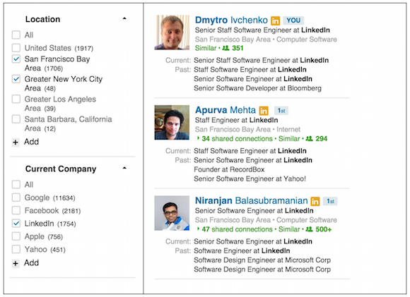

# Arquitecturas de componentes con estado

[codepen-lifting-state-up]: https://codepen.io/adalab/pen/xpzBYz?editors=0010

## Contenidos

- [Introducción](#introducción)
- [¿Para qué sirve lo que vamos a ver en esta sesión?](#¿para-qué-sirve-lo-que-vamos-a-ver-en-esta-sesión)
- [Arquitectura de componentes con estado](#arquitectura-de-componentes-con-estado)

## Introducción

En esta sesión vamos a ver buenas prácticas para organizar nuestros componentes y aplicaciones cuando hacemos uso del estado.

También aprenderemos cómo declarar componentes _dummies_ (títeres) con una sintaxis simplificada. 


## ¿Para qué sirve lo que vamos a ver en esta sesión?

Cuando trabajamos en aplicación React con varios componentes, la gestión de estado se vuelve compleja. Si desde un componente necesito unos datos que está en otro, primero tendré que identificar en cuál estaban y luego acceder a ellos, ya sea por props o lifting. Para manejar esta situación, existen distintas arquitecturas de componentes. En esta sesión os proponemos una concreta con la que trabajar, aunque no es la única ni vale para todas las situaciones, sí que os va a ayudar a estructurar mejor vuestra aplicación React.


## Arquitectura de componentes con estado

A pesar de que todos los componentes pueden tener estado, a la hora de hacer aplicaciones web con React, preferiremos **agrupar todos los estados en el componente raíz**. El resto de componentes serán _dummies_ (títeres), que significa que no tendrán estado. Podemos referirnos al estado del componente raíz como **estado de la aplicación** o **estado global**.

¿Por qué hacemos esto? En los estados guardaremos diferentes datos, algunos de los cuales habremos recibido de servidores: una lista de artículos en venta, sus precios y un booleano de si mostramos el IVA o no, por ejemplo. El mejor sitio para guardar esos datos es siempre el componente raíz, porque es el sitio desde el que cualquier componente hijo podrá acceder a ellos.

¿Y cómo lo haremos? Como vimos en la sesión 3.7 podemos pasar datos de hijos a padres/madres **mediante _lifting_**. Recordemos que la técnica de _lifting_ consistía en pasar una función definida en el padre/madre a un componente hijo mediante las `props`. Esa función puede modificar al padre. Ahora que hemos visto los estados, podemos ver un nuevo uso del _lifting_: **actualizar estados de los padres/madres desde los hijos**.

```js
const ENDPOINT = 'https://...';

class AppRoot extends React.Component {
  constructor(props) {
    super(props);

    this.state = {
      reasonsStore: []
    }

    this.fetchNewReasons = this.fetchNewReasons.bind(this);
  }

  fetchNewReasons() {
    fetch(ENDPOINT)
      .then((response) => response.json())
      .then((data) => {
        this.setState({
          reasonsStore: data.reasons
        });
      });
  }

  render() {
    const { reasonsStore } = this.state;

    return (
      <section>
        <ReasonsList reasons={ reasonsStore } />
        <UpdateButton updateList={ this.fetchNewReasons } />
      </section>
    );
  }
}

class UpdateButton extends React.Component {
  render() {
    const { updateList } = this.props;

    return (
      <button onClick={ updateList }>Update reasons</button>
    );
  }
}
```

[&blacktriangleright; _Lifting_ de estados en Codepen][codepen-lifting-state-up]

> En algunos casos una parte del estado tiene sentido que esté en un componente que no sea el raíz. Por ejemplo, para un componente colapsable tiene sentido que la información de si está desplegado o no sea del propio componente y no del raíz. Este tipo de casos específicos vamos a ir identificándolos con la práctica.

* * *

**EJERCICIO 1: DIRECTORIO**:

En este ejercicio vamos a realizar un directorio de personas, al estilo de LinkedIn, con unos filtros que permiten filtrar las personas que aparecen. Para ello vamos a partir de un array de datos de gente aleatoria generado por https://randomuser.me/. Por ejemplo, un listado de 50 personas con datos aleatorios: https://randomuser.me/api/?results=50

Vamos a mostrar de cada persona
- su nombre
- foto
- ciudad
- edad

Vamos a poder filtrar por
- ciudad
- género

El resultado debe ser parecido a este diseño de LinkedIn:



**¡Al lío!**

* * *


## Recursos externos

### Egghead

Serie de clases en vídeo que introduce y explora los fundamentos básicos de React (en inglés).

- [Componentes de orden superior (con lógica) o contenedores](https://egghead.io/lessons/react-react-fundamentals-higher-order-components-replaces-mixins)
