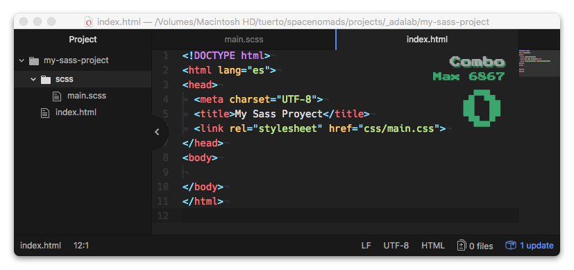
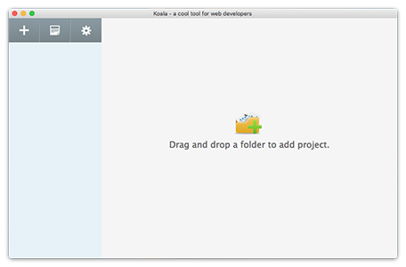
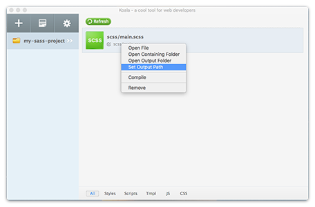
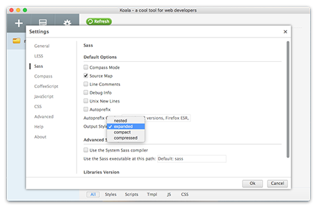

# Sass

## Contenidos

- Qué es preprocesador CSS
- Herramientas de configuración (koala o terminal)
- Básico: variables e imports
- Variables en Sass
- Nested rules en SASS
- Media queries y el &.
- Estructura de un proyecto SASS típico y como dividir archivos usando `@import`

## Introducción
Con CSS podemos personalizar al píxel el aspecto de nuestra página y como hemos visto tiene una serie de reglas y de formas de hacer todo esto. Sin embargo el sector ha ido madurando y nos encontramos con que necesitaríamos poder trabajar con las hojas de estilos de una manera más ágil: permitiendo el uso de variables, pudiendo dividir los archivos en bloques más pequeños, pudiendo crear bloques de estilos que se repitan o incluso pequeñas funciones simples. Esto es posible con los preprocesadores CSS.

## ¿Qué es un preprocesador CSS?
Un preprocesador CSS es un lenguaje parecido al CSS pero que nos permite tener acceso a funcionalidades que no tiene el CSS y, tras el procesado, generar un CSS válido.

De esta manera ya no trabajaremos directamente el CSS sino con este preprocesador que, automáticamente, generará nuestros CSS finales.

Actualmente hay varios preprocesadores, realmente lo que los diferencia es la sintaxis de cada uno pero vienen a hacer un poco lo mismo. Los preprocesadores CSS más famosos son:

* [SASS (el que vamos a ver en Adalab)](http://sass-lang.com)
* [LESS](http://lesscss.org)
* [Stylus](http://learnboost.github.io/stylus/)

Nosotros vamos a usar SASS, concretamente SCSS, que es la sintaxis nueva :)

## Vale, ¿y esto cómo funciona?
Pues esto se instala y se ejecuta por terminal, pero para no sufrir vamos a empezar usando una aplicación, [Koala](http://koala-app.com), que se va a encargar de procesar nuestro archivo de SCSS y a generar los CSS correspondientes.

Luego, `live server`, se ocupará de recargar el navegador cuando el css haya sido generado.

### Koala
Koala es una aplicación de multiplatadorma (Linux, Mac y Windows) que se encarga de procesar nuestros archivos SASS y generar los CSS finales.

  
Un proyecto de ejemplo tendría nuestro CSS enlazado desde el HTML como siempre pero esta vez partiríamos de la carpeta `scss`, con un `main.scss` dentro (por ejemplo).



Entonces, desde la aplicación Koala añadimos nuestra carpeta de proyecto  
  
  
Y el programa nos detecta los archivos procesables, en este caso `main.scss` y nos propone una ruta donde generarlo, normalmente en la misma carpeta. Nosotros lo vamos a querer en otra porque estos son nuestros archivos de trabajo y cuando luego queramos entregarlos nos interesará que no estén mezclados.  
  
Con clic derecho seleccionamos dónde queremos que se coloque el CSS procesado, por ejemplo en nuestra carpeta `css`, y lo llamaremos con su nombre correcto, en este caso `main.css`:  
  
  
Con esto ya estaría aunque podemos tocar alguna cosa más, como el estilo de procesado. Hay 4: nested, expanded, compact, compressed. Por ahora usaremos `expanded` y ya habrá tiempo de ver los otros [estilos de procesado](http://sass-lang.com/documentation/file.SASS_REFERENCE.html#Output_Style).  

  

Ahora ya tenemos listo nuestro proyecto. Cada vez que guardemos los cambios en nuestro `main.scss` se generará un nuevo `main.css` y **live server** se encargará de recargar el navegador.

### Me estás liando, ¿SASS o SCSS?
El preprocesador CSS que vamos a usar se llama SASS (Syntactically Awesome StyleSheets) pero tiene dos sintaxis, SASS y SCSS. Usaremos SCSS porque es más parecida a CSS y no depende tantísimo de estar todo bien tabulado ya que usa las mismas llaves a las que estamos acostumbrados ya. Así que diremos `sass` pero usaremos `scss` ;)

## ¿Y qué puedo hacer con SASS/SCSS?
Maravillas, con SASS se pueden hacer maravillas.

Bueno, se pueden hacer muchas cosas, hoy vamos a ver las variables, como se anida, el símbolo `&` y las media queries, imports y mixins/funciones.

**¡Vamos a ello!**

### Variables
Se usan muy parecido a JavaScript, pero precedidas por el símbolo `$` y se asignan con los `:`  
```scss
$colorLink: blue;
```

Ahora podríamos hacer algo como:
```scss
$color_link: blue;

a {
	color: $color_link;
}
```
El uso de variables nos da una serie de ventajas. Podemos definir al principio del documento todas nuestras variables y si una vez avanzados, o terminados, nuestros estilos queremos cambiar algún valor pues se cambia el valor de la variable que toque y se vuelve a generar el CSS.

¿Qué podemos usar como variables? Lo que queramos de los valores de las propiedades CSS.
```scss
$headerHeight: 100px;
$fontText: 'Roboto', arial, sans-serif;
$pathImages: '../images/';

body {
	font: 16px $fontText;
}
.header {
	background: url($pathImages + 'imagen.png') left top no-repeat;
	height: $headerHeight;
}
```
**¡Vamos a ponerlo en práctica!**
***
EJERCICIO 1:  
En el siguiente [codepen](https://codepen.io/adalab/pen/aVrxYY) tenemos un ejemplo en css que vamos a reescribir a SCSS y modificar un poco.
1. Lo primero es configurarlo para usar SCSS: en la rueda de CSS, desplegar las opciones y elegir SCSS como preprocesador
2. Convertir a variables los valores de las líneas indicadas
3. Hacer los siguientes cambios sólo tocando la variables:
	1. Color del texto de `#414141` a `#010101`;
	2. Tamaño de fuente de la página a `18px`
	3. El margen de `.wrapper` a `0 60px`
	4. Fondo de header y footer a `yellow`
	5. Alto de header y footer a `50px`
	6. Fondo de `.main` a `cyan`
***
> **Cuándo hacemos variables y cuánto no?**  
> Quizás el primer impulso es empezar a crear variables como si no hubiera mañana pero el truco está en ver qué valores reutilizamos (misma altura para diferentes elementos, algunos márgenes, colores) y empezar creando sólo esas.

> **Sobre los colores**
> Lo ideal es usar variables que indiquen el tipo de elemento al que se va a aplicar un color y no tanto el color en sí. Es mejor `$colorLink` en lugar de variables tipo `$colorBlue` que tarde o temprano acaban valiendo un color diferente y va a desconcertar a quien coja el proyecto después. Aunque hay un término médio: definimos nuestros colores como el color que son y asignamos nuesta variable a otra variable que indique el elemento donde se va a usar.

```scss
$colorBlue: blue;
$colorDarkRed: #800;

$colorLink: $colorDarkRed;

a {
	color: $colorLink;
}
```
De esta manera tenemos un poco lo mejor de dos mundos.

### Nesting o anidado, y el símbolo `&`
Una maravilla que nos permite hacer SASS es anidar nuestros estilos.

Si queremos indicar que todos los `<p>` dentro de un elemento `.content` van a ser de color azul y si llevan enlace, éste, se motrará en rojo, podemos escribir:  
```scss
.content {
	p {
		color: blue;
		a {
			color: red;
		}
	}
}
```
Esto nos generará el siguiente CSS:  
```css
.content p {color:blue;}
.content p a {color:red;}
```
El anidado nos permite anidar bloques asimilandose un poco a la jerarquía visual de HTML. Esto nos permite ver algunos bloques más claros o agrupar clases que nos interese ver juntas. Pero atención: anidar genera estilos más específicos y hay que usarlo con mucho cuidado. Con el uso iremos viendo cuándo usarlo y cuándo no ;)

#### Referenciando al selector padre o madre: `&`
¡Pero no todo es tener cuidado! Una de las ventajas que nos ofrece el anidado es poder referenciar al selector padre o madre. Por ejemplo: queremos que los enlaces de nuestra página sean rojos, y el hover en azul, pero los enlaces del footer deben ser naranjas con el hover en verde.
```scss
a {
	color: red;
	&:hover {
		color: blue;
	}
	.footer & {
		color: orange;
		&:hover {
			color: green;
		}
	}
}
```
Esto generaría el siguiente CSS:
```css
a {color: red;}
a:hover {color: blue;}
.footer a {color: orange;}
.footer a:hover {color: green;}
```
En este [codepen](https://codepen.io/adalab/pen/JOqQGG) podéis verlo funcionando.

### Mediaqueries
La posibilidad de anidar selectores nos permite una flexibilidad extra. Hasta ahora sólo podíamos meter selectores completos dentro de nuestras Mediaqueries, pero con SASS podemos incluir mediaqueries en nuestros selectores y hacer cosas como esta.
```SCSS
.wrapper {
	margin: 0 25px;
	@media all and (min-width:768px) {
		margin: 0 40px;
	}
	@media all and (min-width:1280px) {
		margin: 0 auto;
		max-widh: 1200px;
	}
}
```
Y que generaría el siguiente CSS:  
```css
.wrapper {
	margin: 0 25px;
}
@media all and (min-width:768px) {
	.wrapper {
		margin: 0 40px;
	}
}
@media all and (min-width:1280px) {
	.wrapper {
		margin: 0 auto;
		max-width: 1200px;
	}
}

```

### Imports y cómo organizar nuestro proyecto
Bueno, ¿qué más podemos hacer con SASS? Importar archivos. Esto es otra ventaja importante ya que nos permite modularizar nuestros estilos y trabajar en pequeños parciales que luego se unirán en el archivo final. Esto es gracias al `@import`.

Espera, CSS ya tiene un sistema de ´@import´ que todas sabemos que se colocan al principio del archivo CSS, ¿no? Pues sí, pero el ´@import´ de SASS lo puedes poner donde quieras del documento lo que nos permite plantear una estructura de componentes para llevar un orden en nuestros desarrollos. Hay muchas maneras de plantearlo así que os vamos a proponer una.

```
scss
	|
	|- main.scss/index.scss (archivo principal)
	|
  |- core
  |  |- _functions.scss
  |  |- _mixins.scss
  |  `- _variables.scss
  |
  |- components
  |  |- _buttons.scss
  |  |- _forms.scss
  |  |- _hero.scss
  |  |- _newsletter.scss
  |  `- _typography.scss
  |
  |- layout
  |  |- _header.scss
  |  |- _footer.scss
  |  |- _grid.scss
  |
  `- pages
     |- _about-us.scss
     |- _contact.scss
     `- _home.scss
```

Tendríamos cuatro bloques de archivos: los de **core** como son las variables, nuestros mixins y funciones; el bloque principal de **layout** con la estructura del site y los componentes principales como header y footer; los diferentes **componentes** como puede ser un boque de noticias, el formulario de contacto o los botones; y por último el bloque de **páginas** donde tendríamos los ajustes particulares de cada página.

En nuesto `main.scss` llamaríamos a todos estos archivos en orden:
```scss
// Core
@import 'core/functions';
@import 'core/mixins';
@import 'core/variables';

// Layout
@import 'layout/header';
@import 'layout/footer';
@import 'layout/grid';

// Components
@import 'components/buttons';
@import 'components/forms';
@import 'components/hero';
@import 'components/newsletter';
@import 'components/typography';

// Pages
@import 'pages/about-us';
@import 'pages/contact';
@import 'pages/home';
```

> **NOTA 1:**  
> Si ponemos un archivo con un guión bajo delante SASS no lo procesará para convertirlo a CSS. La idea es que todos los nombres de archivos que vayamos a importar los escribamos con un guión bajo delante. Estos archivos a menudo se suelen llamar `parciales`, porque son partes del código final.

> **NOTA 2:**  
> Es importante saber que el orden de los imports es importante y que tal como se carguen será como se importen y como se ejecuten para convertirse a CSS. ¡Recarodad la cascada de CSS!

Una ventaja directa de trabajar con parciales es la cantidad de conflictos de git que nos vamos a ahorrar ;)
***
EJERCICIO 2:  
Vamos a crearnos un proyecto con nuestra estructura de imports de SASS. Recordad que iremos haciendo parciales conforme los vayamos necesitando y que en cada carpeta estarán solo los que necesitemos.
Para el ejercicio querremos:
- Un header de 75 de alto en móvil, 100 en tablet (768px) y 110 en desktop (1280px)
- Una home con 2 bloques:
	- Una sección principal que ocupe la mitad del alto de la pantalla con un texto en el centro
	- Una sección con un título y un botón rojo, con bordes de 5px de radio y 45px de altura

> Por ejemplo: En la carpeta `core` siempre tendremos nuestras variables pero si no tenemos mixins o funciones pues no tendremos esos parciales.
***

Y hasta aquí el contenido de la sesión, pero si quieres saber más tenemos contenido extra...
## CONTENIDO EXTRA

### Mixins y funciones
Vale, ¿qué es esto de mixins y funciones? ¡Lo mejor!

#### Mixins
Los **mixins** son bloques de código que vamos a querer reutilizar y/o personalizar. Veamos un ejemplo.
```scss
@mixin absoluteCentered() {
	position: absolute;
	left: 50%;
	top: 50%;
	transform: translate(-50%, -50%);
}

.container {
	position: relative;
}

.content {
	@include absoluteCentered();
}
```
Y esto generará:
```css
.container {
	position: relative;
}
.content {
	position: absolute;
	left: 50%;
	top: 50%;
	transform: translate(-50%, -50%);
}
```

También podemos crear mixins "personalizable" con parámetros. Otro ejemplo.

```scss
@mixin t($fontSize, $lineHeight) {
	font-size: $fontSize;
	line-height: $lineHeight;
}
.main__title {
	@include t(32px, 40px);
}
.main__content p{
	@include t(18px, 24px);
}
```
Que generará el siguiente CSS:
```css
.main__title {
	font-size: 32px;
	line-height: 40px;
}
.main__content p{
	font-size: 18px;
	line-height: 24px;
}
```
#### Funciones
SASS viene con un un [juego de funciones](http://sass-lang.com/documentation/Sass/Script/Functions.html) y además podemos crear las nuestras propias.
Por ejemplo, vamos a crear una función para poder escribir nuestos `line-height` en porcentajes sabiendo las medidas en píxeles de `line-height` y `font-size`. Supongamos que tenemos un párrafo con la fuente a 18px y 24px de alto de línea.
```scss
@function lh($lineHeight, $fontSize) {
  @return ($lineHeight * 100% / $fontSize);
}
p {
	font-size: 18px;
	line-height: lh(24, 18);
}
```
Y generará:
```css
p {
	font-size: 18px;
	line-height: 133.33%
}
```

### Autoprefixer
Para entender **Autoprefixer**, primero tenemos que entender qué son los vendor-prefixers. Son prefijos que utilizan los navegadores en propiedades experimentales o que no son estándar. Esto lo hacen para permitir a los desarrolladores probar funcionalidades de CSS antes de que se estandaricen. El caso es que al final un montón de navegadores antiguos necesitan estos prefijos en las propiedades para que éstas funcionen correctamente.

Pero, escribir todos los prefijos es un un trabajo muy tedioso, y estar pendiente de cuál necesitamos para cada navegador sería muy agotador. Por suerte tenemos **Autoprefixer** que hace este trabajo por nosotros. Nos permite olvidarnos de ese problema pudiendo especificar cuántos navegadores o versiones de navegador queremos que controle y, una vez que se genere nuestro CSS, colocará los prefijos necesarios en cada caso.

> Por dejar claro, autoprefixer sería un post-procesador. Como hemos visto, SASS lo que hace es convertir un código con una sintaxis a CSS. Autoprefixer, en cambio, parte de un código CSS y lo post-procesa para convertirlo en un CSS con una serie de propiedades añadidas.

***
EJERCICIO 1 de bonus:  
Configurar Autoprefixer en Koala para que tenga en cuenta las 5 últimas versiones de los navegadores (pista: se hace en la parte de css).
***
