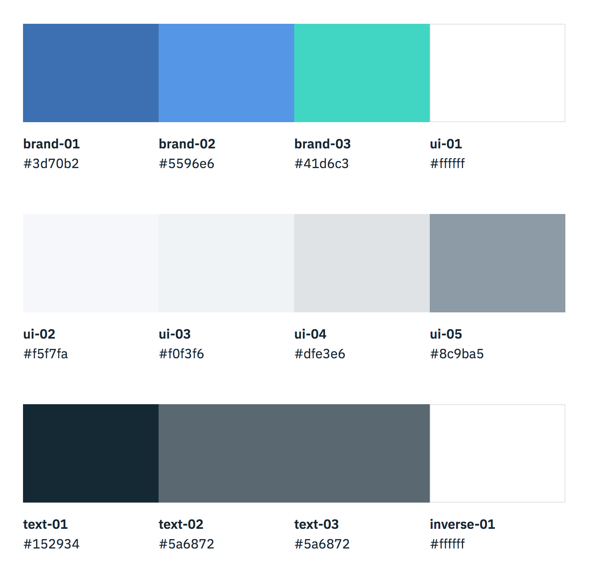
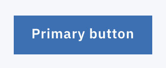
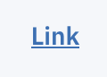
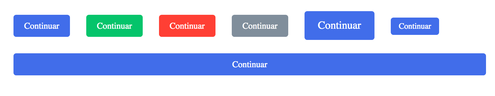

# Sistemas de diseño

## Contenido

- [Introducción](#introducción)
- [¿Qué es un sistema de diseño?](#¿qué-es-un-sistema-de-diseño)
- [¿En qué casos se utiliza?](#¿en-que-casos-se-utiliza)
- [Convertir un sistema a código](#convertir-un-sistema-a-código)
  - [Colores](#colores)
  - [Tipografías](#tipografías)
  - [Clases de ayuda](#clases-de-ayuda)
- [Ejemplos de sistemas de diseño](#ejemplos-de-sistemas-de-diseño)

## Introducción

En esta sesión aprenderemos qué es un sistema de diseño, cómo convertir ese sistema a código mediante clases CSS y que podamos aplicarlo de forma sencilla sobre nuestra página web y a su vez nos facilite la tarea de maquetar y crear páginas y vistas mucho más rápido manteniendo una consistencia y coherencia en los estilos.


## ¿Qué es un sistema de diseño?

Un sistema de diseño es un conjunto de patrones y reglas que rigen el estilo de un producto de forma consistente y armoniosa.

En el caso de un sistema de diseño web, éste definirá los estilos para los componentes, por ejemplo como deben ser los estilos de los botones o los inputs así como los iconos.

A la hora de dar coherencia, el sistema deberá mantener sus estilos a lo largo de todos sus componentes de tal forma que la linea gráfica se mantenga a través de todos ellos. Por ejemplo, esto se suele ver claramente cuando tenemos una visión global de todos los componentes. En el momento que tenemos esa visión global, si el sistema es bueno, veremos una relación clara entre todos ellos y una coherencia en sus estilos.

Por último un sistema no sólo son estilos para nuestros componentes, sino que también define las reglas sobre cómo debe usarse, como los colores y cuándo usarlos, la tipografía y cuándo usar un tamaño u otro y los márgenes y paddings que se pueden aplicar.

La idea principal del sistema es que cualquiera que lo analice sepa con claridad cuales son sus reglas y cómo aplicarlas. De esta forma cualquier persona puede empezar a trabajar con él en muy poco tiempo, generar vistas que no parezcan sacadas de un estilo completamente distinto y todo esto de forma rápida y sencilla.

Y ahora pensarás «vale sí muy bien, pero sigues hablándome en chino, ¿podrías ponerme un ejemplo?». Sin duda, el ejemplo más claro y que todos hemos vivido y conocemos de primera mano es [Material Design](https://material.io/guidelines/material-design/introduction.html) de Google, que es el sistema que se utiliza para diseñar la mayoría de aplicaciones de Google y que muchas otras empresas han utilizado para diseñar las suyas propias.

Este sistema establece un [conjunto de reglas y principios](https://material.io/guidelines/), [estilos](https://material.io/guidelines/style) y [componentes](https://material.io/guidelines/components/#).

Durante esta sesión veremos cómo nos afecta esto de los sistemas a la hora de desarrollar páginas, aprenderemos técnicas para aplicarlos de forma sencilla y veremos los pros y los contras de usar este recurso.


## ¿En qué casos se utiliza?

Los sistemas de diseño hoy en día se utilizan tanto en sitios web simples con un par de páginas como en aplicaciones con más de 100 vistas diferentes. La diferencia entre un caso y otro es que en el primero definiremos una serie de reglas que serán bastante simples y tendremos pocos componentes y en el segundo habrá más de ambos.

Los sistemas también se utilizan si queremos dar consistencia a nuestra web, partir de una base sencilla y concisa de reglas para hacer crecer una web de forma rápida. O si queremos que a la hora de desarrollar la página estén claros los estilos y las reglas para no fallar en la implementación, es decir, que diseño y web sean similares.

Por último, si estamos diseñando una web muy sencilla en la que queremos darle un toque artístico o romper con la consistencia, se podrá prescindir de definir un sistema complejo pero siempre estarán ahí ciertas reglas que definan el estilo de nuestra web y los componentes que la conforman. Un ejemplo sería la nueva tendencia [brutalista](http://brutalistwebsites.com/) que hay en la web, cuya raíz es romper con la monotonía actual que se vive en las páginas web actuales en las que la mayoría tienen muchas similitudes entre sí.


## Convertir un sistema a código

Bien, ya tenemos una idea básica de qué es un sistema. Ahora vamos a ver cómo implementarlo en nuestro código. Para ello es bueno retomar la estructura que definimos en la sesión de [Sass](3_1_sass.md):

```
scss
  |- core
  |  |- _functions.scss
  |  |- _mixins.scss
  |  `- _variables.scss
  |
  |- components
  |  |- _buttons.scss
  |  |- _forms.scss
  |  |- _hero.scss
  |  |- _newsletter.scss
  |  `- _typography.scss
  |
  |- layout
  |  |- _header.scss
  |  |- _footer.scss
  |  |- _grid.scss
  |
  `- pages
     |- _about-us.scss
     |- _contact.scss
     `- _home.scss
```

Lo normal a la hora de pasar un sistema a código es empezar por los estilos generales. Estos estilos generales son entre otros los colores, la tipografía, la iconografía y el estilo que tendrán las imágenes. A la hora de programar, la iconografía y los estilos de las imágenes será algo que nos venga dado y en pocos casos tendremos que crear un estilos para ellas ya que nos pasarán imágenes para que las metamos directamente. Pero en desarrollo sí que podemos generar estilos para tipografía y colores.

### Colores

En esta caso, empezaremos por los colores de nuestra página. Imaginemos que tenemos la siguiente paleta de colores, extraída del [sistema de diseño de Carbon creado por IBM](http://carbondesignsystem.com/):



Para definir estos colores, lo que haremos será crear variables en `Sass` para cada uno de ellos, para esto hay dos formas distintas de crear las variables, usando un map (que sería similar a un objeto de JavaScript) o usando multiples variables:

```scss
/*
  Truco: En inglés sería 'primary color' pero ponemos la palabra 'color' delante para que a
  la hora autocompletar con Atom, escribamos $color y nos aparezcan las sugerencias
  para todos los colores existentes
*/

// Podríamos usar también $color-brand-1, $color01, etc. El que más claro nos sea

$color-primary: #3d70b2;
$color-secondary: #5596e6;
$color-tertiary: #41d6c3;

// Para ir del blanco al negro. Hemos excluido algunos colores porque así queda claro :)

$color-light: #ffffff; // Usamos light porque es blanco, pero puede ser un azul claro
$color-light-midtone: #dfe3e6;
$color-midtone: #8c9ba5;
$color-dark-midtone: #5a6872;
$color-dark: #152934;

/*
Para los colores de soporte. Lo normal es que haya cuatro:

  - Error (error): Suele ser rojo
  - Éxito (success): Suele ser verde
  - Precaución (warning): Suele ser amarillo
  - Informativo (info): Varía en color
*/

$color-error: #e71d32;
$color-success: #5aa700;
$color-warning: #efc100;
$color-info: #5aaafa;
```

Esa sería la opción de usar variables para definir los colores. Estas variables las generaremos en el archivo `core/_variables.scss` y luego las utilizaremos en otros archivos, para dar estilos a nuestra página. Por ejemplo, imaginemos que tanto para los enlaces como para los botones de nuestro formulario usamos el mismo color `$color-primary`, uno para el texto (enlace) y el otro para el fondo (botón).




Utilizaríamos los siguientes estilos:

```scss
.link {
  color: $color-primary;
}

.button {
  background-color: $color-primary;
}
```

Que generarían este código CSS:

```css
.link {
  color: #3d70b2;
}

.button {
  background-color: #3d70b2;
}
```

Lo bueno de esta técnica es que si en el futuro nos da por cambiar el color que estamos usando por otro, sólo tendremos que cambiarlo en `$color-primary` y automáticamente cambiará en todos los sitios que lo utilicemos y nos sentiremos en la gloria.

Bien, la otra alternativa para usar colores es, como hemos dicho el map. De esta forma se el código quedaría así:

```scss
  $colors: (
    primary: #3d70b2,
    secondary: #5596e6,
    tertiary: #41d6c3,

    light: #ffffff, // Usamos light porque es blanco, pero puede ser un azul claro
    light-midtone: #dfe3e6,
    midtone: #8c9ba5,
    dark-midtone: #5a6872,
    dark: #152934,

    error: #e71d32,
    success: #5aa700,
    warning: #efc100,
    info: #5aaafa
  );
```

Y para utilizarlo en nuestro CSS, utilizariamos la función [`map-get`](http://sass-lang.com/documentation/Sass/Script/Functions.html#map_get-instance_method) que sería como una función de JavaScript y lo que hace es que nos devuelve el valor asignado a una propiedad dentro de un objeto de Sass:

```scss
.button {
  background-color: map-get($colors, 'primary');
}
```

Que generaría este código CSS:

```css
.button {
  background-color: #3d70b2;
}
```

* * *

EJERCICIO 1: COLORES

Vamos a descargarnos el [ejercicio de evaluación del primer sprint de Adalab](https://github.com/Adalab/clarke-s1-evaluacion).

A continuación, vamos a reestructurar el archivo siguiendo la estructura que hemos aprendido para organizar nuestros archivos de Sass. Por ejemplo, crearemos un archivo en la ruta `scss/layout/_header.scss` donde meteremos los estilos de la cabecera.

Además, crearemos un archivo `scss/core/_variables.scss` donde crearemos variables para cada uno de los colores que hemos utilizado y sustituiremos después cada una de las ocurrencias del color que tengamos en CSS por el nombre de la variable de Sass que hemos creado.

Para finalizar, vamos a cambiar los colores que tenemos por los de esta página: http://flatuicolors.com/. Sustituiremos el turquesa que tenemos actualmente en la web por el turquesa de FlatUIColors y el negro por el Wet Asphalt.

>NOTA: Si hemos realizado bien el código, cada uno de estos cambios de color lo podremos llevar a cabo cambiando sólo una línea

* * *


### Tipografía

Con la tipografía pasa lo mismo que con los colores. Al final tenemos un estilo tipográfico que usaremos en nuestra página y definiremos aspectos como el tamaño de fuente para el cuerpo de nuestra página, el estilo de fuente, los pesos y otro tipo de configuraciones en nuestro archivo `_variables.scss`:

```scss
// Después de colores para poder usar las variables de los colores (e.g. $color-dark)

$font-family: 'Geori', sans-serif;
$font-size: 16px;
$line-height: 1.5;
$font-color-base: $color-dark; // o map-get($colors, 'dark')
$font-color-light: $color-light;  // o map-get($colors, 'dark')
$font-weight-light: 300;
$font-weight-normal: 400;
$font-weight-medium: 500;
```

Aquí también podríamos usar un map:

```scss
$font: (
  family: 'Geori', sans-serif,
  size: 16px,
  line-height: 1.5,
  color-base: $color-dark, // o map-get($colors, 'dark')
  color-light: $color-light,  // o map-get($colors, 'dark')
  weight-light: 300,
  weight-normal: 400,
  weight-medium: 500
);
```

En el caso de las tipografías, aparte de añadir variables a `_variables.scss`, lo normal suele ser definir una serie de clases que utilizaremos a lo largo de toda nuestra web y que nos servirán para definir el tamaño de nuestros textos, los pesos, la alineación, etc. Todos estos estilos los incluiremos en el archivo `_typography.scss`.

Un ejemplo de como quedaría el archivo de `_typography.scss` sería el siguiente:

```scss
body {
  font-family: $font-family; // o map-get($font, 'family') y así
  color: $font-color-base;
  font-size: $font-size;
  line-height: $line-height;
  font-weight: $font-weight-normal;

  // Definimos el texto para pantallas grandes
  @media (min-width: 1024px) {
    font-size: 16px;
    line-height: 1.68;
  }
}

// Distintos tamaños de texto

.txt-sm {
  font-size: 14px;

  @media (min-width: 1024px) {
    font-size: 16px;
    line-height: 1.68;
  }
}

.txt-md {
  font-size: 16px;

  @media (min-width: 1024px) {
    font-size: 18px;
    line-height: 1.68;
  }
}

.txt-lg {
	font-size: 20px;
  line-height: 1.6;

  @media (min-width: 1024px) {
    font-size: 26px;
    line-height: 1.4;
  }
}

.txt-xl {
	font-size: 20px;
  line-height: 1.2;

  @media (min-width: 1024px) {
    font-size: 54px;
    font-weight: $font-weight-light;
  }
}

// Clases de ayuda para alinear texto

.txt-center { text-align: center; }
.txt-left { text-align: left; }
.txt-right { text-align: right; }

// Clases de ayuda para cambiar el color de texto

.txt-primary { color: $color-primary; }
.txt-light { color: $color-light; }
.txt-dark { color: $color-dark; }


// Clases de ayuda para cambiar el estilo de texto

.italic  { font-style: italic; }
.light { font-weight: $font-weight-light; }
.normal { font-weight: $font-weight-normal; }
.medium { font-weight: $font-weight-medium; }

// Clases de ayuda para cambiar mayúsculas en el texto

.uppercase { text-transform: uppercase; }
```

Creando estos estilos podremos reutilizarlos simplemente para dar estilo a nuestra página y componer varias clases para añadir varios estilos. Lo que conseguimos con esto es que llegados a un punto en el que hemos creado todos los estilos para nuestra tipografía, nuestra única tarea a la hora de dar estilos a nuestra web será asignar clases en nuestro HTML.

```html
<h1 class="txt-xl">Título</h1>
<p class="txt-primary medium">
  Lorem ipsum dolor sit amet, consectetur adipisicing elit, sed do eiusmod tempor incididunt ut labore et dolore magna aliqua.
</p>
<small class="txt-sm txt-center"></small>
```

* * *

EJERCICIO 2: TIPOGRAFÍA

Vamos a crear un nuevo proyecto en el que tendremos solo tres archivos `scss`:

- `scss/main.scss`
- `scss/_varibles.scss`
- `scss/_typography.scss`

A continuación, siguiendo lo aprendido en esta lección, vamos a añadir al archivo de `_typography.scss` clases para cada uno de los tamaños de fuente que aparece en [esta página](https://design.trello.com/style/typography) y cada uno de los colores.

Además, asignaremos a `body` los estilos que consideremos necesarios pero usando la siguiente fuente en vez de Helvetica:

`"Lucida Sans Unicode", "Lucida Grande", sans-serif`

* * *

### Componentes


En este apartado veremos en clase como trabajar con componentes. Cuando hablamos de componentes en la web, hacemos referencia a la unidad mínima con la que se forman las distintas vistas de nuestra web. Por ejemplo, elementos como un botón o un campo d e texto (input) serán componentes de nuestra página.

Una de las claves en los sistemas de diseño es la reutilización, al igual que sucede con las tipografías y los colores, los componentes en un sistema deberían de estar diseñados para ser reutilizables y así poder sacar múltiples vistas para nuestra web reutilizando dichos componentes y que de esa forma tanto el diseño como el desarrollo lleven menos tiempo en realizarse. Hacer que desarrollar vistas de una web sea más rápido no solo hace que el producto se desarrolle más rápido, sino que también permite dedicar tiempo a crear páginas y diseños para probar hipótesis de forma rápida, por ejemplo, añadir

En los comienzos de la web los diseños de las páginas eran muy variopintos. Cada web tenía sus propios estilos y muchas veces varios elementos con la misma función - un enlace, por ejemplo - no tenían los mismos estilos. Esto hacía muy dificil sacar componentes que reutilizar y mantener una consistencia en los estilos.

Con la llegada de los negocios y por consecuencia las aplicaciones web (Amazon, Dropbox, Facebook...) se vio la necesidad de crear interfaces que siguiesen una serie de patrones en sus estilos para facilitar la interacción a los usuarios y ganar velocidad en el desarrollo. Gracias a este hecho, poco a poco se fue adaptando el diseño para hacerlo más sistemático y así mejorar la experiencia de usuario y la rapidez a la hora de crear nuevas páginas.

Un ejemplo de la mejora en la experiencia de usuario es que si un botón rojo indica alerta, si utilizamos ese mismo estilo en todos los botones de alerta el usuario entenderá cada vez que vea ese botón que la acción que llevará a cabo requiere de mayor atención que otras acciones.

Respecto a la reutilización, si tenemos un mismo estilo para las tarjetas con información que aparecen en nuestra página y creamos una clase CSS para una, podremos aplicar esa clase creada al resto, esto nos ahorrará el tiempo de crear el mismo estilo para varios elementos similares y además hará que cuando cambiemos la clase los cambios se apliquen en toda nuestra web.

Hasta aquí la introducción a componentes y el por qué detrás de la proliferación de diseños que se enfocan en ellos. Lo que haremos ahora será explicar cómo crear un componente ayudándonos de Sass, más concretamente de los estilos anidados, de los `@import`s y de las variables.

Para este ejemplo vamos a crear los estilos para un botón. Lo primero que vamos a hacer es crear un archivo parcial de Sass llamado `_button.scss`. De esta forma tendremos un archivo específico para los estilos de botón y si queremos añadir un nuevo estilo o modificar uno ya existente sabremos que lo podremos (¡y deberemos!) hacer en ese archivo.

Recordando el ejemplo de la estructura que vimos para Sass, este componente deberíamos meterlo en la carpeta `components`:

```
scss
	|
	|- main.scss/index.scss (archivo principal)
	|
  |- core
  |  |- _functions.scss
  |  |- _mixins.scss
  |  `- _variables.scss
  |
  |- components
  |  |- _buttons.scss
  |  |- _forms.scss
  |  |- _hero.scss
  |  |- _newsletter.scss
  |  `- _typography.scss
  ...

```

Bien, una vez creado el archivo vamos a crear un par de clases para nuestro botón. La idea es que, tras crear todas las clases CSS, tengamos los estilos suficientes para poder obtener el resultado que aparece en la imagen siguiente sin tener que añadir ni una linea de CSS adicional.



En primer lugar crearemos la clase `.btn` que será general y se aplicará a todos los botones y añade estilos como el color del texto, su alineación, el margen, etc... Además añadiremos otra clase `.btn-default` para aplicar los estilos del botón por defecto.

```sass
// Para el ejemplo ponemos el color aquí pero este deberíamos ponerlo en el archivo _variables.scss
$color-primary: #416dea;

// Como norma general, las variables específicas de un componente se suelen poner
// al principio del archivo para que se puedan modificar facilmente más tarde
$btn-font-color: #fff;
$btn-line-height: 1.3;
$btn-font-weight: 500;

.btn {
  display: inline-block;
  margin: 10px;
  padding: 9px 16px 7px;
  cursor: pointer;
  text-align: center;
  text-transform: capitalize;
  color: $btn-font-color;
  border: none;
  border-radius: 4px;
  font-family: inherit;
  font-size: 13px;
  line-height: 1.3;
  font-weight: $btn-font-weight;
  text-decoration: none;
  appearance: none;

  &:hover {
    transition: all 150ms linear;
    opacity: 0.85;
  }
  &:active {
    transition: all 150ms linear;
    opacity: 0.75;
  }
  &:focus {
    outline: 1px dotted #959595;
    outline-offset: -4px;
  }
}

.btn-default {
  background-color: $color-primary;

  &:hover {
    background-color: lighten($color-primary, 10%);
    opacity: 1;
  }
  &:active {
    background-color: darken($color-primary, 10%);
    opacity: 1;
  }
}

```

Tras añadir estos estilos, sólo tendremos que hacer lo siguiente para que se apliquen sobre el elemento HTML que queramos:

```html
<a class="btn btn-default" href="#">Continuar</a>
<button class="btn btn-default">Continuar</button>
```

[Ejemplo en CodePen](https://codepen.io/anon/pen/bvMEeg)

Si te fijas, podemos aplicar el mismo estilo a un elemento `button` y a un elemento `a` y ambos conservan la misma apariencia, esto no se debe a un tipo de magía negra, sino a que hemos aplicado estilos para que funcionen correctamente en ambos elementos de HTML. Debemos hacer esto para que no tengamos que preocuparnos por qué tipo de elemento es sino por cómo queremos que se vea y se comporte.

Es MUY IMPORTANTE colocar el estilo `.btn-default` después de `.btn` para que sobreescriba los estilos que necesite. Si colocamos los estilos CSS de `.btn` despues de los de `.btn-default` debido a como funciona CSS, los estilos de `.btn` serán los que prevalezcan por estar colocados más abajo.

Bien, hemos creado un estilo para los botones del tipo `default` pero queremos más estilos, ¿no?. Pues vamos a crearlos, es muy típico tener varios tipos de estilos para los botones según lo que queramos transmitir al usuario. En nuestro caso vamos a crear los siguientes:

  - Botón por defecto. El que tenemos creado y como su nombre indica es el común. Cuando quieres poner un botón sin más, este es el que utilizas
  - Botón de éxito. Se suele utilizar para botones de confirmación o de pago. Suele utilizar colores verdes porque el usuario lo ve como un color positivo y se identifica con algo bueno
  - Botón de alerta. Sirve para utilizarlo en casos en los que necesitamos llamar la atención del usuario o reflejar que la acción que va a realizar al pulsar el botón puede ser peligrosa. Suele utilizarse un color rojo para representarlo.
  - Botón alternativo. Muchas veces se crean este tipo de botones para utilizarlos en situaciones en las que el botón por defecto no podrá visualizarse bien (por su color, por ejemplo) y en otros casos se utiliza para añadir un botón menos llamativo que el botón por defecto.

Bien vamos a crear los estilos para estos botones. Estos los añadiremos después de los estilos de `.btn-default` y lo haremos de la siguiente manera:

```sass
// Aquí iría el código de btn y btn-default

// Estas variables las definimos para los colores. Deberían ir en el archivo
// _variables.scss. Pero las colocaremos aquí sólo para el ejemplo

$color-success: #05c46b;
$color-alert: #ff3f34;
$color-alternate: #808e9b;

.btn-success {
  background-color: $color-success;

  &:hover {
    background-color: lighten($color-success, 10%);
    opacity: 1;
  }

  &:active {
    background-color: darken($color-success, 10%);
    opacity: 1;
  }
}

.btn-alert {
  background-color: $color-alert;

  &:hover {
    background-color: lighten($color-alert, 10%);
    opacity: 1;
  }

  &:active {
    background-color: darken($color-alert, 10%);
    opacity: 1;
  }
}

.btn-alternate {
  background-color: $color-alternate;

  &:hover {
    background-color: lighten($color-alternate, 10%);
    opacity: 1;
  }

  &:active {
    background-color: darken($color-alternate, 10%);
    opacity: 1;
  }
}
```

[Ejemplo en CodePen](https://codepen.io/anon/pen/qoYbVz)

Si te fijas bien, verás que en todas las clases de los botones mantenemos la clase `btn` y utilizamos una distinta según el estilo que queremos que tenga cada botón. Lo hacemos así porque todos los botones tienen estilos comunes (tamaño de fuente, redondeado del borde, etc.) y en vez de añadir todas esas reglas a cada botón creamos esa clase común y la añadimos en todos los botones. Esta es una muy buena práctica porque si en el futuro queremos quitar, por ejemplo, los bordes redondeados, lo cambiaremos solo en la clase `btn` y se aplicará a todos los botones a la vez. Ganamos así en mantenimiento  porque no tenemos 30 líneas iguales y en adaptación al cambio porque con un ligero cambio modificamos los estilos de varios componentes, genial ¿no?.

Otra de las ventajas de aplicar estilos usando varias clases distintas es que simplemente tocando HTML y cambiando una clase por otra podemos cambiar el estilo del botón. Imagina la rapidez a la hora de desarrollar que esto nos aporta si creamos clases de este estilo para inputs, imágenes, cabecera, etc...En muchos casos incluso si se crea un buen sistema de componentes alguien sin tocar el CSS puede crear nuevas secciones de una página y contribuir al desarrollo de una web.

Este principio de componer clases para obtener un estilo u otro es el que utiliza el framework de [Bootstrap](https://v4-alpha.getbootstrap.com/). Este es un framework muy famoso porque permite a gente con pocas habilidades de diseño o maquetación (por ejemplo, un desarrollador backend o un product managers) crear una interfaz de manera rápida para un producto o un prototipo. De hecho los productos o primeros prototipos de muchas empresas empezaron con Bootstrap y gracias a la rapidéz que este ofrece pudieron sacar un prototipo rápido y validar su modelo de negocio o presentarlo a inversores. Dicho esto es importante saber que Boostrap es una solución pero no es la única y que al igual que ofrece rapídez a la hora de crear una web tiene una desventaja y es que es díficil de modificar para adaptarlo a unas necesidades muy concretas y que a menudo como suele ser la opción de gente que no sabe mucho de CSS se empiezan a hacer muchas ñapas con él y se crea un código muy díficil de mantener. Tendremos que saber cuando es mejor utilizar una opción u otra en función de la rapidez (Bootstrap) o versatilidad (no Bootstrap) que busquemos.

Bien hemos visto cómo podríamos aplicar distintos estilos según el tipo de botón que queremos, pero esa es una de la muchas posibilidades que tenemos. Vamos a ver ahora posibilidades para modificar el tamaño del botón y poder hacerlo más grande, más pequeño o que ocupe el 100% del ancho del elemento que lo contiene con los siguientes estilos:

```sass
.btn-lg {
  padding: 12px 20px 10px;
  font-size: 16px;
}

.btn-sm {
  padding: 6px 12px 4px;
  font-size: 12px;
}

.btn-full-width {
  display: block;
  width: 100%;
}
```

[Ejemplo en CodePen](https://codepen.io/anon/pen/vRjLbK)

Como se muestra en el ejemplo, en este caso ya estamos modificando algo más que simplemente los colores, esto nos permite ver que creando unas pocas clases podemos aplicar estilos de forma muy versátil sin mucha complicación.

Y con estos estilos para cambiar el tamaño de los botones terminamos esta sección de cómo crear componentes. Si que es importante tener en cuenta dos cosas:

- No nos debemos volver locos creando estilos sino crear solo los justos y necesarios en función del diseño. Un ejemplo, si tenemos los titulares (h1) con una Times New Roman y 42px de tamaño y siempre van así y tenemos por otro lado los títulos de sección (h3) con una Arial de 18px de tamaño no tiene sentido que creemos cuatro estilos (font-arial, font-times, txt-xxl, txt-l) sino que sería más recomendable tener dos estilos porque un título siempre va a ir con Times New Roman y un h3 siempre con Arial.

- No hay una única solución para nombrar y organizar los estilos. Nosotros os planteamos más abajo algunas soluciones de algunos sistemas pero en muchas ocasiones, como sucede muchas veces en programación, no existe la forma única sino que dependerá de cada caso. Por tanto, no te preocupes si no estás segura de cómo nombrar o que clases utilizar para tus componentes, puedes preguntarnos en clase o hacerlo como mejor consideres y nosotros siempre te daremos consejo en los ejercicios y el feedback.

#### BONUS: Mixins para nuestros estilos

Bien hasta ahora mencionabamos los mixins en la sección de bonus de Sass pero muchas veces sucede que no tenemos ejemplos claros donde veamos para qué sirven estos exactamente. Pues para el caso que hemos visto de aplicar distintos estilos a los botones pueden ser de gran ayuda y nos permitirán crear un código más sencillo y fácil de mantener.

Recuperando el código de Sass de nuestros botones esto era lo que teníamos:

```sass
$color-success: #05c46b;
$color-alert: #ff3f34;
$color-alternate: #808e9b;

.btn-success {
  background-color: $color-success;

  &:hover {
    background-color: lighten($color-success, 10%);
    opacity: 1;
  }

  &:active {
    background-color: darken($color-success, 10%);
    opacity: 1;
  }
}

.btn-alert {
  background-color: $color-alert;

  &:hover {
    background-color: lighten($color-alert, 10%);
    opacity: 1;
  }

  &:active {
    background-color: darken($color-alert, 10%);
    opacity: 1;
  }
}

.btn-alternate {
  background-color: $color-alternate;

  &:hover {
    background-color: lighten($color-alternate, 10%);
    opacity: 1;
  }

  &:active {
    background-color: darken($color-alternate, 10%);
    opacity: 1;
  }
}
```

Bien, si nos fijamos, se puede ver claramente que el código de los tres estilos (`.btn-alternate`, `.btn-alert` y `.btn-success`) es prácticamente igual pero solo cambia la variable de color que se utiliza en cada uno. Esto hace que no podamos usar una misma clase para todos y a la vez no podamos eliminar esa repetición de código. Es en estos casos dónde los mixins cobran sentido. Si recordamos, en JavaScript cuando queríamos ejecutar un mismo código pero pasandole distintos valores utilizabamos una función ¿verdad?. Pues en este caso queremos hacer lo mismo, con distintos colores, aplicar una serie de estilos y lo haremos con mixins.

Sass tambien tiene funciones pero la diferencia entre las funciones y los mixins en Sass es que una función debe devolver un valor (1px, 100%, 1em, left, etc.) mientras que un mixin se suele utilizar para devolver estilos enteros (`a {color: red;}`, `width: 240px;`, etc.). Como en este caso queremos devolver una clase entera con sus correspondientes estilos utilizaremos mixins y lo haremos de la siguiente forma:

```sass
// Creamos el mixin, la "funcion" que genera un código CSS
// $color es el nombre que le damos al color que se le pasará al mixin a la hora
// de utilizarlo para poder definir cómo se va a utilizar
@mixin button-style($color) {
  background-color: $color;

  &:hover {
    background-color: lighten($color, 10%);
    opacity: 1;
  }
  &:active {
    background-color: darken($color, 10%);
    opacity: 1;
  }
}

// Para utilizar el mixin, utilizamos el `@include` seguido del nombre del mixin
// y entre paréntesis el color que queremos utilizar en cada caso
.btn-success {
  @include button-style($color-success);
}

.btn-alert {
  @include button-style($color-alert);
}

.btn-alternate {
  @include button-style($color-alternate);
}
```

Si copiamos ese código y lo utilizamos en vez del anterior veremos que el resultado es idéntico pero además el código que se genera es también el mismo. La única diferencia es que de esta forma hacemos más sencillo y fácil de entender nuestro código y permitimos que sea más fácil de mantener.

Si quieres experimentar más y ver cómo convierte el código Sass a CSS, puedes usar [Sassmeister](http://sassmeister.com/). Prueba a escribir Sass en el panel izquierdo y verás el resultado CSS en el derecho.

* * *

EJERCICIO BONUS 1: Mixin para el tamaño de los botones

Como hemos visto en el ejemplo, podemos crear un mixin para los distintos estilos de un botón. Como sugerencia de ejercicio y sólo si quieres, puedes probar a hacer un mixin para los tamaños de los botones. Puedes usar tanto CodePen como Sassmeister para realizarlo. El resultado debería ser idéntico y solo debería cambiar el código.

Puedes partir de este [CodePen](https://codepen.io/anon/pen/vRjLbK) cómo base

* * *

* * *

EJERCICIO 3: Nuestro componente input

En este ejercicio vamos a crear los estilos para un componente input. Este componente, como se puede ver en la imagen tendrá distintos estados (activo, hover, etc.) y distintos formatos (con icono a la derecha y con icono a la izquierda)


A continuación generaremos un HTML en el que probaremos que funciona cada uno de los estados y cada una de las variantes. La idea es que usando un HTML como el siguiente los estilos se apliquen correctamente:

```html
<div class="input-w-icon">
  
  <input type="text" name="username">
</div>

<input class="input" type="text" name="lastname" >
<input class="input" type="number" name="creditcard" disabled>
```


>NOTA: No es necesario que los estilos sean idénticos a los que aparecen en la foto, pero si deben de estar definidos los estilos para cada uno de los estados y para cada una de las variaciones

* * *

### Clases de ayuda

A la hora de generar el CSS para crear un sistema es muy común crear clases que sirvan de ayuda para aplicar estilos en determinados casos. Estas clases suelen ir definidas en un archivo llamado `_helpers.scss` o `_utilities.scss` y suele ser el último archivo que se importa desde nuestro `main.scss` para que así las clases que definamos en éste archivo prevalezcan frente al resto por la regla de la cascada de CSS.

Un ejemplo del código que podríamos encontrar en este archivo sería el siguiente:

```scss
.block { display: block; }
.inline { display: inline; }
.inline-block { display: inline-block; }

// Esta clase se suele aplicar mucho a un elemento padre que contiene otro en
// posición absoluta y se utiliza para que el elemento en posición absoluta se
// coloque en función de la posición del padre con posición relativa.

.relative { position: relative; }

// Esta clase es la solemos usar con JavaScript para ocultar o mostrar un elemento
// Algunas personas suelen poner el prefijo js- delante de las clases relacionadas
// con JavaScript para identificarlas mejor (e.g. .js-hidden)
.hidden { display: none; }
.hide-sm { @media (max-width: 1023px) { display: none; } }
.hide-lg { @media (min-width: 1024px) { display: none; } }

.m-xs { margin: 16px; }
.m-md { margin: 24px; }
.m-lg { margin: 32px; }
.m-xl { margin: 40px; }
.m-xs { margin: 16px; }
.m-md { margin: 24px; }
.m-lg { margin: 32px; }
.m-xl { margin: 40px; }

.m-bottom-xs { margin-bottom: 16px; }
.m-bottom-md { margin-bottom: 24px; }
.m-bottom-lg { margin-bottom: 32px; }
.m-bottom-xl { margin-bottom: 40px; }
.m-top-xs { margin-top: 16px; }
.m-top-md { margin-top: 24px; }
.m-top-lg { margin-top: 32px; }
.m-top-xl { margin-top: 40px; }

.p-xs { padding: 16px; }
.p-md { padding: 24px; }
.p-lg { padding: 32px; }
.p-xl { padding: 40px; }
.p-xs { padding: 16px; }
.p-md { padding: 24px; }
.p-lg { padding: 32px; }
.p-xl { padding: 40px; }

.p-bottom-xs { padding-bottom: 16px; }
.p-bottom-md { padding-bottom: 24px; }
.p-bottom-lg { padding-bottom: 32px; }
.p-bottom-xl { padding-bottom: 40px; }
.p-top-xs { padding-top: 16px; }
.p-top-md { padding-top: 24px; }
.p-top-lg { padding-top: 32px; }
.p-top-xl { padding-top: 40px; }
```

Luego a la hora de usarlo será algo tan simple como esto:

```html
<div class="hide-lg">
  <p>Solo aparezco en pantallas pequeñas</p>
</div>

<p class="p-lg m-top-lg">Tengo mucho padding y un margen superior grande</p>
```


## Ejemplos de sistemas de diseño

Para finalizar y para que sirva de inspiración hemos recogido algunos de los sistemas que consideramos que están mejor resueltos. Estos sistemas de diseño están enfocados a web y por tanto en la documentación muestran los nombres de las clases que utilizan y las distancias en píxeles y sirven para inspirarse y ver cómo trabajan en empresas que destacan en el sector tecnológico.

- [Purple de Heroku](https://purple.herokuapp.com/)
- [Sistema de Mailchimp](http://ux.mailchimp.com/patterns)
- [Nachos: Sistema de diseño de Trello](https://design.trello.com/)

* * *

(BONUS) EJERCICIO 4: UN SISTEMA COMPLETO

A partir de la siguiente imagen. Crea el HTML y los archivos de Sass necesario para replicar los estilos y generar un sistema a partir de lo visto. Utiliza variables para los tamaños de fuente, los colores, los radios de los botones, etc. por si se decide cambiar en el futuro. No importa si no es exacto el color o el radio del borde.

La tipografía es Roboto Slab y puedes obtenerla de Google Fonts.


* * *
