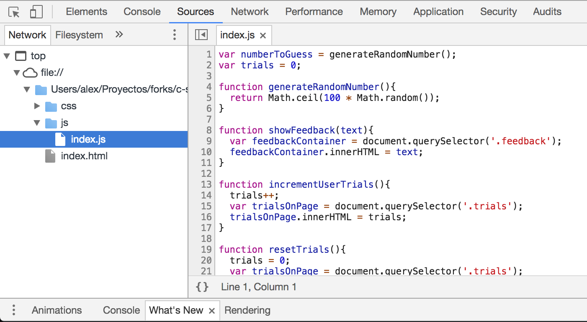
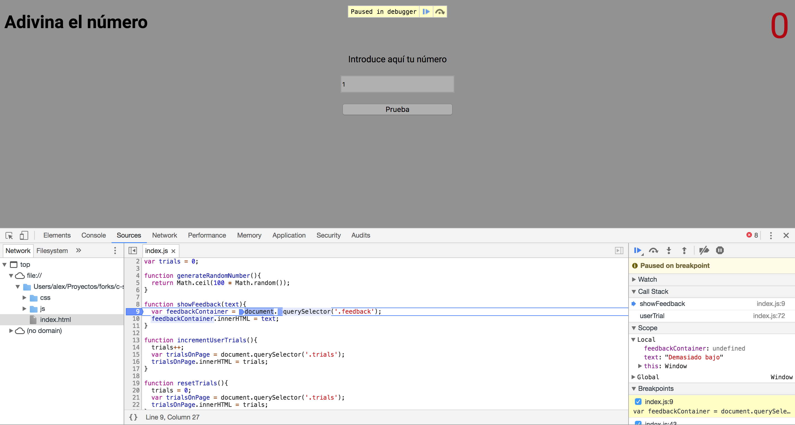
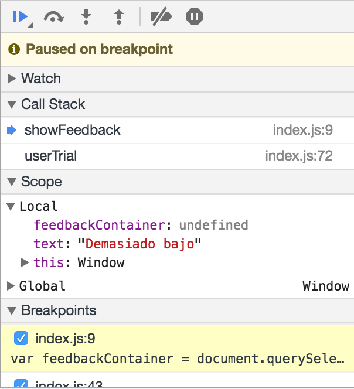

# Scope y hoisting

## Contenidos

- [Introducción](#introducción)
- [¿Para qué sirve lo que vamos a ver en esta sesión?](#¿para-qué-sirve-lo-que-vamos-a-ver-en-esta-sesión)
- [¿En qué casos se utiliza?](#¿en-qué-casos-se-utiliza)
- [Ámbito o scope](#ámbito-o-scope)
- [Hoisting](#hoisting)

## Introducción

A medida que vamos aprendiendo más y más JavaScript, es necesario que vayamos profundizando en conceptos un poco más técnicos pero que es fundamental que entendamos. Estos conceptos nos ayudarán a entender cómo funciona JavaScript a más bajo nivel y nos harán que captemos mejor el funcionamiento de un código y, por tanto, sepamos resolver mejor los errores que se producen y creemos un código más estable y mejor estructurado.

En esta sesión veremos, en primer lugar, qué es el ámbito (scope) de las variables y funciones y aprenderemos a fondo cómo funciona para tenerlo en cuenta a la hora de ver dónde declarar variables y funciones en nuestro código.

También veremos qué es el hoisting (que no tiene nada que ver con hosting :) ) y que describe cómo reorganiza el intérprete de JavaScript (nuestro navegador web) el código antes de ejecutarlo.


## ¿Para qué sirve lo que vamos a ver en esta sesión?

Hasta ahora hemos establecido una serie de normas porque sí, como que siempre tenemos que declarar una variable antes de usarla o que las funciones las podemos definir después de utilizarlas. También hemos comentado que las variables que creamos fuera de una función pueden usarse dentro de esta y, sin embargo, las que creamos dentro de una función no pueden ser utilizadas fuera de esta.

El hecho es que solo hemos definido reglas para esto y no hemos explicado el porqué detrás de cada una de ellas. Lo que vamos a ver en esta sesión nos ayudará a saber el por qué y a conocer cuál es el proceso que se produce en nuestro navegador y que influye en ese comportamiento.


## ¿En qué casos se utiliza?

Dado que todo lo que vamos a ver es algo relacionado con cómo funciona JavaScript, nos será útil en todo momento debido a que estos conceptos forman parte de la naturaleza de este lenguaje.

Aprender este tipo de conceptos un poco más avanzados te aportará conocimientos clave a la hora de empezar a trabajar con JavaScript y a obtener una base sólida y unos conocimientos que van más allá de generar código sin saber las reglas que caracterizan la estructura, entender el por qué detrás de ciertas buenas prácticas.


## Contenido

### Ámbito o scope

Bien, vamos a empezar entendiendo mejor qué es el scope o el ámbito, para ello lo mejor es ponernos en situación, entender cómo es el proceso que se lleva a cabo en nuestro navegador para entender qué sucede con el código de JavaScript que generamos y cómo este es ejecutado.

En primer lugar, hay que dejar claro que no vamos a ver en detalle qué sucede desde que se lee el código JavaScript hasta que se ejecuta. Pero vamos a pensar como si fuésemos el intérprete de JavaScript, la parte de nuestro navegador encargada de entender JavaScript y saber qué hacer con el código.

Bien, imaginemos que tenemos el siguiente código:

```js

var greeting = 'Hola';

function sayHello() {
  var greeting = 'Hello';
  console.log(greeting);
}

sayHello();
```

>Como puedes ver, este código no tiene ninguna lógica, simplemente es algo sencillo para que nos sirva de ejemplo.

¿Sabrías adivinar que va a mostrar? Piénsalo detenidamente (no vale ejecutar el código 👮🏻‍♀️).

Bien, antes de saber cuál será el resultado, vamos a ver qué pasos sigue este código.

JavaScript en este caso realiza los siguientes pasos:
1. Genera la variable `greeting` en el ámbito global y posteriormente le asigna `Hola`
1. Declara una función (crea la función)
1. Ejecuta la función sayHello
1. Al ejecutar la función `sayHello` y por tanto el código que contiene, se crea una variable `greeting` en el ámbito de la función `sayHello`
1. Se ejecuta el `console.log`, en este caso como le hemos pasado como argumento la variable `greeting`, buscará esa variable en el ámbito más próximo y utilizará el valor que almacena

Bien, la clave en estos pasos reside en una palabra, ámbito. Hemos hablado de ámbito de la función, ámbito global y ámbito más próximo, pero ¿qué es el ámbito?. En JavaScript, el ámbito se encarga de llevar la lista de todas las variables y funciones declaradas y define una serie de reglas que establecen si esas variables son accesibles en el momento de ejecutar un código. Dentro de nuestro código podremos tener distintos ámbitos, cada uno con una serie distinta de variables a las que podemos acceder.

En JavaScript, la única forma de generar un nuevo ámbito es creando una función. Dentro de esta todo lo que definamos (variables o funciones) estará encapsulado y solo se podrá acceder desde dentro de la función, desde su ámbito, fuera de este será como si no existiese.

>NOTA: en realidad es mentira que la única forma de crear un nuevo ámbito en JavaScript es a través de las funciones. Existe otra manera para crear un nuevo ámbito en la versión que estamos utilizando de JavaScript pero no la vamos a ver en este curso. Sí que veremos más adelante, una nueva forma de crear ámbitos en la nueva versión de JavaScript, pero por el momento pensemos que solo se puede generar un nuevo ámbito usando funciones.

Por lo tanto, cada vez que creemos una nueva función estaremos generando a la par un nuevo ámbito. Todo lo que esté fuera de funciones y se defina directamente en el código, pertenecerá al denominado ámbito global, que es el que engloba todo nuestro código y es accesible desde cualquier parte.

Como esto puede ser un poco lioso, vamos a ilustrar cuáles serían los ámbitos en el ejemplo anterior, cómo funcionan y cómo se modifican en cada paso.

Bien, volviendo a los pasos anteriores, vamos a ilustrar cada uno de ellos para ver que sucede en cada uno de ellos:

#### 1. Genera la variable `greeting` en el ámbito global y posteriormente le asigna `Hola`

En este paso añadimos al *scope* global una variable `greeting` y guardamos el valor de `Hola` dentro de ella. El ámbito global abarcaría todo el código, como hemos comentado anteriormente, si generamos una variable o función en el scope global esta podrá ser usada en cualquier parte de nuestro JavaScript, de ahí que el alcance de este scope (donde se pueden utilizar las variables y funciones creadas en él) se extienda a todo el código.

#### 2. Declara una función (crea la función)

Al crear la función `sayHello`, generamos un nuevo ámbito, por lo que todas las variables que se creen dentro de la función ya no estarán incluidas en el ámbito global, sino en el de esta función. Lo mismo sucede con los parámetros, que estarán incluidos en el ámbito.

#### 3. Al ejecutar la función `sayHello` y por tanto el código que contiene, se crea una variable `greeting` en el ámbito de la función `sayHello`

Bien, hemos creado una variable y la hemos creado dentro de `sayHello`. En el momento de crearla, esta se añadirá al scope de la función.

#### 4. Se ejecuta el `console.log`, en este caso como le hemos pasado como argumento la variable `greeting`, buscará esa variable en el ámbito más próximo y utilizará el valor que almacena

Bien, este es una de las partes clave para entender cómo funciona el scope. En esta parte del código estamos utilizando la variable `greeting` para poder utilizar el valor que almacena y por tanto, que este se muestre en el `console.log`. ¿Qué hace JavaScript en este caso? Pues muy simple, busca si esa variable existe en el ámbito actual y sino en el ámbito que está por encima y sino en el de encima de ese y así continuamente.

En este caso busca en el ámbito actual, como el código se está ejecutando dentro de la función `sayHello`, el ámbito actual será el ámbito de la función, por lo que en primer lugar buscará ahí si existe la variable que necesita (`greeting`). Como sí existe ahí, utiliza esa variable para coger el valor y por tanto, como en este caso el `greeting` de dentro de la función guarda `'Hello'`, se sustituirá por ese texto y el `console.log` mostrará `'Hello'`.

Si en este caso no hubiésemos declarado una variable `greeting` en la función, al ejecutar el código, el intérprete de JavaScript (el navegador) buscaría esa variable en el ámbito de `sayHello` y al no encontrarla iría subiendo en ámbitos. En ese caso iría directamente al ámbito global porque es el único por encima de `sayHello` y trataría de buscar ahí la variable. Como ese scope tiene una variable `greeting` definida, utilizará esa y por tanto en este caso el `console.log` mostrará `'Hola'`.

Si tras buscar en todos los ámbitos que afectan a un código no se encuentra ninguna variable que coincida con la utilizada, se producirá un error de JavaScript llamado `ReferenceError` porque no encuentra la referencia a la variable utilizada, no encuentra ningún sitio donde se haya declarado esa variable y por tanto hay un error de referencia (porque la referencia no existe).

El scope es algo que no podemos ver pero que debemos tener en cuenta y entender para prever cuál será el resultado de nuestro código. Es un proceso que no vemos pero está ahí y existe e influye en cómo se ejecuta el código.

### Consultar el scope en las Chrome DevTools

Por último, podemos saber cual es el scope local y global en un momento determinado utilizando la pestaña sources de las Chrome Dev Tools. Esta pestaña sirve para depurar nuestro código JavaScript y comprobar qué está haciendo en cada paso. En ella nos aparece un panel a la izquierda de la pantalla con la estructura de carpetas de la página. Si no nos aparece el panel, tenemos que pulsar en el icono con la flecha que apunta hacia la derecha, situado justo debajo del icono con el ratón.

>Vista por defecto de la pestaña de _Sources_ de las Chrome DevTools


A continuación seleccionaremos el archivo JavaScript que queremos depurar dentro de la estructura de carpetas y nos mostrará el código del archivo.

>Vista con un archivo abierto.Pestaña de _Sources_ de las herramientas de desarollo de Chrome



Para comprobar cuál es el scope en un momento determinado de la ejecución de nuestro código, simplemente pulsamos en el número de una línea de código para generar una parada en el código (breakpoint), al pulsar sobre el número aparecerá un marcador azul para indicarnos que hemos generado una parada.

>Código con un breakpoint para parar la ejecución en una línea determinada


Despues de generar una parada en el código, recargamos la página. Al recargarla ejecutará el código JavaScript hasta la linea en la que hemos puesto el breakpoint, donde se parará hasta que le digamos que continue.

>Vista del código parado en un punto determinado



En este momento podemos ver a la derecha un panel con una sección que tiene el nombre de scope. Dentro de esta podremos ver otras dos subsecciones, local y global. Local hará referencia al scope local (si se está ejecutando una función, será al scope de la función) y global hará referencia al scope global, a todas las variables y funciones disponibles a lo largo de todo nuestro código (tanto las que hemos creado nosotros como las que genera por defecto el navegador). El scope que se muestra será el que haya justo en el momento antes de ejecutar la linea de código en la que hemos realizado la parada.

>Vista de la sección scope en el panel de info de Sources



Y hasta aquí sería la descripción de qué es el scope o ámbito en JavaScript. Si no te ha quedado todo perfectamente claro y no lo has pillado a la primera no te preocupes, este concepto es algo que a veces cuesta más, la idea es explicarlo y que, a base de consultarlo y volver de vez en cuando a esta explicación se llegue a un punto de entendimiento del concepto. Por el momento, con entender que el scope determina el alcance de nuestras variables y funciones y como funciona a grandes rasgos es más que suficiente. La práctica y repaso a base de constancia con el código harán el resto para entender a fondo de qué se trata.


* * *

EJERCICIO 1: Averigua el resultado

A continuación vamos a poner una serie de códigos. Estos no tienen un sentido lógico más allá de practicar con lo aprendido sobre el scope. Sin ejecutarlos, intenta averiguar qué se mostrará en el `console.log` de cada uno de ellos.

>NOTA: Los ejercicios son parecidos pero cada uno de ellos tiene una modificación. Lo mejor es leer paso a paso que hace cada uno aunque ya lo hayamos leído antes para saber cuál será el proceso que realicen.

```js
var message = 'El resultado será A';

function changeMessage() {
  message = 'El resultado será B';
}

changeMessage();

console.log(message);
```

```js
var message = 'El resultado será A';

function changeMessage() {
  message = 'El resultado será B';
}

console.log(message);
```

```js
var message = 'El resultado será A';

function changeMessage() {
  var message = 'El resultado será B';
}

changeMessage();

console.log(message);
```

Una vez hayas intentado averiguar cuál es el resultado de estos código, comprueba si has acertado o no ejecutándolos en tu navegador.

* * *

EJERCICIO 2: Aprendiendo a averiguar el scope con las Dev Tools

Abre tu ejercicio de evaluación individual del segundo sprint (el de adivinar el número aleatorio) y después abre el panel de las Chrome Dev Tools. Selecciona la pestaña _Sources_, coloca algunas paradas en el código pulsando en los números de línea del editor de código que aparece. Recarga la página para que se vaya parando en cada una de las líneas y comprueba en el panel derecho cual es el scope en cada caso.

Prueba a poner paradas tanto dentro de funciones como fuera para ver qué sucede.

* * *

### Hoisting

Como hemos visto hasta ahora, JavaScript genera ámbitos para determinadas partes de nuestro código, una cosa que hace para que la tarea de generar esos ámbitos sea más rápida es que todas las declaraciones (cuando creamos una variable o una función) se "mueven" al principio de su ámbito respectivo, esto es a lo que llamamos _hoisting_.

Imaginemos que tenemos el siguiente código:

```js
var lower = 1;
var upper = 100;

function getRandomNumber(min, max) {
  console.log('Vamos a crear un número random');

  var message = 'Se ha generado un número aleatorio: ';
  var result = Math.floor((Math.random() * (max - min)) + min);

  console.log(message + result);

  return result;
}

console.log('Mensaje estúpido');

var randomNumber = getRandomNumber(lower, upper);
```

JavaScript cambiará el orden del código y lo dejará de la siguiente forma:

```js
var lower;
var upper;
var randomNumber;

function getRandomNumber(min, max) {
  var message;
  var result;

  console.log('Vamos a crear un número random');

  message = 'Se ha generado un número aleatorio: ';
  result = Math.floor((Math.random() * (max - min)) + min);

  console.log(message + result);

  return result;
}

lower = 1;
upper = 100;

console.log('Mensaje estúpido');

randomNumber = getRandomNumber(lower, upper);
```

Como se puede ver, lo que hace básicamente es mover las declaraciones de funciones y variables al principio del scope. Esto se ve muy claro si nos fijamos en que la declaración de variables se han colocado antes que la ejecución de los `console.log`.

¡OJO! En el caso de las variables, solo se se aplica el hoisting a la declaración (`var lower`) haciendo que esta se coloque al principio del código. La asignación (`lower = 1`) no se mueve, por eso siempre se recomienda que antes de usar una variable siempre la declaremos y asignemos, para que en el momento de usarla ya tenga un valor definido.

Saber esto nos ayuda a entender varias cosas:

- Las funciones siempre se van a mover arriba, por lo que da igual dónde las declaremos (antes o después de usarlas) siempre podremos usarlas donde queramos
- Las declaración de variables siempre se "mueve" arriba, pero la asignación no. Debemos tener cuidado de siempre crear y asignar una variable antes de usarla
- JavaScript realiza una serie de operaciones antes de ejecutar el código, estas le facilitan el trabajo y optimizan la ejecución del código

* * *

EJERCICIO 3: Comprobando cómo se aplica el hoisting con las Chrome Dev Tools

Abre tu ejercicio de evaluación individual del segundo sprint (el de adivinar el número aleatorio). Pon una parada en el código y comprueba si las variables se han añadido al scope para ver cómo JavaScript aplica el _hoisting_.

* * *

EJERCICIO 4: Detectando fallos en las declaraciones de variables

A continuación vamos a poner una serie de códigos, algunos de ellos tendrán un error debido a que hemos usado/modificado una variable en un ámbito que no está definido. Averigua cuáles de estos códigos son los que tienen un error e intenta razonar el por qué.

>NOTA: Estos códigos no tienen un sentido lógico más allá de practicar con lo aprendido sobre el scope

```js
'use strict';

var message = '¡Hola!';
function showMessage() {
  console.log(message);
}
```

```js
'use strict';

function showMessage() {
  console.log(message);
}

var message = '¡Hola!';
```

```js
'use strict';

var message;

function showMessage() {
  console.log(message);
}

message = '¡Hola!';
```

```js
'use strict';

message = '¡Hola!';

function showMessage() {
  console.log(message);
}
```

```js
'use strict';

function showMessage() {
  message = '¡Hola!';
  console.log(message);
}

var message;
```

* * *
